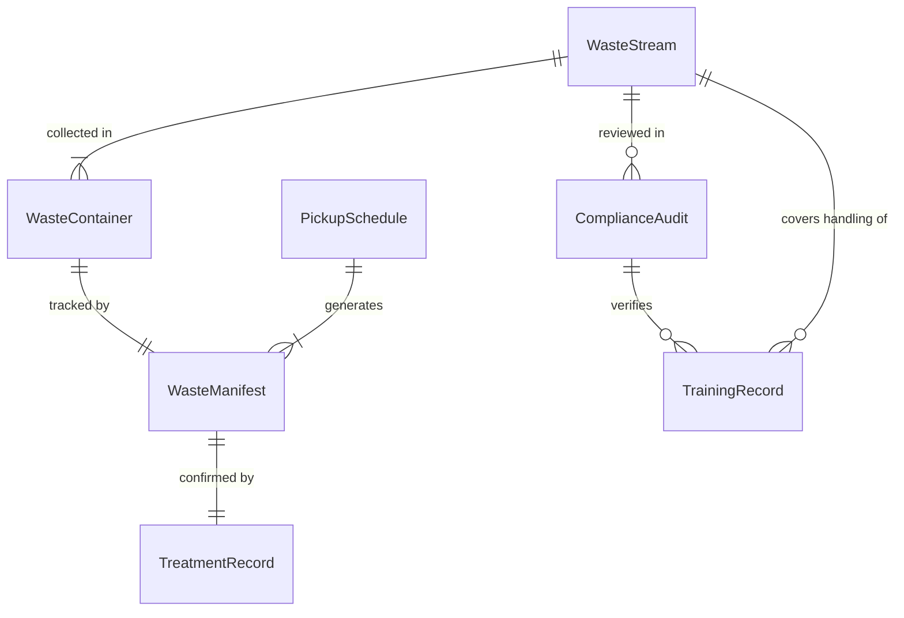
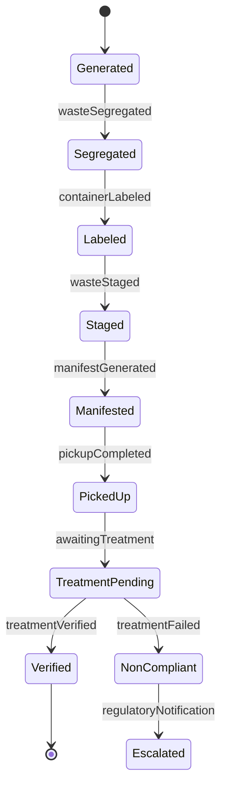
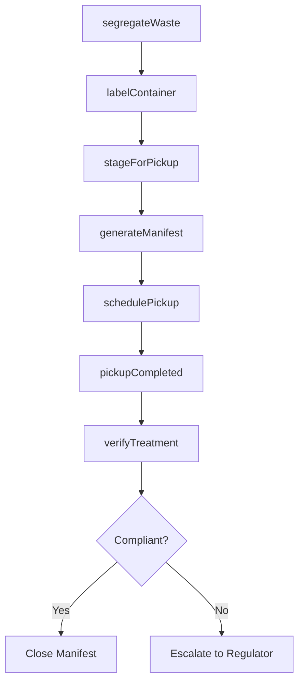
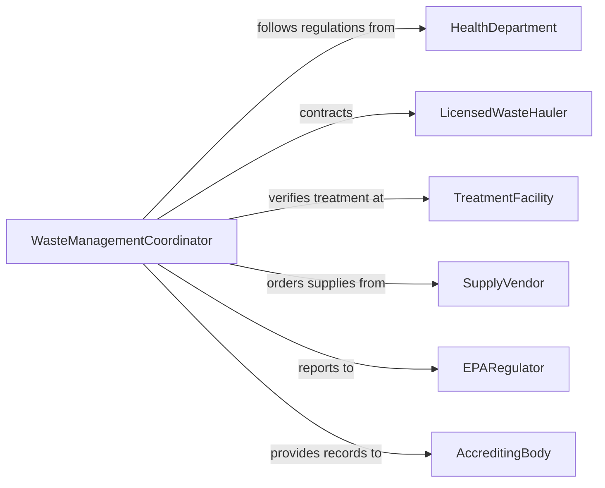

# Dispose of Biomedical Waste in Accordance with Standards

> Business-as-Code definition for the compliant segregation, containment, tracking, and disposal of biomedical and infectious waste from healthcare and research facilities.

## Overview

Biomedical waste disposal involves the proper identification, segregation, packaging, labeling, transport, and treatment of infectious, pathological, pharmaceutical, and sharps waste generated in healthcare and laboratory settings. This definition models the full chain of custody from point of generation through licensed treatment and disposal, ensuring compliance with OSHA, EPA, and state health department regulations.

## Actors

| Actor | Description |
|-------|-------------|
| HealthDepartment | Sets biomedical waste handling and disposal regulations |
| LicensedWasteHauler | Transports regulated medical waste to treatment facilities |
| TreatmentFacility | Processes biomedical waste through incineration or autoclaving |
| SupplyVendor | Provides sharps containers, biohazard bags, and labels |
| EPARegulator | Enforces environmental standards for waste treatment |
| AccreditingBody | Audits waste management practices for facility accreditation |

## Roles

| Role | Description |
|------|-------------|
| WasteManagementCoordinator | Oversees biomedical waste program compliance |
| ClinicalStaff | Segregates waste at the point of generation |
| EnvironmentalServicesTech | Collects and stages waste for pickup |
| InfectionControlOfficer | Monitors waste handling practices for safety |

## Entities

| Entity | Description |
|--------|-------------|
| WasteStream | A category of biomedical waste such as sharps or pathological |
| WasteContainer | A labeled receptacle for collecting specific waste types |
| WasteManifest | A chain-of-custody document tracking waste from generation to disposal |
| TreatmentRecord | Documentation of waste processing method and results |
| ComplianceAudit | A review of waste handling practices against regulations |
| TrainingRecord | Documentation of staff training on waste handling procedures |
| PickupSchedule | A recurring schedule for waste hauler collections |

## Actions

| Action | Description |
|--------|-------------|
| segregateWaste | Sort biomedical waste into appropriate stream containers |
| labelContainer | Apply proper hazard labels and tracking codes to containers |
| stageForPickup | Move filled containers to the designated collection area |
| generateManifest | Create chain-of-custody documentation for waste transport |
| schedulePickup | Arrange licensed hauler collection at the facility |
| verifyTreatment | Confirm waste has been properly treated and disposed |
| conductAudit | Review waste handling practices for regulatory compliance |

## Events

| Event | Description |
|-------|-------------|
| wasteSegregated | Biomedical waste has been sorted into proper containers |
| containerLabeled | Waste container has been labeled with tracking information |
| wasteStaged | Filled containers have been moved to the collection area |
| manifestGenerated | Chain-of-custody documentation has been created |
| pickupCompleted | Licensed hauler has collected the waste |
| treatmentVerified | Waste treatment and disposal has been confirmed |
| auditCompleted | Compliance review of waste handling has been finished |

## Searches

| Search | Description |
|--------|-------------|
| findPendingPickups | List facilities with waste staged for collection |
| getManifestHistory | Retrieve waste tracking records by date or stream |
| findOpenAudits | Locate compliance audits pending completion |
| getTrainingStatus | Check staff training completion for waste handling |
| getTreatmentRecords | Pull waste treatment confirmation records |

## Entity Relationships



## State Diagram



## Workflow



## Actor Relationships



## Usage

### Calling Actions

```typescript
import { disposeBiomedicalWasteAccordanceStandards } from '@headlessly/dispose-biomedical-waste-accordance-standards'

const waste = disposeBiomedicalWasteAccordanceStandards()

// Segregate and label waste
await waste.segregateWaste({
  facilityId: 'HOSPITAL-MAIN',
  stream: 'sharps',
  containerId: 'SHARPS-BIN-042',
  volume: { liters: 5 }
})

await waste.labelContainer({
  containerId: 'SHARPS-BIN-042',
  labels: ['biohazard', 'sharps'],
  trackingCode: 'BMW-2026-02-0547'
})

// Generate manifest and schedule pickup
const manifest = await waste.generateManifest({
  facilityId: 'HOSPITAL-MAIN',
  containers: ['SHARPS-BIN-042', 'SHARPS-BIN-043', 'PATH-BAG-017'],
  haulerId: 'STERICYCLE-NE'
})

await waste.schedulePickup({
  manifestId: manifest.id,
  date: '2026-02-06'
})
```

### Event-Driven Automation

```typescript
// Auto-schedule pickup when staging area reaches capacity
waste.wasteStaged(async ({ facilityId, capacityPercent }) => {
  if (capacityPercent >= 80) {
    await waste.schedulePickup({ facilityId, priority: 'next-available' })
  }
})

// Alert compliance when treatment verification fails
waste.treatmentVerified(async ({ manifestId, compliant }) => {
  if (!compliant) {
    await notify({
      to: 'waste-management-coordinator',
      message: `Manifest ${manifestId} treatment non-compliant - regulatory escalation required`
    })
  }
})
```
