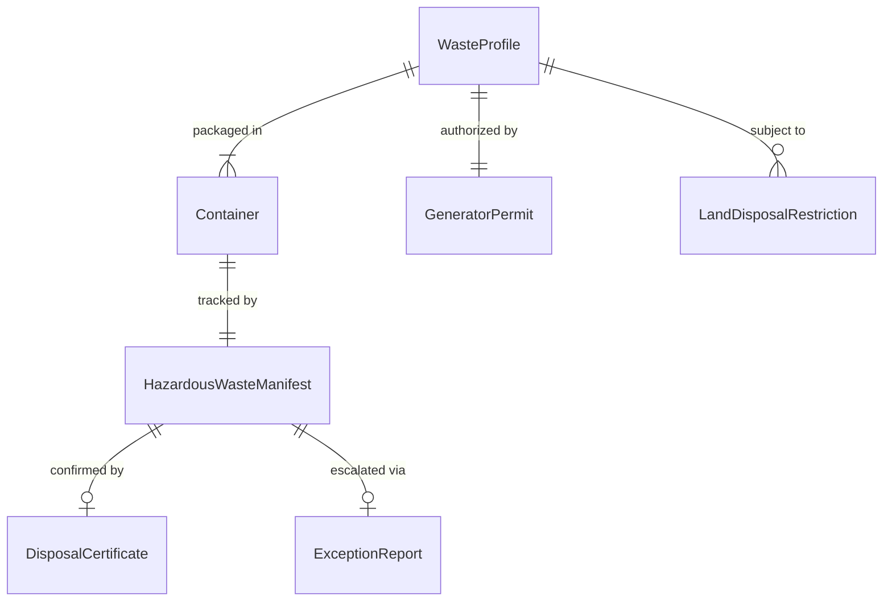
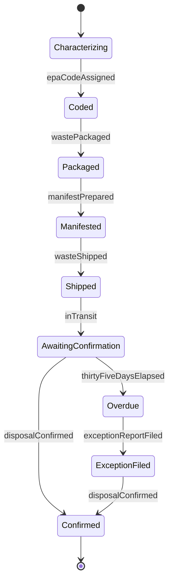
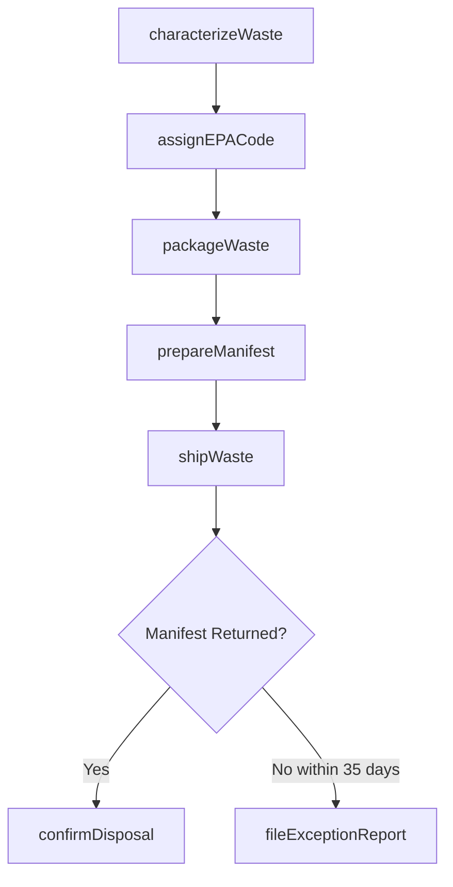
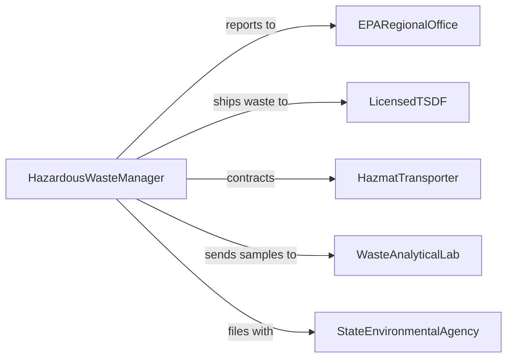

# Dispose of Hazardous Materials

> Business-as-Code definition for the safe identification, packaging, transport, and disposal of hazardous materials in compliance with RCRA, DOT, and EPA regulations.

## Overview

Hazardous materials disposal encompasses the classification, containment, manifesting, and transport of chemical, flammable, corrosive, reactive, and toxic waste from generators to licensed treatment, storage, and disposal facilities. This definition models the cradle-to-grave tracking required by the Resource Conservation and Recovery Act, ensuring proper handling at every stage.

## Actors

| Actor | Description |
|-------|-------------|
| EPARegionalOffice | Enforces hazardous waste regulations and issues permits |
| LicensedTSDF | Treats, stores, or disposes of hazardous waste at a permitted facility |
| HazmatTransporter | Provides DOT-compliant transport of hazardous materials |
| WasteAnalyticalLab | Performs waste characterization testing |
| StateEnvironmentalAgency | Administers state-level hazardous waste requirements |

## Roles

| Role | Description |
|------|-------------|
| HazardousWasteManager | Oversees the hazardous waste disposal program |
| WasteCharacterizationSpecialist | Classifies waste streams and determines disposal methods |
| PackagingTechnician | Prepares hazardous materials for compliant transport |
| ComplianceCoordinator | Maintains permits, manifests, and regulatory filings |

## Entities

| Entity | Description |
|--------|-------------|
| WasteProfile | A chemical characterization of a hazardous waste stream |
| HazardousWasteManifest | A RCRA-mandated tracking document for waste shipments |
| Container | A DOT-approved drum, tote, or vessel for waste storage |
| GeneratorPermit | An EPA identification number authorizing waste generation |
| LandDisposalRestriction | A regulatory limit on land disposal of specific wastes |
| ExceptionReport | Documentation filed when manifests are not returned timely |
| DisposalCertificate | Confirmation from TSDF that waste has been properly handled |

## Actions

| Action | Description |
|--------|-------------|
| characterizeWaste | Test and classify a waste stream by hazard characteristics |
| assignEPACode | Assign appropriate waste codes to the characterized stream |
| packageWaste | Contain hazardous materials in DOT-approved containers |
| prepareManifest | Generate a RCRA uniform hazardous waste manifest |
| shipWaste | Transfer waste to licensed transporter for delivery to TSDF |
| confirmDisposal | Verify signed manifest return from the disposal facility |
| fileExceptionReport | Report to EPA when manifest confirmation is overdue |

## Events

| Event | Description |
|-------|-------------|
| wasteCharacterized | Hazardous waste stream has been tested and classified |
| epaCodeAssigned | Waste codes have been assigned to the stream |
| wastePackaged | Hazardous materials have been placed in approved containers |
| manifestPrepared | RCRA tracking manifest has been generated |
| wasteShipped | Hazardous waste has been transferred to transporter |
| disposalConfirmed | Signed manifest returned confirming proper disposal |
| exceptionReportFiled | EPA notified of overdue manifest confirmation |

## Searches

| Search | Description |
|--------|-------------|
| findActiveProfiles | List current hazardous waste stream profiles |
| getManifestStatus | Track manifest status from generation to return |
| findPendingShipments | Locate waste containers awaiting transport |
| getDisposalCertificates | Retrieve disposal confirmations by date or stream |
| findOverdueManifests | Locate manifests not returned within the 35-day window |

## Entity Relationships



## State Diagram



## Workflow



## Actor Relationships



## Usage

### Calling Actions

```typescript
import { disposeHazardousMaterials } from '@headlessly/dispose-hazardous-materials'

const hazwaste = disposeHazardousMaterials()

// Characterize and classify a waste stream
const profile = await hazwaste.characterizeWaste({
  generatorId: 'EPA-NJD123456789',
  stream: 'spent-solvent-mixture',
  samples: ['pH', 'flashpoint', 'TCLP-metals']
})

await hazwaste.assignEPACode({
  profileId: profile.id,
  codes: ['D001', 'F003']
})

// Package and manifest
await hazwaste.packageWaste({
  profileId: profile.id,
  containers: [{ type: '55-gal-drum', quantity: 4 }]
})

const manifest = await hazwaste.prepareManifest({
  generatorId: 'EPA-NJD123456789',
  transporterId: 'EPA-NJT987654321',
  tsdfId: 'EPA-PAD111222333',
  wasteCodes: ['D001', 'F003']
})

await hazwaste.shipWaste({ manifestId: manifest.id })
```

### Event-Driven Automation

```typescript
// File exception report when manifest is overdue
hazwaste.wasteShipped(async ({ manifestId, shippedAt }) => {
  await scheduleTask({
    action: 'checkManifestReturn',
    manifestId,
    delay: '35d',
    onOverdue: () => hazwaste.fileExceptionReport({ manifestId })
  })
})

// Notify compliance when disposal is confirmed
hazwaste.disposalConfirmed(async ({ manifestId, tsdfId }) => {
  await notify({
    to: 'compliance-coordinator',
    message: `Manifest ${manifestId} confirmed by ${tsdfId} - disposal complete`
  })
})
```
