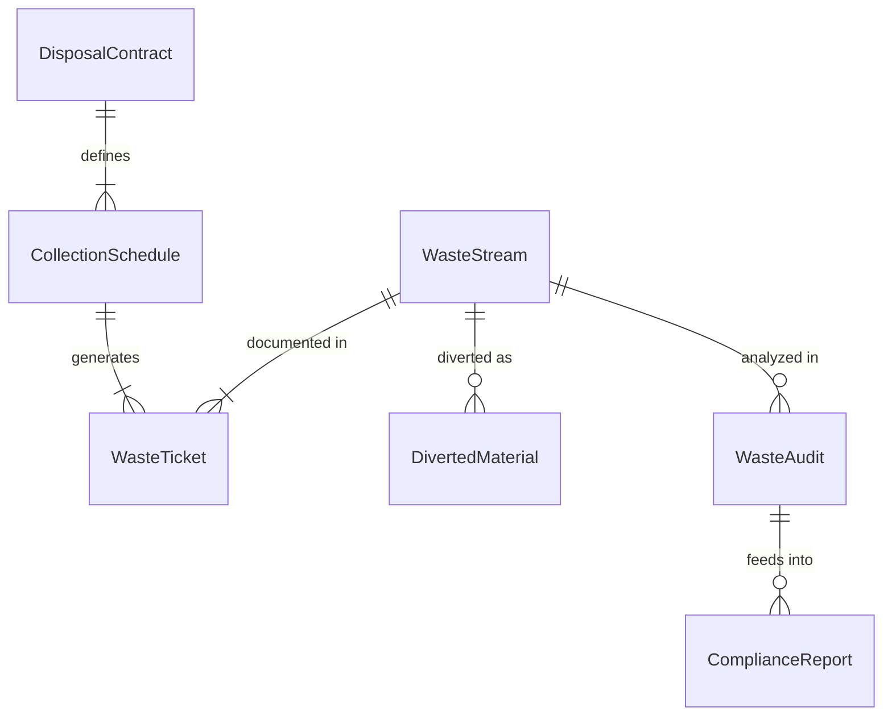
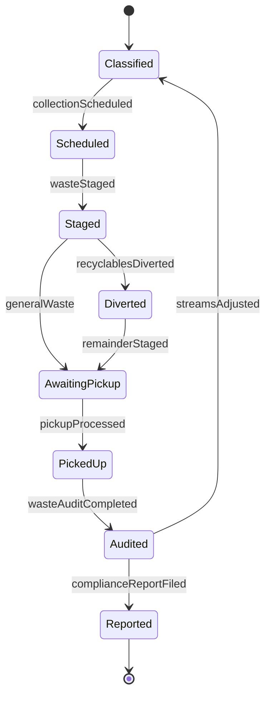
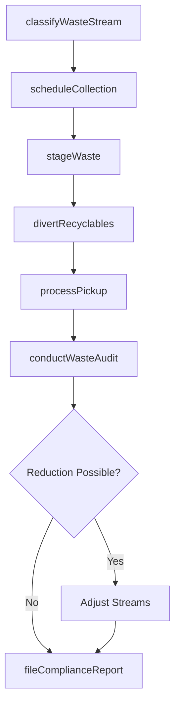
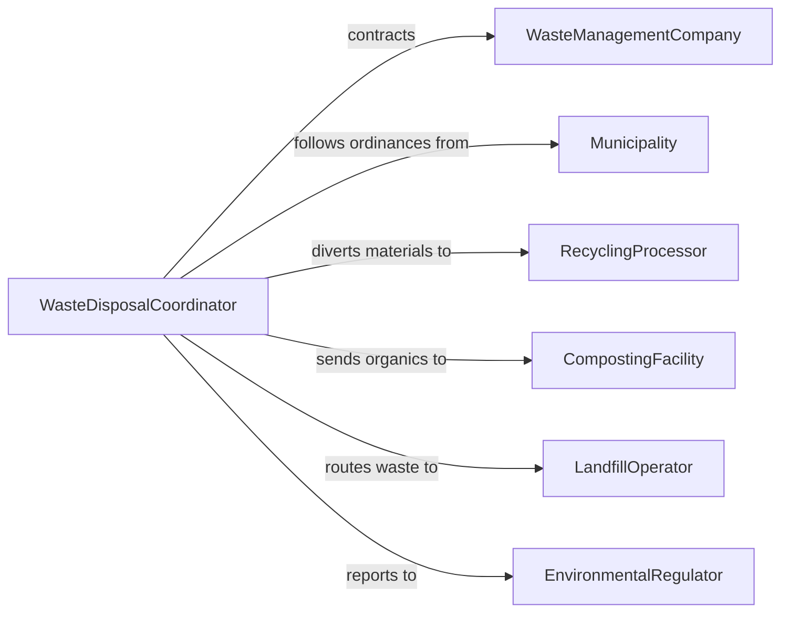

# Dispose of Trash or Waste Materials

> Business-as-Code definition for the comprehensive disposal of general trash and waste materials from commercial, industrial, and institutional facilities, including waste stream classification, hauling coordination, and regulatory compliance.

## Overview

Disposing of trash and waste materials involves classifying waste streams, selecting appropriate disposal methods, coordinating pickup services, and maintaining records for environmental compliance. This definition models the end-to-end waste disposition process from generation through final disposal or diversion, covering landfill routing, recycling separation, composting options, and waste reduction reporting required by local and state ordinances.

## Actors

| Actor | Description |
|-------|-------------|
| WasteManagementCompany | Provides commercial collection, transport, and disposal services |
| Municipality | Sets waste disposal ordinances, recycling mandates, and collection zones |
| RecyclingProcessor | Accepts and processes separated recyclable materials |
| CompostingFacility | Receives organic waste for composting and soil amendment |
| LandfillOperator | Operates permitted landfill sites for non-divertible waste |
| EnvironmentalRegulator | Enforces waste reduction targets and disposal standards |

## Roles

| Role | Description |
|------|-------------|
| WasteDisposalCoordinator | Manages waste contracts, schedules, and compliance reporting |
| Custodian | Collects and sorts waste from interior spaces to staging areas |
| DockAttendant | Manages loading dock waste staging and hauler access |
| SustainabilityOfficer | Tracks diversion rates and drives waste reduction initiatives |

## Entities

| Entity | Description |
|--------|-------------|
| WasteStream | A classified category of waste such as general, recyclable, or organic |
| DisposalContract | An agreement with a waste hauler for scheduled collection services |
| WasteTicket | A per-pickup record documenting volume, weight, and destination |
| DivertedMaterial | Waste routed to recycling or composting instead of landfill |
| ComplianceReport | A periodic filing documenting waste volumes and diversion rates |
| WasteAudit | An assessment of waste composition to identify reduction opportunities |
| CollectionSchedule | A recurring calendar of pickup times and locations |

## Actions

| Action | Description |
|--------|-------------|
| classifyWasteStream | Categorize waste by type, hazard level, and disposal method |
| scheduleCollection | Arrange pickup times and routes with the waste hauler |
| stageWaste | Move sorted waste to the appropriate collection point |
| processPickup | Confirm hauler collection and record volumes |
| divertRecyclables | Route recyclable and compostable materials away from landfill |
| conductWasteAudit | Analyze waste composition to find reduction opportunities |
| fileComplianceReport | Submit waste volume and diversion data to regulators |

## Events

| Event | Description |
|-------|-------------|
| wasteStreamClassified | Waste category and disposal method have been determined |
| collectionScheduled | Pickup time and route have been arranged with the hauler |
| wasteStaged | Sorted waste has been moved to the collection point |
| pickupProcessed | Hauler has collected waste and volumes have been recorded |
| recyclablesDiverted | Recyclable or compostable materials have been routed for recovery |
| wasteAuditCompleted | Waste composition analysis has been finished |
| complianceReportFiled | Waste data has been submitted to the regulatory authority |

## Searches

| Search | Description |
|--------|-------------|
| findScheduledPickups | List upcoming waste collections by facility or date |
| getWasteVolumes | Retrieve waste quantities by stream, period, or facility |
| getDiversionRates | Calculate recycling and composting diversion percentages |
| findAuditFindings | Locate waste reduction opportunities from recent audits |
| getContractStatus | Check active waste disposal contracts and renewal dates |

## Entity Relationships



## State Diagram



## Workflow



## Actor Relationships



## Usage

### Calling Actions

```typescript
import { disposeTrashWasteMaterials } from '@headlessly/dispose-trash-waste-materials'

const disposal = disposeTrashWasteMaterials()

// Classify waste streams for a manufacturing facility
await disposal.classifyWasteStream({
  facilityId: 'PLANT-MIDWEST-3',
  streams: [
    { type: 'general-trash', estimatedVolume: { cubicYards: 20 }, frequency: 'weekly' },
    { type: 'cardboard-recyclable', estimatedVolume: { cubicYards: 8 }, frequency: 'weekly' },
    { type: 'food-organic', estimatedVolume: { cubicYards: 3 }, frequency: 'bi-weekly' }
  ]
})

// Schedule collection and process pickup
await disposal.scheduleCollection({
  facilityId: 'PLANT-MIDWEST-3',
  haulerId: 'WM-REGIONAL-04',
  schedule: { days: ['monday', 'thursday'], timeWindow: '06:00-08:00' }
})

await disposal.processPickup({
  facilityId: 'PLANT-MIDWEST-3',
  date: '2026-02-05',
  volumes: [
    { stream: 'general-trash', cubicYards: 18, destination: 'county-landfill' },
    { stream: 'cardboard-recyclable', cubicYards: 7, destination: 'regional-mrf' }
  ]
})
```

### Event-Driven Automation

```typescript
// Auto-schedule extra pickup when volumes exceed capacity
disposal.pickupProcessed(async ({ facilityId, volumes }) => {
  const totalYards = volumes.reduce((sum, v) => sum + v.cubicYards, 0)
  if (totalYards > 25) {
    await disposal.scheduleCollection({
      facilityId,
      type: 'overflow',
      priority: 'next-available'
    })
  }
})

// File quarterly compliance reports automatically
disposal.wasteAuditCompleted(async ({ facilityId, quarter }) => {
  const rates = await disposal.getDiversionRates({ facilityId, period: quarter })
  await disposal.fileComplianceReport({
    facilityId,
    period: quarter,
    diversionRate: rates.percentage,
    totalVolume: rates.totalCubicYards
  })
})
```
