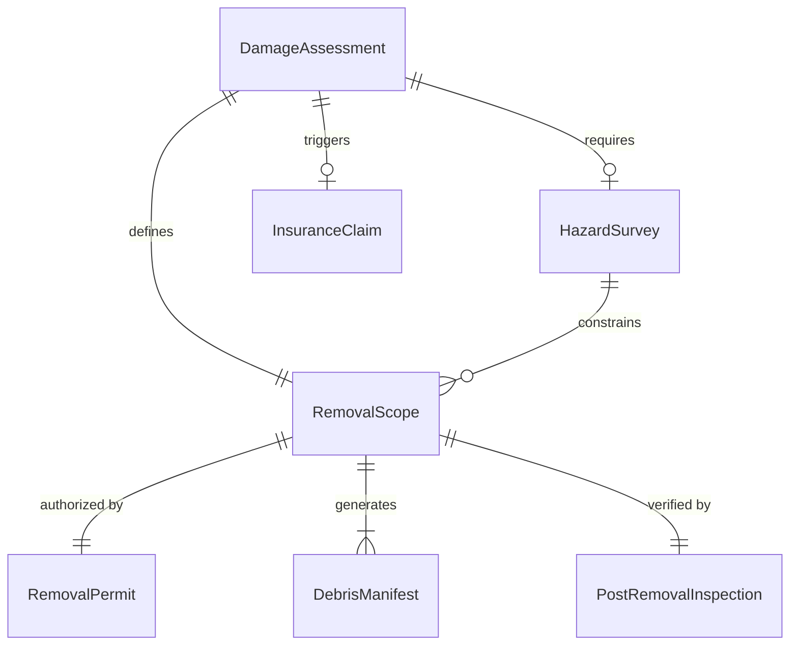
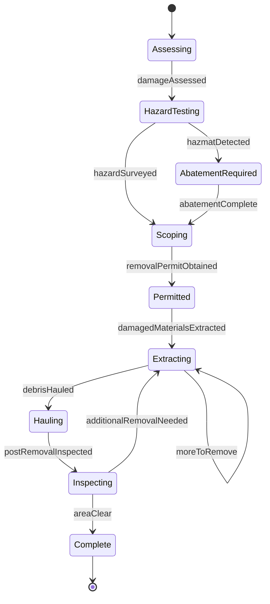
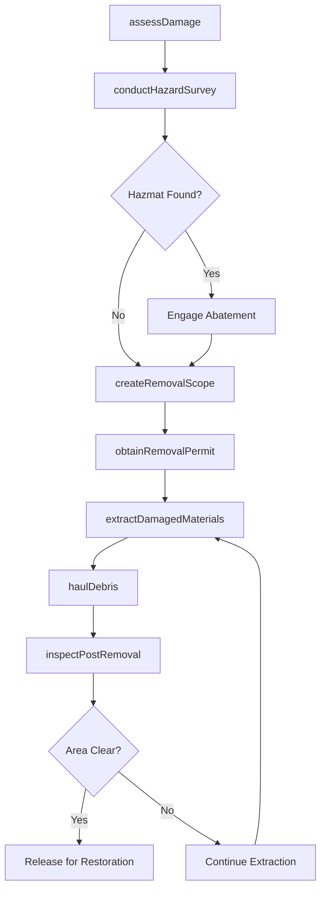
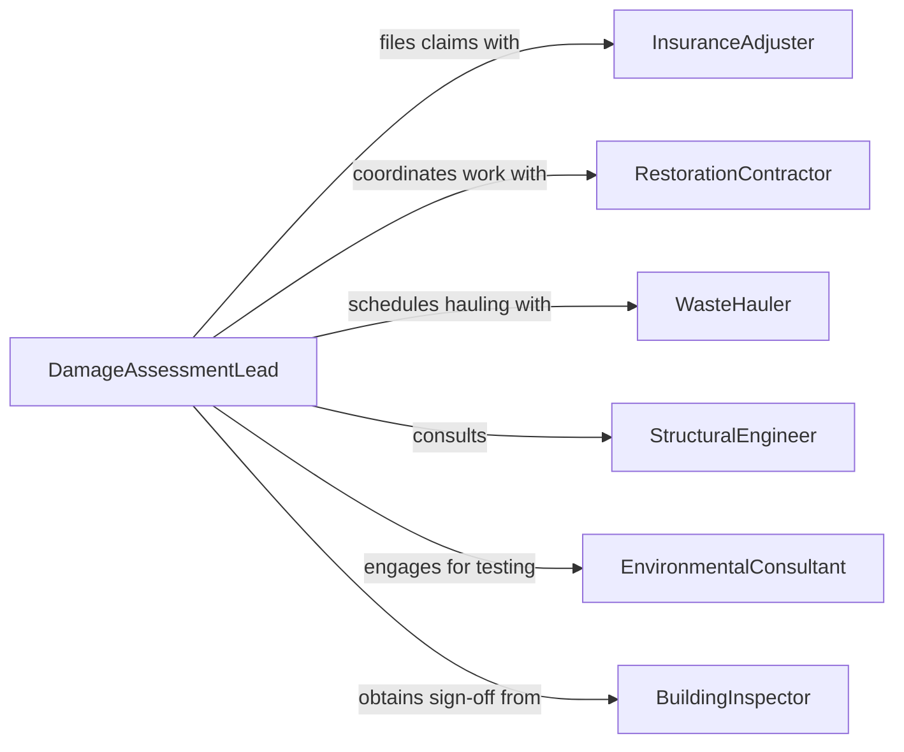

# Remove Debris or Damaged Materials

> Business-as-Code definition for assessing, removing, and disposing of debris and damaged materials from buildings, infrastructure, and facilities following storms, accidents, wear, or renovation activities.

## Overview

Removing debris and damaged materials involves evaluating the scope of damage or accumulation, safely extracting compromised structural elements, furnishings, or equipment, and coordinating disposal or recycling of the removed items. This definition models damage assessment, removal planning, crew mobilization, hazard mitigation during extraction, hauling coordination, and post-removal inspection to restore affected areas to safe, functional condition.

## Actors

| Actor | Description |
|-------|-------------|
| InsuranceAdjuster | Assesses damage claims and approves removal costs |
| RestorationContractor | Provides specialized removal and rebuilding services |
| WasteHauler | Transports removed debris and damaged materials to disposal sites |
| StructuralEngineer | Evaluates structural integrity before and after material removal |
| EnvironmentalConsultant | Tests for asbestos, lead, or mold before demolition or removal |
| BuildingInspector | Verifies the area is safe and code-compliant after removal |

## Roles

| Role | Description |
|------|-------------|
| DamageAssessmentLead | Evaluates the extent of damage and creates the removal scope |
| RemovalForeman | Directs crews in safe extraction of debris and damaged components |
| HazmatTechnician | Handles potentially contaminated materials during removal |
| ProjectCoordinator | Schedules removal phases and coordinates with building occupants |

## Entities

| Entity | Description |
|--------|-------------|
| DamageAssessment | A report documenting the type and extent of material damage |
| RemovalScope | A detailed plan specifying what materials to remove and the sequence |
| HazardSurvey | Testing results for asbestos, lead paint, or mold presence |
| RemovalPermit | Authorization from building authorities to proceed with demolition |
| DebrisManifest | A log of all materials removed, including weight and destination |
| PostRemovalInspection | Verification that the area is structurally sound and clean |
| InsuranceClaim | A filed claim covering the cost of damage remediation |

## Actions

| Action | Description |
|--------|-------------|
| assessDamage | Evaluate the type and extent of debris or material damage |
| conductHazardSurvey | Test for hazardous materials before beginning removal |
| createRemovalScope | Define the sequence and methods for material extraction |
| obtainRemovalPermit | Secure authorization from building authorities |
| extractDamagedMaterials | Physically remove compromised structural or decorative elements |
| haulDebris | Transport removed materials to disposal or recycling facilities |
| inspectPostRemoval | Verify the area is structurally sound and ready for restoration |

## Events

| Event | Description |
|-------|-------------|
| damageAssessed | Damage type and extent have been evaluated |
| hazardSurveyed | Testing for hazardous materials has been completed |
| removalScopeCreated | Extraction plan and sequence have been documented |
| removalPermitObtained | Building authority authorization has been secured |
| damagedMaterialsExtracted | Compromised materials have been physically removed |
| debrisHauled | Removed materials have been transported to their destination |
| postRemovalInspected | Area has been verified as structurally sound and clean |

## Searches

| Search | Description |
|--------|-------------|
| findActiveAssessments | List damage assessments by building, date, or severity |
| getPendingRemovals | Locate approved removal scopes awaiting crew assignment |
| getHazardSurveyResults | Retrieve hazardous material test results by location |
| getDebrisManifests | Pull removal records by project, date, or material type |
| findInsuranceClaims | Locate claims associated with damage removal projects |

## Entity Relationships



## State Diagram



## Workflow



## Actor Relationships



## Usage

### Calling Actions

```typescript
import { removeDebrisDamagedMaterials } from '@headlessly/remove-debris-damaged-materials'

const removal = removeDebrisDamagedMaterials()

// Assess storm damage at a commercial building
const assessment = await removal.assessDamage({
  buildingId: 'RETAIL-CENTER-09',
  cause: 'wind-storm',
  areas: ['roof-section-B', 'storefront-3', 'parking-canopy'],
  damageTypes: ['structural', 'water-intrusion', 'glass-breakage']
})

// Check for hazardous materials before removal
const hazardReport = await removal.conductHazardSurvey({
  buildingId: 'RETAIL-CENTER-09',
  assessmentId: assessment.id,
  tests: ['asbestos-roofing', 'lead-paint', 'mold']
})

// Create scope and extract
const scope = await removal.createRemovalScope({
  assessmentId: assessment.id,
  hazardReportId: hazardReport.id,
  sequence: ['roof-debris', 'broken-glass', 'water-damaged-drywall']
})

await removal.extractDamagedMaterials({
  scopeId: scope.id,
  crewId: 'RESTORATION-CREW-04',
  equipment: ['skid-steer', 'demolition-hammer', 'vacuum-truck']
})

await removal.haulDebris({
  scopeId: scope.id,
  loads: [
    { type: 'roofing-debris', cubicYards: 15, destination: 'construction-landfill' },
    { type: 'glass', cubicYards: 3, destination: 'glass-recycler' }
  ]
})
```

### Event-Driven Automation

```typescript
// Auto-engage abatement contractor when hazmat is found
removal.hazardSurveyed(async ({ buildingId, results }) => {
  const hazards = results.filter(r => r.detected)
  if (hazards.length > 0) {
    await notify({
      to: 'hazmat-coordinator',
      message: `Building ${buildingId} requires abatement for: ${hazards.map(h => h.type).join(', ')}`
    })
  }
})

// File insurance claim when removal is complete
removal.postRemovalInspected(async ({ buildingId, assessmentId }) => {
  const manifests = await removal.getDebrisManifests({ assessmentId })
  const totalCost = manifests.reduce((sum, m) => sum + m.cost, 0)
  await notify({
    to: 'insurance-coordinator',
    message: `Building ${buildingId} removal complete - total removal cost: $${totalCost}`
  })
})
```
