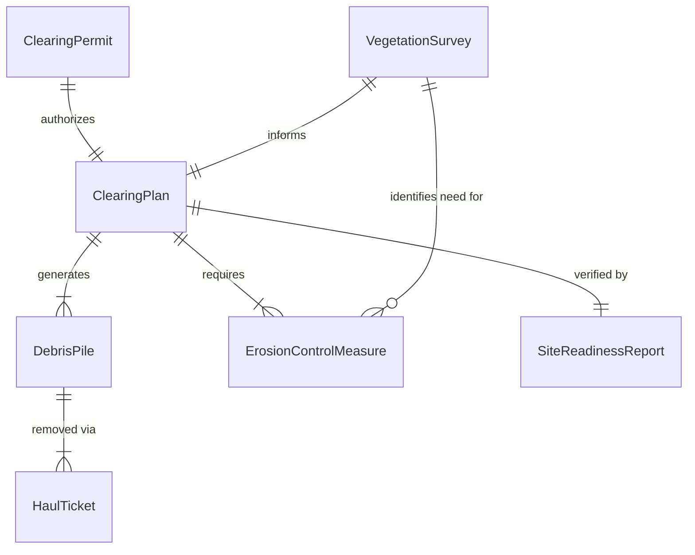
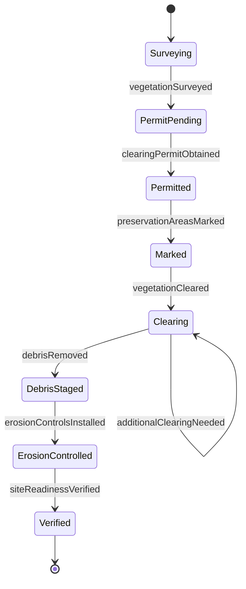
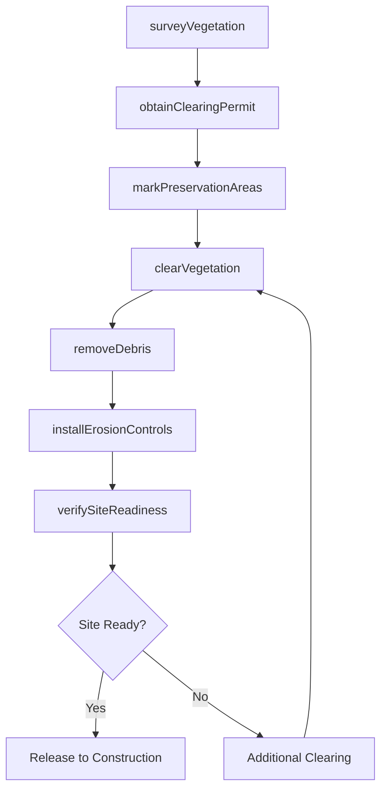
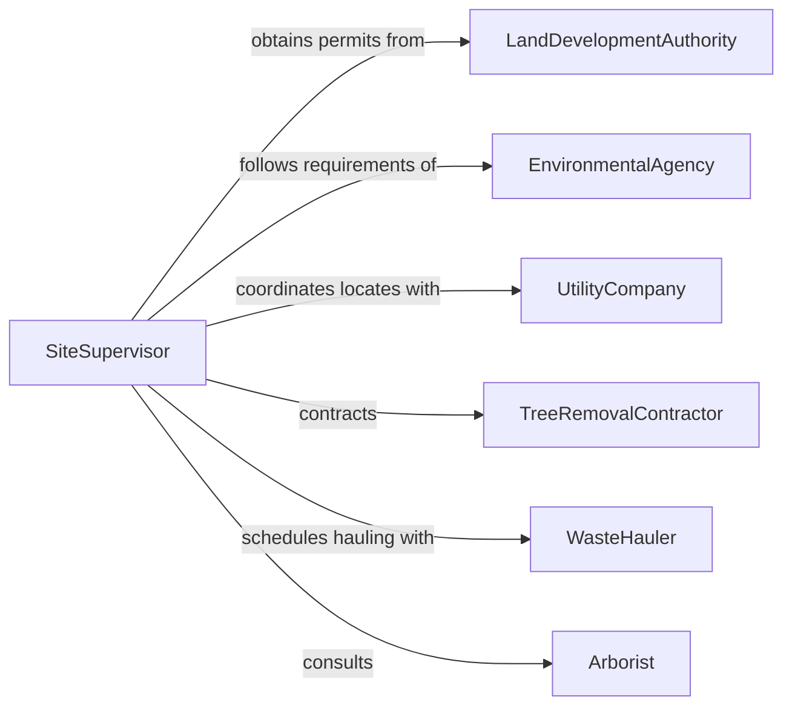

# Remove Debris or Vegetation from Work Sites

> Business-as-Code definition for clearing debris, brush, trees, and unwanted vegetation from construction, utility, and industrial work sites to enable safe operations and site access.

## Overview

Removing debris and vegetation from work sites involves land clearing, brush cutting, stump removal, and general site cleanup before, during, and after construction or maintenance activities. This definition models site assessment, vegetation management planning, clearing crew coordination, debris hauling, erosion control compliance, and site readiness verification to maintain productive and safe work environments.

## Actors

| Actor | Description |
|-------|-------------|
| LandDevelopmentAuthority | Issues clearing permits and enforces land-use regulations |
| EnvironmentalAgency | Oversees protected species, wetlands, and erosion control requirements |
| UtilityCompany | Identifies underground and overhead utility locations before clearing |
| TreeRemovalContractor | Provides specialized tree felling and stump grinding services |
| WasteHauler | Transports cleared debris to composting, chipping, or disposal facilities |
| Arborist | Assesses tree health and recommends preservation or removal |

## Roles

| Role | Description |
|------|-------------|
| SiteSupervisor | Oversees clearing operations and coordinates with project schedules |
| ClearingCrewLead | Directs laborers in vegetation cutting, debris collection, and staging |
| EquipmentOperator | Runs bulldozers, brush cutters, chippers, and excavators |
| EnvironmentalComplianceOfficer | Ensures erosion control and habitat protection measures are followed |

## Entities

| Entity | Description |
|--------|-------------|
| ClearingPermit | Authorization to remove vegetation from a designated area |
| VegetationSurvey | An inventory of trees, brush, and ground cover on the site |
| ClearingPlan | A document specifying what to remove, preserve, and how to manage erosion |
| DebrisPile | A staging area for cut vegetation and site debris awaiting removal |
| ErosionControlMeasure | Silt fences, hay bales, or blankets installed to prevent runoff |
| HaulTicket | A record of debris loads transported from the site |
| SiteReadinessReport | Verification that the cleared area meets project requirements |

## Actions

| Action | Description |
|--------|-------------|
| surveyVegetation | Inventory existing trees, brush, and ground cover on the site |
| obtainClearingPermit | Secure regulatory approval for vegetation removal |
| markPreservationAreas | Flag trees and habitat zones that must not be disturbed |
| clearVegetation | Cut, chip, or uproot unwanted vegetation from the work area |
| removeDebris | Collect and stage cleared materials for hauling |
| installErosionControls | Place silt fences and erosion blankets on exposed soil |
| verifySiteReadiness | Confirm the cleared site meets construction or operational standards |

## Events

| Event | Description |
|-------|-------------|
| vegetationSurveyed | Site vegetation inventory has been completed |
| clearingPermitObtained | Regulatory approval for clearing has been secured |
| preservationAreasMarked | Protected zones have been flagged on the site |
| vegetationCleared | Unwanted vegetation has been cut and removed |
| debrisRemoved | Cleared materials have been hauled from the site |
| erosionControlsInstalled | Runoff prevention measures have been placed |
| siteReadinessVerified | Cleared area confirmed ready for the next phase of work |

## Searches

| Search | Description |
|--------|-------------|
| findPendingClearingOrders | List sites with approved clearing permits awaiting action |
| getVegetationSurveys | Retrieve vegetation inventories by site or date |
| findPreservationConflicts | Locate areas where clearing plans overlap protected zones |
| getHaulHistory | Pull hauling records by site, date, or debris type |
| getSiteReadinessStatus | Check clearance verification status for active sites |

## Entity Relationships



## State Diagram



## Workflow



## Actor Relationships



## Usage

### Calling Actions

```typescript
import { removeDebrisVegetationWorkSites } from '@headlessly/remove-debris-vegetation-work-sites'

const clearing = removeDebrisVegetationWorkSites()

// Survey vegetation on a pipeline right-of-way
const survey = await clearing.surveyVegetation({
  siteId: 'ROW-PIPELINE-22',
  acreage: 15,
  types: ['hardwood-trees', 'brush', 'invasive-vines']
})

// Obtain permit and mark preservation areas
const permit = await clearing.obtainClearingPermit({
  siteId: 'ROW-PIPELINE-22',
  surveyId: survey.id,
  authority: 'county-land-development'
})

await clearing.markPreservationAreas({
  siteId: 'ROW-PIPELINE-22',
  zones: [
    { type: 'wetland-buffer', boundaryMarkers: ['WB-01', 'WB-02'] },
    { type: 'heritage-tree', treeIds: ['OAK-144', 'OAK-167'] }
  ]
})

// Clear and haul
await clearing.clearVegetation({
  siteId: 'ROW-PIPELINE-22',
  permitId: permit.id,
  equipment: ['brush-cutter', 'excavator', 'chipper']
})

await clearing.removeDebris({
  siteId: 'ROW-PIPELINE-22',
  destination: 'county-composting-facility'
})
```

### Event-Driven Automation

```typescript
// Install erosion controls immediately after clearing
clearing.vegetationCleared(async ({ siteId, acreage }) => {
  await clearing.installErosionControls({
    siteId,
    measures: ['silt-fence', 'erosion-blanket'],
    linearFeet: acreage * 200
  })
})

// Notify project manager when site is ready
clearing.siteReadinessVerified(async ({ siteId }) => {
  await notify({
    to: 'project-manager',
    message: `Site ${siteId} cleared and ready for construction mobilization`
  })
})
```
