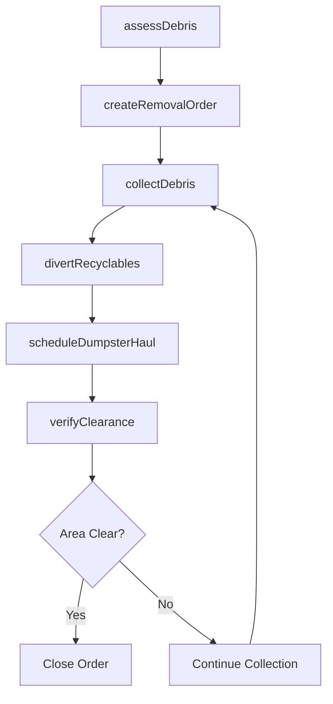
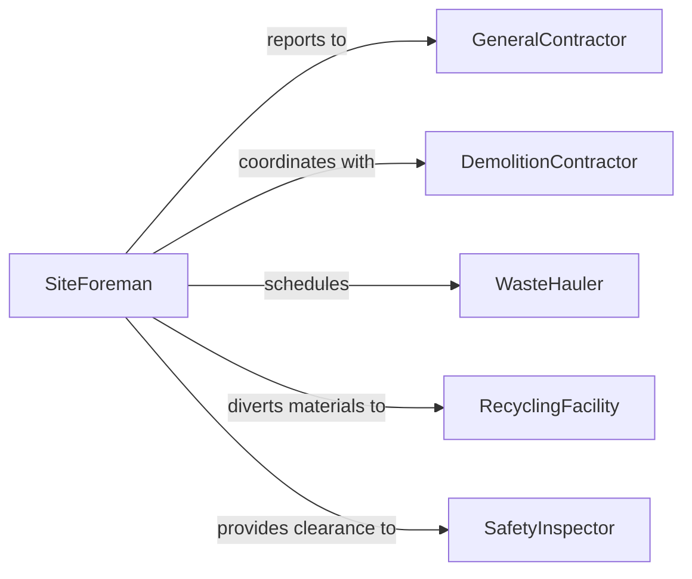

# Remove Debris from Work Sites

> Business-as-Code definition for removing construction, demolition, and operational debris from active work sites to maintain safety and enable continued operations.

## Overview

Work site debris removal involves the collection, sorting, and hauling of scrap materials, broken components, packaging waste, and other refuse generated during construction, renovation, or industrial operations. This definition models debris assessment, removal crew coordination, waste stream segregation for recycling and disposal, and site clearance verification.

## Actors

| Actor | Description |
|-------|-------------|
| GeneralContractor | Manages overall site operations and debris expectations |
| DemolitionContractor | Generates significant debris during teardown activities |
| WasteHauler | Provides dumpsters and hauls debris to disposal sites |
| RecyclingFacility | Accepts sorted recyclable materials from the site |
| SafetyInspector | Verifies debris removal meets site safety standards |

## Roles

| Role | Description |
|------|-------------|
| SiteForeman | Coordinates debris removal with active work schedules |
| CleanupCrewLead | Directs laborers in debris collection and sorting |
| Laborer | Performs physical debris collection and loading |
| WasteCoordinator | Manages dumpster placement and hauling schedules |

## Entities

| Entity | Description |
|--------|-------------|
| DebrisType | A category of waste such as wood, metal, concrete, or mixed |
| RemovalOrder | A request to clear debris from a specified area |
| Dumpster | A container placed on site for debris collection |
| HaulTicket | A record of debris removed and delivered to disposal |
| RecyclingManifest | Documentation of materials diverted to recycling |
| SiteClearance | Verification that an area is free of debris |

## Actions

| Action | Description |
|--------|-------------|
| assessDebris | Evaluate the type and volume of debris present |
| createRemovalOrder | Request debris clearing for a specific site area |
| collectDebris | Gather and sort debris into appropriate containers |
| scheduleDumpsterHaul | Arrange pickup of filled dumpsters |
| divertRecyclables | Separate recyclable materials from general waste |
| verifyClearance | Confirm the work area is clear of all debris |

## Events

| Event | Description |
|-------|-------------|
| debrisAssessed | Type and volume of site debris has been evaluated |
| removalOrderCreated | A debris clearing request has been submitted |
| debrisCollected | Debris has been gathered and sorted into containers |
| dumpsterHauled | A filled dumpster has been picked up from the site |
| recyclablesDiverted | Recyclable materials have been separated and documented |
| clearanceVerified | Work area confirmed free of debris |

## Searches

| Search | Description |
|--------|-------------|
| findOpenOrders | List debris removal orders by status or area |
| getDumpsterStatus | Check fill level and pickup schedule for site dumpsters |
| getHaulHistory | Retrieve hauling records by date or debris type |
| getRecyclingRates | Calculate diversion percentages for the project |

## Workflow



## Actor Relationships



## Usage

### Calling Actions

```typescript
import { removeDebrisWorkSites } from '@headlessly/remove-debris-work-sites'

const debris = removeDebrisWorkSites()

// Assess debris at a demolition site
const assessment = await debris.assessDebris({
  siteId: 'DEMO-SITE-14',
  types: ['concrete', 'rebar', 'wood-framing', 'drywall'],
  estimatedVolume: { cubicYards: 120 }
})

// Create removal order and collect
const order = await debris.createRemovalOrder({
  siteId: 'DEMO-SITE-14',
  assessmentId: assessment.id,
  priority: 'same-day'
})

await debris.collectDebris({
  orderId: order.id,
  crewId: 'CLEANUP-03',
  dumpsters: ['DUMP-A', 'DUMP-B']
})

// Divert recyclables and haul
await debris.divertRecyclables({
  orderId: order.id,
  materials: [{ type: 'rebar', weight: 2400, unit: 'lbs' }]
})

await debris.scheduleDumpsterHaul({ dumpsterId: 'DUMP-A' })
```

### Event-Driven Automation

```typescript
// Auto-schedule haul when dumpster is full
debris.debrisCollected(async ({ dumpsterId, fillPercent }) => {
  if (fillPercent >= 90) {
    await debris.scheduleDumpsterHaul({ dumpsterId, priority: 'next-available' })
  }
})

// Report recycling rates to general contractor
debris.recyclablesDiverted(async ({ siteId }) => {
  const rates = await debris.getRecyclingRates({ siteId })
  await notify({
    to: 'general-contractor',
    message: `Site ${siteId} recycling diversion rate: ${rates.percentage}%`
  })
})
```
