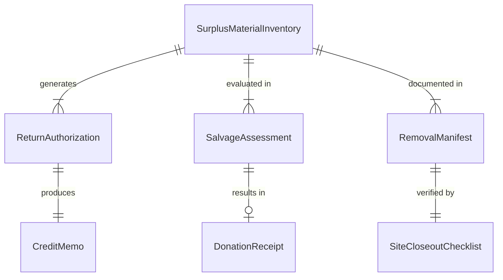
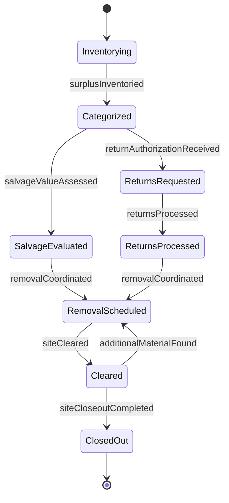
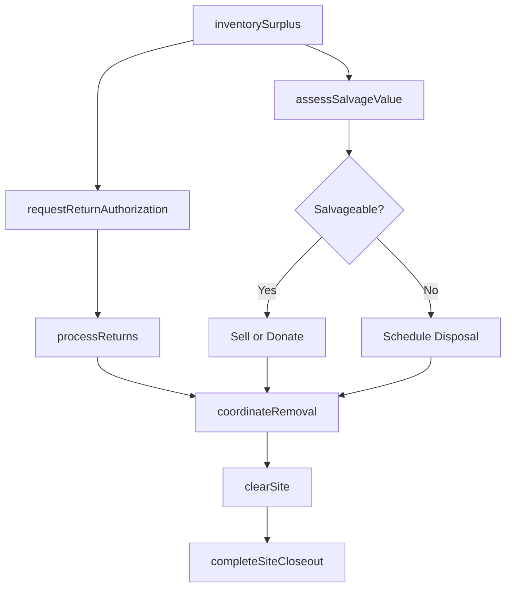
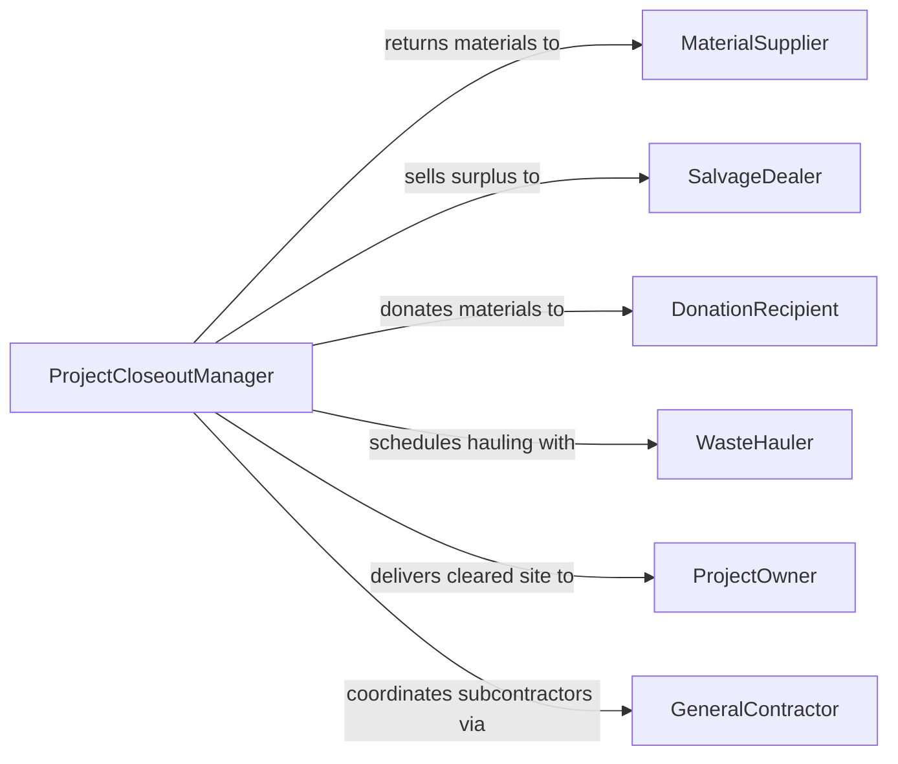

# Remove Excess Materials from Finished Construction Projects

> Business-as-Code definition for identifying, cataloging, and removing surplus construction materials from completed project sites, including return-to-vendor coordination, salvage recovery, and site closeout verification.

## Overview

Removing excess materials from finished construction projects involves inventorying leftover supplies, determining which materials can be returned, resold, donated, or salvaged, and physically clearing the site for final inspection and turnover. This definition models surplus material identification, vendor return authorization, salvage valuation, hauling coordination, and site closeout documentation to recover value from unused materials and meet contract closeout requirements.

## Actors

| Actor | Description |
|-------|-------------|
| MaterialSupplier | Accepts returns of unused or surplus materials under vendor agreements |
| SalvageDealer | Purchases or accepts reusable construction materials for resale |
| DonationRecipient | Accepts donated surplus materials such as Habitat for Humanity ReStores |
| WasteHauler | Transports non-salvageable excess materials to disposal facilities |
| ProjectOwner | Requires site cleared of all materials before final acceptance |
| GeneralContractor | Manages subcontractor material removal obligations |

## Roles

| Role | Description |
|------|-------------|
| ProjectCloseoutManager | Oversees the surplus material removal and site turnover process |
| MaterialCoordinator | Inventories excess materials and coordinates returns and salvage |
| CleanupCrewLead | Directs physical removal and loading of surplus materials |
| CostAccountant | Tracks material return credits and salvage revenue |

## Entities

| Entity | Description |
|--------|-------------|
| SurplusMaterialInventory | A catalog of excess materials remaining on site after construction |
| ReturnAuthorization | Vendor approval to return unused materials for credit |
| SalvageAssessment | An evaluation of salvageable value for surplus materials |
| RemovalManifest | A document listing all materials being removed and their destination |
| SiteCloseoutChecklist | A verification form confirming all materials have been cleared |
| CreditMemo | A financial record of vendor return credits received |
| DonationReceipt | Documentation of materials donated for tax deduction purposes |

## Actions

| Action | Description |
|--------|-------------|
| inventorySurplus | Catalog all excess materials remaining on the finished site |
| requestReturnAuthorization | Submit return requests to suppliers for unused materials |
| assessSalvageValue | Evaluate remaining materials for resale or donation potential |
| coordinateRemoval | Schedule crews and trucks for physical material removal |
| processReturns | Ship materials back to vendors and record credit memos |
| clearSite | Remove all remaining materials and prepare for final inspection |
| completeSiteCloseout | Verify the site is free of all surplus and sign off on closeout |

## Events

| Event | Description |
|-------|-------------|
| surplusInventoried | Excess materials have been cataloged and valued |
| returnAuthorizationReceived | Vendor has approved the return of specific materials |
| salvageValueAssessed | Reuse and donation potential has been evaluated |
| removalCoordinated | Crews and trucks have been scheduled for material removal |
| returnsProcessed | Materials have been shipped back and credits recorded |
| siteCleared | All surplus materials have been removed from the project site |
| siteCloseoutCompleted | Final inspection confirms the site is clear and ready for turnover |

## Searches

| Search | Description |
|--------|-------------|
| findSurplusByProject | List excess materials by project, trade, or material type |
| getPendingReturns | Locate return authorizations awaiting shipment |
| getSalvageOpportunities | Find surplus materials with resale or donation value |
| getCloseoutStatus | Check site closeout progress for active projects |
| getCreditHistory | Retrieve vendor return credits by project or supplier |

## Entity Relationships



## State Diagram



## Workflow



## Actor Relationships



## Usage

### Calling Actions

```typescript
import { removeExcessMaterialsFinishedConstruction } from '@headlessly/remove-excess-materials-finished-construction'

const closeout = removeExcessMaterialsFinishedConstruction()

// Inventory surplus materials on a completed office building
const inventory = await closeout.inventorySurplus({
  projectId: 'OFFICE-BLDG-47',
  trades: ['electrical', 'plumbing', 'drywall', 'flooring'],
  categories: ['cable-spools', 'pipe-fittings', 'sheet-goods', 'tile-boxes']
})

// Request vendor returns for high-value items
await closeout.requestReturnAuthorization({
  projectId: 'OFFICE-BLDG-47',
  items: [
    { material: 'copper-wire-12awg', quantity: 2400, unit: 'ft', supplierId: 'ELEC-SUPPLY-01' },
    { material: 'porcelain-tile-12x24', quantity: 45, unit: 'boxes', supplierId: 'TILE-DIST-03' }
  ]
})

// Assess salvage and clear site
await closeout.assessSalvageValue({
  projectId: 'OFFICE-BLDG-47',
  items: inventory.items.filter(i => !i.returnEligible)
})

await closeout.clearSite({ projectId: 'OFFICE-BLDG-47' })
await closeout.completeSiteCloseout({ projectId: 'OFFICE-BLDG-47' })
```

### Event-Driven Automation

```typescript
// Auto-coordinate removal when all returns are processed
closeout.returnsProcessed(async ({ projectId }) => {
  const pending = await closeout.getPendingReturns({ projectId })
  if (pending.length === 0) {
    await closeout.coordinateRemoval({ projectId, priority: 'standard' })
  }
})

// Notify owner when site is ready for turnover
closeout.siteCloseoutCompleted(async ({ projectId }) => {
  await notify({
    to: 'project-owner',
    message: `Project ${projectId} site cleared - ready for final acceptance walkthrough`
  })
})
```
