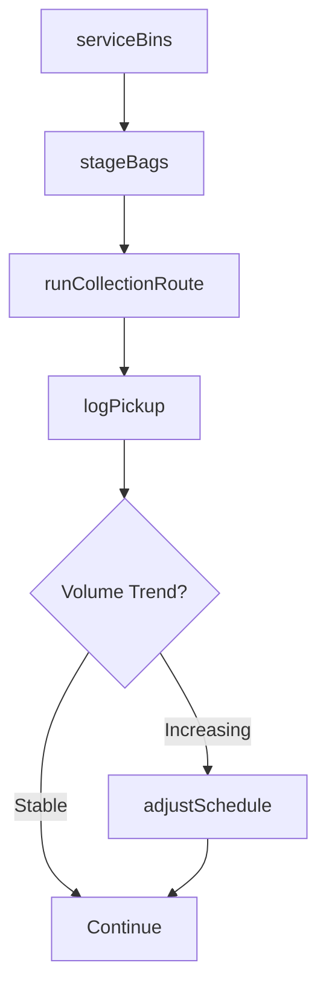
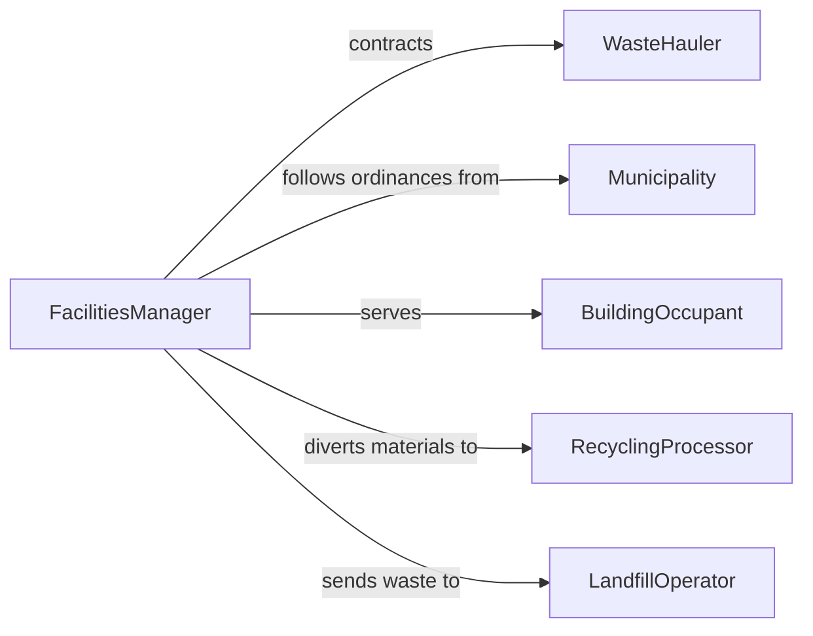

# Remove Trash

> Business-as-Code definition for the routine collection, transport, and disposal of general trash and solid waste from buildings, facilities, and public spaces.

## Overview

Trash removal covers the daily or scheduled collection of general solid waste from offices, retail spaces, residential buildings, and public areas. This definition models waste bin servicing routes, collection scheduling, volume tracking, recycling compliance monitoring, and waste hauler coordination to maintain clean environments and meet municipal waste ordinances.

## Actors

| Actor | Description |
|-------|-------------|
| WasteHauler | Provides commercial trash collection and transport services |
| Municipality | Sets waste collection ordinances and recycling requirements |
| BuildingOccupant | Generates trash and uses designated collection points |
| RecyclingProcessor | Accepts separated recyclable materials |
| LandfillOperator | Receives and processes non-recyclable solid waste |

## Roles

| Role | Description |
|------|-------------|
| FacilitiesManager | Oversees trash removal contracts and schedules |
| Custodian | Services indoor waste bins and transports bags to staging |
| WasteCollectionDriver | Operates collection vehicles along scheduled routes |
| RecyclingCoordinator | Monitors recycling compliance and contamination rates |

## Entities

| Entity | Description |
|--------|-------------|
| WasteBin | A receptacle for trash collection at a specific location |
| CollectionRoute | A scheduled path of bins and dumpsters to be serviced |
| PickupSchedule | A recurring calendar for trash collection services |
| WasteTicket | A record of collection volume, date, and destination |
| ContaminationReport | Documentation of recycling bin contamination issues |
| ServiceContract | An agreement with a waste hauler for collection services |

## Actions

| Action | Description |
|--------|-------------|
| serviceBins | Empty waste bins and replace liners |
| stageBags | Transport collected waste bags to the dumpster or staging area |
| runCollectionRoute | Operate the collection vehicle along the scheduled route |
| logPickup | Record the volume and destination of collected waste |
| reportContamination | Flag recycling bins with non-recyclable contamination |
| adjustSchedule | Modify collection frequency based on volume trends |

## Events

| Event | Description |
|-------|-------------|
| binsServiced | Waste bins have been emptied and relined |
| bagsStaged | Collected waste has been moved to the staging area |
| routeCompleted | Collection vehicle has finished its scheduled route |
| pickupLogged | Collection volume and destination have been recorded |
| contaminationReported | Recycling contamination issue has been flagged |
| scheduleAdjusted | Collection frequency has been modified |

## Searches

| Search | Description |
|--------|-------------|
| findBinsByStatus | List waste bins by fill level or service status |
| getRouteSchedule | Retrieve upcoming collection routes and times |
| getVolumeHistory | Pull waste collection volumes over a date range |
| findContaminationIssues | Locate bins with reported recycling contamination |

## Workflow



## Actor Relationships



## Usage

### Calling Actions

```typescript
import { removeTrash } from '@headlessly/remove-trash'

const trash = removeTrash()

// Service office floor bins
await trash.serviceBins({
  buildingId: 'OFFICE-TOWER-1',
  floor: 3,
  custodianId: 'CUST-011',
  binCount: 24
})

// Stage and log collection
await trash.stageBags({
  buildingId: 'OFFICE-TOWER-1',
  stagingArea: 'loading-dock',
  bagCount: 12
})

await trash.logPickup({
  routeId: 'ROUTE-DOWNTOWN-A',
  stop: 'OFFICE-TOWER-1',
  volume: { cubicYards: 4 },
  destination: 'county-landfill'
})
```

### Event-Driven Automation

```typescript
// Auto-adjust schedule when volumes spike
trash.pickupLogged(async ({ routeId, volume }) => {
  const history = await trash.getVolumeHistory({ routeId, days: 30 })
  const average = history.reduce((sum, h) => sum + h.volume, 0) / history.length
  if (volume > average * 1.5) {
    await trash.adjustSchedule({ routeId, frequency: 'increase' })
  }
})

// Alert recycling coordinator on contamination
trash.contaminationReported(async ({ binId, contaminant }) => {
  await notify({
    to: 'recycling-coordinator',
    message: `Bin ${binId} contaminated with ${contaminant} - re-education needed`
  })
})
```
