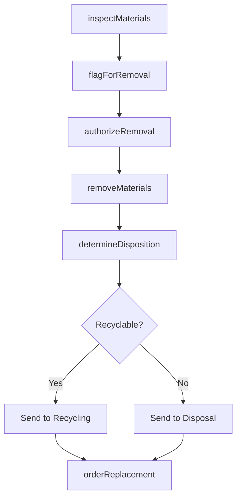
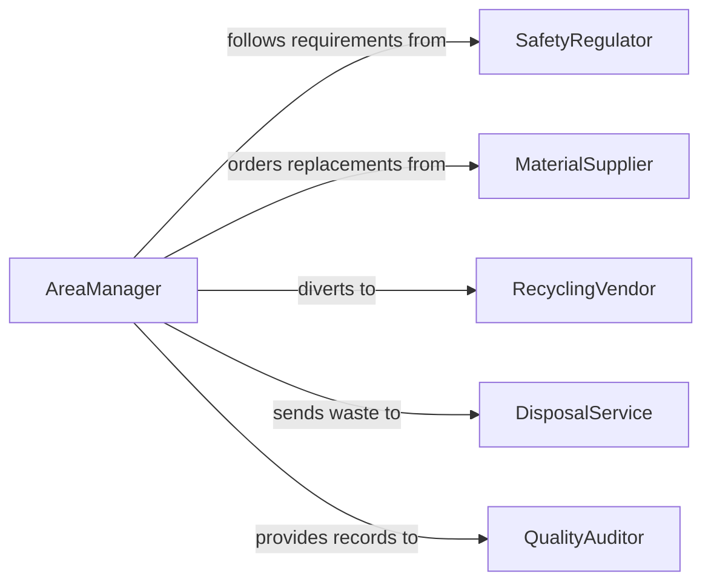

# Remove Worn, Damaged, or Outdated Materials

> Business-as-Code definition for identifying and removing worn, damaged, or obsolete materials from work areas to maintain safety, efficiency, and regulatory compliance.

## Overview

Removing worn, damaged, or outdated materials involves systematic inspection of work areas to identify items past their useful life, followed by safe removal, disposition decisions, and replacement coordination. This definition models the assessment cycle, removal authorization, disposal or recycling routing, and inventory updates needed to keep work areas stocked with current, serviceable materials.

## Actors

| Actor | Description |
|-------|-------------|
| SafetyRegulator | Mandates removal of expired or compromised materials |
| MaterialSupplier | Provides replacement materials for removed items |
| RecyclingVendor | Accepts materials suitable for reclamation or recycling |
| DisposalService | Handles materials not suitable for recycling |
| QualityAuditor | Reviews material condition and replacement practices |

## Roles

| Role | Description |
|------|-------------|
| AreaManager | Authorizes material removal and replacement orders |
| InspectionTechnician | Evaluates materials for wear, damage, or obsolescence |
| RemovalWorker | Physically removes and stages materials for disposition |
| InventorySpecialist | Updates stock records and orders replacements |

## Entities

| Entity | Description |
|--------|-------------|
| MaterialItem | A specific material, product, or component in the work area |
| ConditionReport | An assessment of an item's current state and usability |
| RemovalOrder | An authorization to remove specific items from the area |
| DispositionRecord | Documentation of how a removed item was handled |
| ReplacementOrder | A request to procure a new item to replace what was removed |
| ExpirationTracker | A system for monitoring material shelf life and certifications |

## Actions

| Action | Description |
|--------|-------------|
| inspectMaterials | Evaluate items in work areas for wear, damage, or expiration |
| flagForRemoval | Mark items that need to be removed from the work area |
| authorizeRemoval | Approve the removal of flagged items |
| removeMaterials | Physically take out worn, damaged, or outdated items |
| determineDisposition | Decide whether to recycle, dispose, or return items |
| orderReplacement | Procure new materials to replace removed items |

## Events

| Event | Description |
|-------|-------------|
| materialsInspected | Work area items have been evaluated for condition |
| itemsFlagged | Items have been identified for removal |
| removalAuthorized | Removal of flagged items has been approved |
| materialsRemoved | Worn, damaged, or outdated items have been taken out |
| dispositionDetermined | Handling method for removed items has been decided |
| replacementOrdered | New materials have been procured to fill the gap |

## Searches

| Search | Description |
|--------|-------------|
| findFlaggedItems | List items identified for removal across work areas |
| getExpiringMaterials | Locate items approaching their expiration date |
| getDispositionHistory | Retrieve records of past material removals |
| findPendingReplacements | List replacement orders not yet fulfilled |

## Workflow



## Actor Relationships



## Usage

### Calling Actions

```typescript
import { removeWornDamagedOutdatedMaterials } from '@headlessly/remove-worn-damaged-outdated-materials'

const materials = removeWornDamagedOutdatedMaterials()

// Inspect materials in a manufacturing area
const report = await materials.inspectMaterials({
  areaId: 'ASSEMBLY-LINE-2',
  categories: ['cutting-tools', 'safety-gear', 'calibration-standards']
})

// Flag and authorize removal
const flagged = await materials.flagForRemoval({
  items: [
    { id: 'DRILL-BIT-SET-14', reason: 'excessive-wear' },
    { id: 'HARD-HAT-089', reason: 'expired-certification' },
    { id: 'CAL-STD-005', reason: 'outdated-reference' }
  ]
})

await materials.authorizeRemoval({
  flagId: flagged.id,
  authorizedBy: 'AM-012'
})

// Remove and order replacements
await materials.removeMaterials({ flagId: flagged.id })
await materials.orderReplacement({
  items: ['drill-bit-set', 'hard-hat', 'calibration-standard'],
  supplierId: 'SUPPLIER-MAIN'
})
```

### Event-Driven Automation

```typescript
// Auto-flag expiring materials
materials.materialsInspected(async ({ areaId }) => {
  const expiring = await materials.getExpiringMaterials({
    areaId,
    withinDays: 30
  })
  for (const item of expiring) {
    await materials.flagForRemoval({
      items: [{ id: item.id, reason: 'approaching-expiration' }]
    })
  }
})

// Auto-order replacements when materials are removed
materials.materialsRemoved(async ({ items }) => {
  for (const item of items) {
    await materials.orderReplacement({
      items: [item.type],
      priority: item.critical ? 'expedite' : 'standard'
    })
  }
})
```
