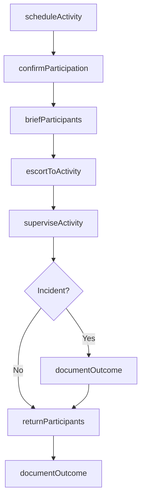
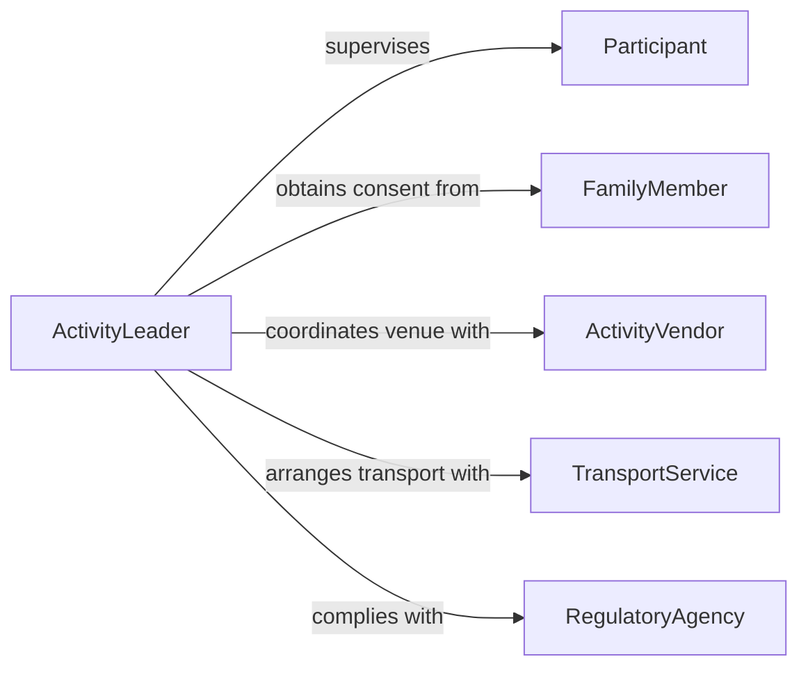

# Accompany Individuals Groups Activities

> Business-as-Code definition for accompanying individuals or groups to activities. Models the scheduling, participant coordination, supervision, and activity completion workflow.

## Overview

Accompanying individuals or groups to activities involves coordinating logistics, ensuring participant safety, and providing guidance during recreational, educational, or therapeutic outings. This definition exposes actions for planning activity schedules, confirming participant readiness, supervising during activities, and documenting outcomes for program reporting and compliance.

## Actors

| Actor | Description |
|-------|-------------|
| Participant | The individual or group member being accompanied to the activity |
| FamilyMember | A guardian or relative who authorizes participation |
| ActivityVendor | The organization providing the activity or venue |
| TransportService | Supplies vehicles for group transportation to activity sites |
| RegulatoryAgency | Enforces safety and supervision ratio requirements |

## Roles

| Role | Description |
|------|-------------|
| ActivityLeader | Accompanies participants and provides direct supervision |
| ProgramCoordinator | Plans activity schedules and manages logistics |
| SafetyOfficer | Monitors compliance with safety protocols during activities |
| CaseManager | Tracks participation outcomes for individual care plans |

## Entities

| Entity | Description |
|--------|-------------|
| ActivitySchedule | A planned outing with date, time, location, and participant list |
| ParticipantProfile | Information about an individual including needs, restrictions, and consent |
| ConsentForm | Written authorization from a guardian or participant for the activity |
| SupervisionLog | A record of attendance, observations, and any incidents during the activity |
| IncidentReport | Documentation of any safety concerns or unusual events |
| ActivityReport | A summary of the outing including outcomes and recommendations |

## Actions

| Action | Description |
|--------|-------------|
| scheduleActivity | Create a planned outing with logistics and participant roster |
| confirmParticipation | Verify consent forms and participant readiness |
| briefParticipants | Provide safety instructions and activity expectations |
| escortToActivity | Accompany the group from the origin location to the activity site |
| superviseActivity | Monitor participants during the activity for safety and engagement |
| documentOutcome | Record attendance, observations, and activity results |
| returnParticipants | Escort the group back to the origin location after the activity |

## Events

| Event | Description |
|-------|-------------|
| activityScheduled | A new outing has been planned and published |
| participationConfirmed | Consent and readiness have been verified for all participants |
| participantsBriefed | Safety instructions have been delivered to the group |
| groupDeparted | The group has left the origin location for the activity |
| activityCompleted | The planned activity has been carried out |
| outcomeDocumented | Attendance and observations have been recorded |
| participantsReturned | The group has been escorted back to the origin location |

## Searches

| Search | Description |
|--------|-------------|
| findActivities | List scheduled activities by date, type, or participant group |
| getParticipantHistory | Retrieve past activity participation for an individual |
| findConsentStatus | Check consent form status for participants in an upcoming activity |
| getIncidentReports | Search incident reports by activity, date, or participant |

## Workflow



## Actor Relationships



## Usage

### Calling Actions

```typescript
import { accompanyIndividualsGroupsActivities } from '@headlessly/accompany-individuals-groups-activities'

const activities = accompanyIndividualsGroupsActivities()

// Schedule a community recreation outing
const outing = await activities.scheduleActivity({
  name: 'Community Pool Visit',
  location: 'Westside Aquatic Center',
  date: '2026-06-15',
  startTime: '10:00',
  duration: 120, // minutes
  participantIds: ['P-101', 'P-102', 'P-103', 'P-104']
})

// Confirm all participants have consent
await activities.confirmParticipation({ activityId: outing.id })

// Brief and escort group
await activities.briefParticipants({
  activityId: outing.id,
  safetyTopics: ['water safety', 'buddy system', 'emergency exits']
})

await activities.escortToActivity({ activityId: outing.id })
await activities.superviseActivity({ activityId: outing.id })
await activities.returnParticipants({ activityId: outing.id })
```

### Event-Driven Automation

```typescript
// Remind families about upcoming activities
activities.activityScheduled(async ({ activityId, participantIds, date }) => {
  for (const participantId of participantIds) {
    const profile = await getParticipant(participantId)
    await sendReminder({
      to: profile.guardianEmail,
      message: `${profile.name} has an upcoming activity on ${date}. Please confirm consent.`
    })
  }
})

// Flag missing consent forms before departure
activities.participationConfirmed(async ({ activityId, missingConsent }) => {
  if (missingConsent.length > 0) {
    await notify({
      to: 'program-coordinator',
      message: `Activity ${activityId} has ${missingConsent.length} participants without signed consent forms.`
    })
  }
})
```
