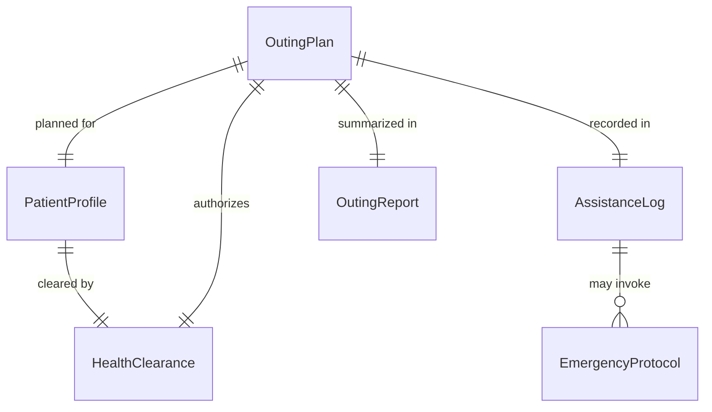
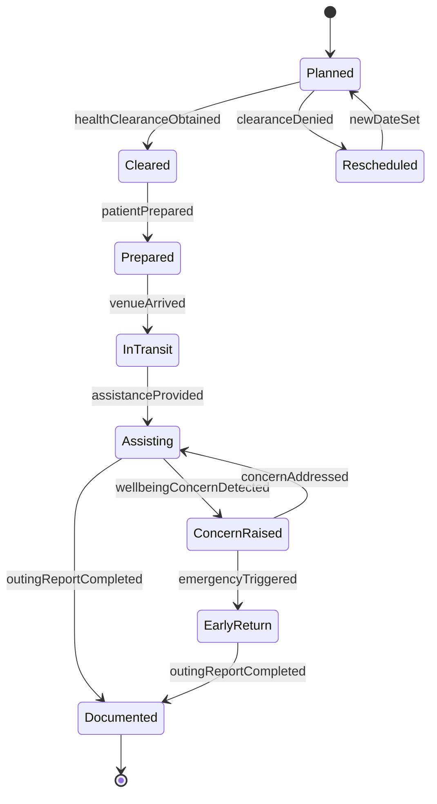
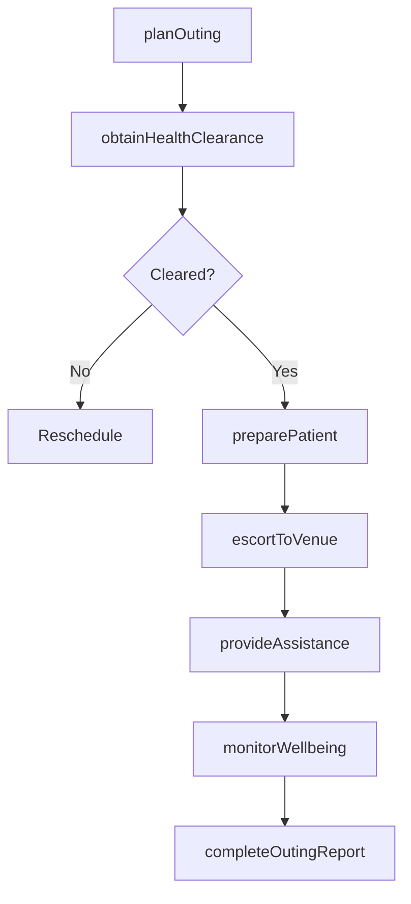
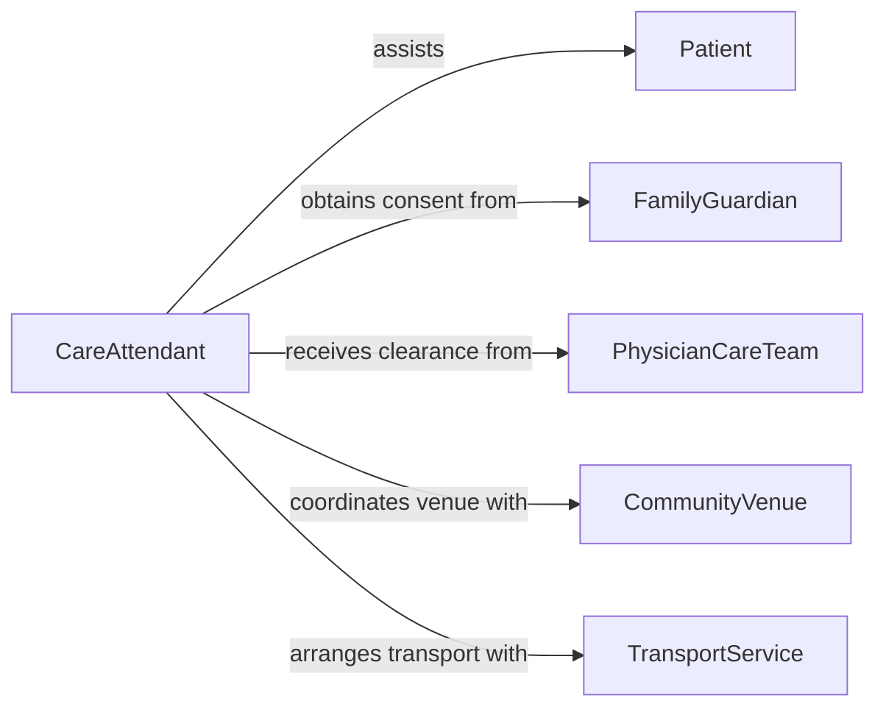

# Accompany Patients Clients Outings Provide

> Business-as-Code definition for accompanying patients or clients on outings to provide assistance. Models the outing planning, health screening, supervision, and care documentation workflow.

## Overview

Accompanying patients or clients on outings involves planning therapeutic or recreational excursions, assessing patient readiness, providing physical and emotional support during the outing, and documenting observations for care teams. This definition exposes actions for outing authorization, pre-departure health checks, real-time assistance during activities, and post-outing reporting to support ongoing treatment plans.

## Actors

| Actor | Description |
|-------|-------------|
| Patient | The individual receiving assistance during the outing |
| FamilyGuardian | A relative or legal guardian who authorizes the outing |
| PhysicianCareTeam | The medical team that clears the patient for outings |
| CommunityVenue | The destination providing the recreational or therapeutic activity |
| TransportService | Provides accessible vehicles for patient transportation |

## Roles

| Role | Description |
|------|-------------|
| CareAttendant | Accompanies the patient and provides hands-on assistance |
| ChargeNurse | Authorizes outings based on patient health status |
| ActivitiesDirector | Plans and schedules therapeutic outings for patients |
| SocialWorker | Coordinates community integration goals with outing plans |

## Entities

| Entity | Description |
|--------|-------------|
| OutingPlan | A scheduled excursion with destination, duration, and participant details |
| PatientProfile | Health status, mobility needs, and behavioral considerations for the individual |
| HealthClearance | A medical authorization confirming the patient is fit for the outing |
| AssistanceLog | A record of support provided during the outing including mobility and medication |
| OutingReport | A post-outing summary documenting observations and patient responses |
| EmergencyProtocol | Procedures for handling medical or behavioral emergencies during the outing |

## Actions

| Action | Description |
|--------|-------------|
| planOuting | Create a scheduled excursion with destination and participant needs |
| obtainHealthClearance | Confirm with the care team that the patient is medically cleared |
| preparePatient | Assist the patient with dressing, mobility aids, and medication packing |
| escortToVenue | Accompany the patient from the care facility to the activity location |
| provideAssistance | Deliver hands-on support during the outing as needed |
| monitorWellbeing | Observe the patient for signs of fatigue, distress, or medical concerns |
| completeOutingReport | Document observations, assistance provided, and patient responses |

## Events

| Event | Description |
|-------|-------------|
| outingPlanned | A new therapeutic or recreational outing has been scheduled |
| healthClearanceObtained | The patient has been medically cleared for the outing |
| patientPrepared | The patient is dressed, has medications, and is ready to depart |
| venueArrived | The patient has arrived at the activity destination |
| assistanceProvided | Hands-on support has been delivered during the activity |
| wellbeingConcernDetected | A health or behavioral concern has been observed |
| outingReportCompleted | Post-outing documentation has been finalized |

## Searches

| Search | Description |
|--------|-------------|
| findOutingPlans | List scheduled outings by patient, date, or destination |
| getHealthClearances | Retrieve medical clearance status for upcoming outings |
| getOutingHistory | Look up past outings and reports for a specific patient |
| findWellbeingAlerts | Search for flagged health or behavioral concerns from outings |

## Entity Relationships



## State Diagram



## Workflow



## Actor Relationships



## Usage

### Calling Actions

```typescript
import { accompanyPatientsClientsOutingsProvide } from '@headlessly/accompany-patients-clients-outings-provide'

const outings = accompanyPatientsClientsOutingsProvide()

// Plan a therapeutic community outing
const plan = await outings.planOuting({
  patientId: 'PT-2024-0219',
  destination: 'Riverside Botanical Garden',
  date: '2026-04-20',
  startTime: '10:00',
  duration: 150, // minutes
  mobilityNeeds: 'wheelchair',
  medicationSchedule: [{ medication: 'Metformin', time: '12:00' }]
})

// Obtain health clearance and prepare
await outings.obtainHealthClearance({ outingId: plan.id })
await outings.preparePatient({
  outingId: plan.id,
  checklist: ['wheelchair charged', 'medications packed', 'weather-appropriate clothing']
})

// Execute the outing
await outings.escortToVenue({ outingId: plan.id })
await outings.provideAssistance({ outingId: plan.id, type: 'mobility-and-navigation' })
await outings.monitorWellbeing({ outingId: plan.id })
await outings.completeOutingReport({
  outingId: plan.id,
  mood: 'positive',
  observations: 'Patient engaged well with garden exhibits. No health concerns.'
})
```

### Event-Driven Automation

```typescript
// Alert charge nurse when a wellbeing concern is detected
outings.wellbeingConcernDetected(async ({ outingId, patientId, concern }) => {
  await notify({
    to: 'charge-nurse',
    message: `Wellbeing concern for patient ${patientId} during outing ${outingId}: ${concern}`,
    priority: 'urgent'
  })
})

// Update care plan with outing outcomes
outings.outingReportCompleted(async ({ outingId, patientId, mood, observations }) => {
  await updateCarePlan({
    patientId,
    entry: {
      type: 'community-outing',
      date: new Date().toISOString(),
      mood,
      observations
    }
  })
})
```
