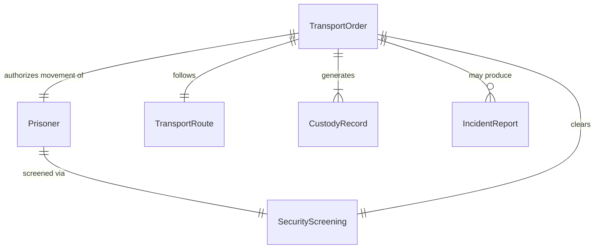
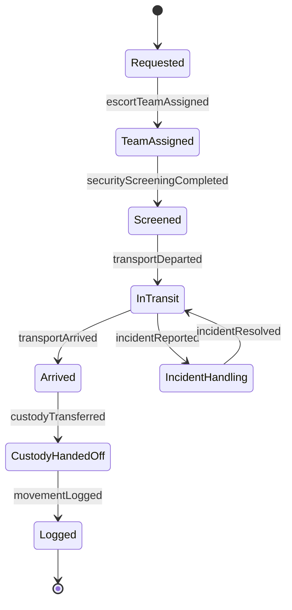
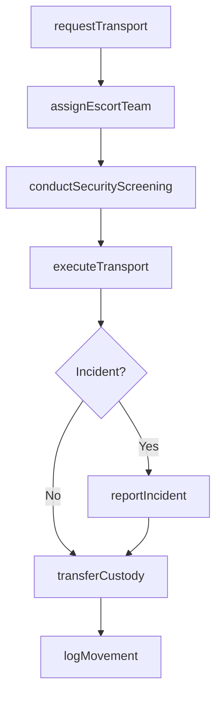
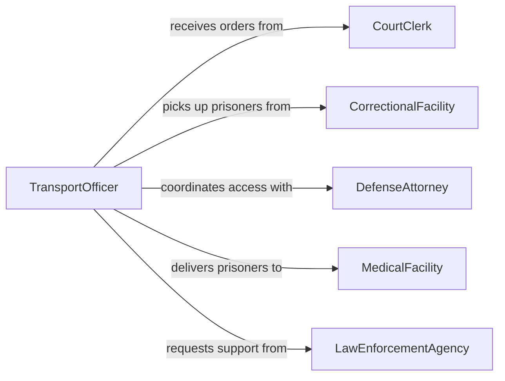

# Escort Prisoners Courtrooms Prisons Facilities

> Business-as-Code definition for escorting prisoners to courtrooms, prisons, and other facilities. Models the transport request, security screening, custody transfer, and movement logging workflow.

## Overview

Prisoner escort involves the secure transport and movement of inmates between correctional facilities, courtrooms, medical facilities, and other designated locations. This definition exposes actions for processing transport requests, conducting pre-transport security checks, executing secure movements, and completing custody transfer documentation while maintaining chain-of-custody integrity throughout.

## Actors

| Actor | Description |
|-------|-------------|
| CourtClerk | Issues transport orders for court appearances |
| CorrectionalFacility | Releases and receives prisoners during transfers |
| DefenseAttorney | Coordinates prisoner availability for legal proceedings |
| MedicalFacility | Receives prisoners for medical treatment or evaluation |
| LawEnforcementAgency | Provides support for high-risk transports |

## Roles

| Role | Description |
|------|-------------|
| TransportOfficer | Physically escorts prisoners during movement |
| ShiftSupervisor | Approves transport requests and assigns escort personnel |
| BookingOfficer | Processes intake and release documentation at each facility |
| ControlRoomOperator | Monitors transport status and coordinates communications |

## Entities

| Entity | Description |
|--------|-------------|
| TransportOrder | An authorized request to move a prisoner between locations |
| Prisoner | The individual being transported under custody |
| CustodyRecord | Documentation tracking who has custody of the prisoner at each point |
| SecurityScreening | Pre-transport search and restraint verification results |
| TransportRoute | The planned path and vehicle assignment for the movement |
| IncidentReport | Documentation of any security events during transport |

## Actions

| Action | Description |
|--------|-------------|
| requestTransport | Submit a transport order for a prisoner movement |
| conductSecurityScreening | Search the prisoner and verify restraints before transport |
| assignEscortTeam | Designate officers and vehicles for the transport detail |
| executeTransport | Physically move the prisoner along the designated route |
| transferCustody | Complete the handoff of custody at the destination facility |
| logMovement | Record all movement details, times, and personnel involved |
| reportIncident | Document any security events or irregularities during transport |

## Events

| Event | Description |
|-------|-------------|
| transportRequested | A transport order has been submitted for processing |
| securityScreeningCompleted | The prisoner has been searched and cleared for transport |
| escortTeamAssigned | Officers and vehicles have been designated for the detail |
| transportDeparted | The prisoner has left the origin facility |
| transportArrived | The prisoner has arrived at the destination |
| custodyTransferred | Custody has been formally handed off to the receiving facility |
| incidentReported | A security event has been documented during transport |

## Searches

| Search | Description |
|--------|-------------|
| findTransportOrders | List transport orders by prisoner, date, destination, or status |
| getCustodyHistory | Retrieve the chain-of-custody log for a specific prisoner |
| findActiveTransports | Locate transports currently in progress |
| getIncidentReports | Search incident reports by transport, date, or severity |

## Entity Relationships



## State Diagram



## Workflow



## Actor Relationships



## Usage

### Calling Actions

```typescript
import { escortPrisonersCourtroomsPrisonsFacilities } from '@headlessly/escort-prisoners-courtrooms-prisons-facilities'

const escorts = escortPrisonersCourtroomsPrisonsFacilities()

// Request a court appearance transport
const order = await escorts.requestTransport({
  prisonerId: 'INM-2024-4481',
  origin: 'County Detention Center',
  destination: 'Superior Court Room 3B',
  scheduledTime: '2026-03-15T08:30:00',
  securityLevel: 'medium'
})

// Assign escort team and conduct screening
await escorts.assignEscortTeam({
  transportOrderId: order.id,
  officers: ['OFF-112', 'OFF-118'],
  vehicle: 'TRANS-VAN-07'
})

await escorts.conductSecurityScreening({ transportOrderId: order.id })
await escorts.executeTransport({ transportOrderId: order.id })
await escorts.transferCustody({
  transportOrderId: order.id,
  receivingOfficer: 'Bailiff Martinez',
  facility: 'Superior Court Room 3B'
})
```

### Event-Driven Automation

```typescript
// Notify court clerk when transport departs
escorts.transportDeparted(async ({ transportOrderId, prisonerId, estimatedArrival }) => {
  await notify({
    to: 'court-clerk',
    message: `Prisoner ${prisonerId} has departed. ETA: ${estimatedArrival}`
  })
})

// Escalate high-severity incidents to shift supervisor
escorts.incidentReported(async ({ transportOrderId, severity, description }) => {
  if (severity === 'high') {
    await escalate({
      to: 'shift-supervisor',
      subject: `Transport incident on order ${transportOrderId}`,
      details: description
    })
  }
})
```
