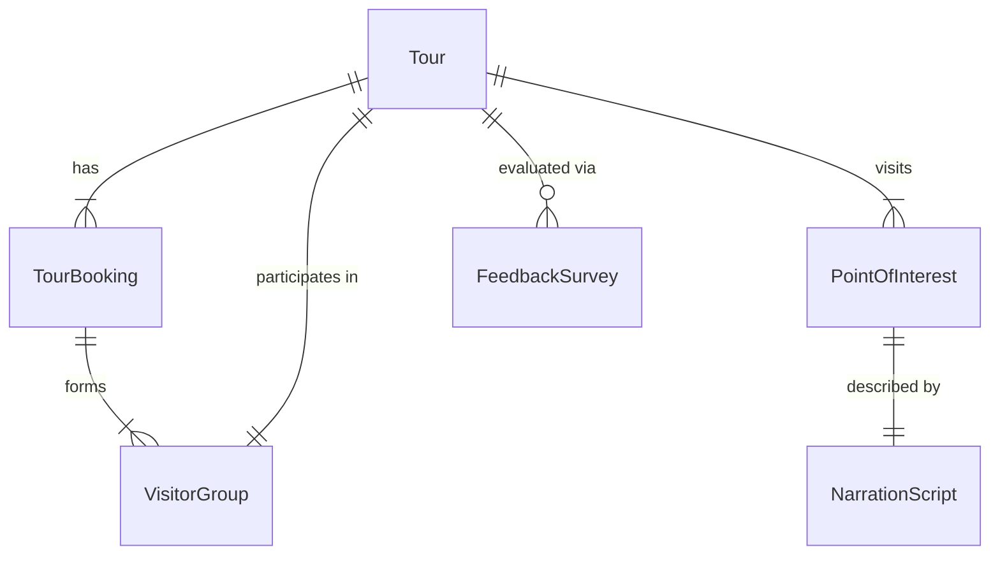
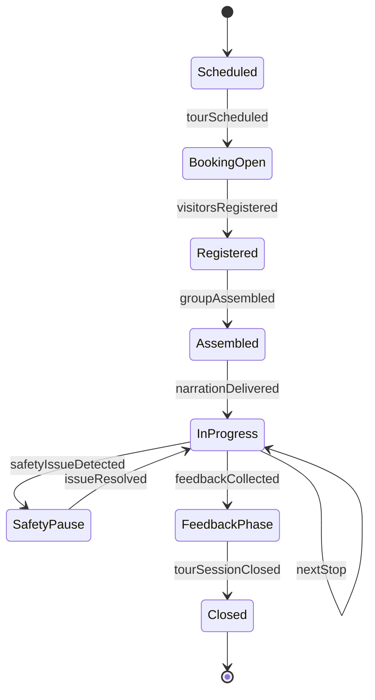
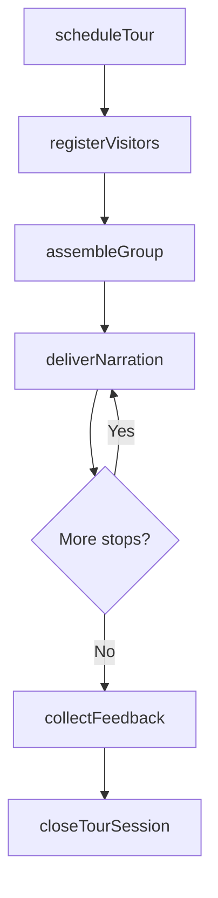
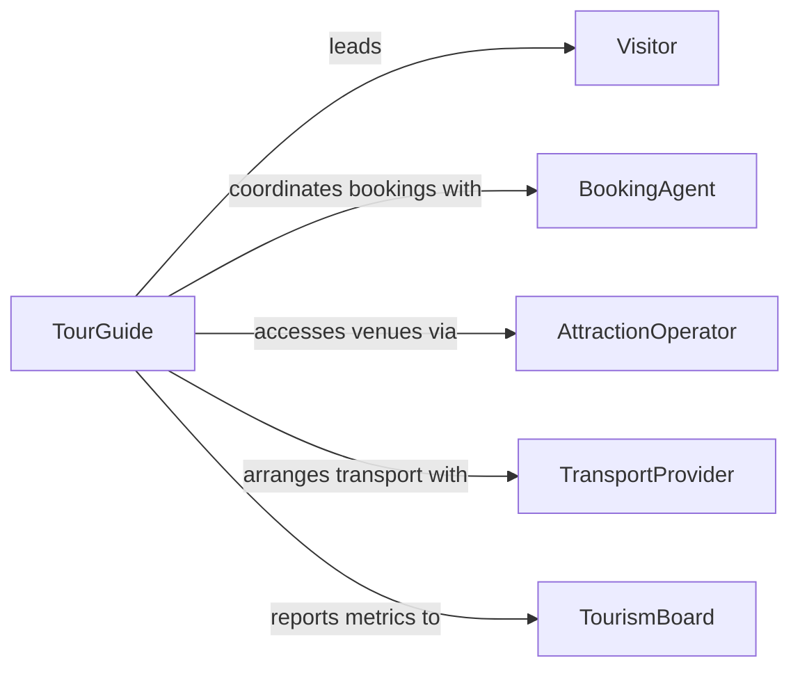

# Guide Patrons Tours

> Business-as-Code definition for guiding patrons on tours. Models the tour scheduling, group management, narration delivery, and visitor feedback workflow.

## Overview

Guiding patrons on tours involves leading individuals or groups through attractions, historical sites, natural areas, or facilities while providing informative commentary and ensuring visitor safety. This definition exposes actions for scheduling tours, managing group sizes, delivering narrated content at points of interest, and collecting visitor feedback to improve tour experiences.

## Actors

| Actor | Description |
|-------|-------------|
| Visitor | The patron or tourist participating in the tour |
| BookingAgent | Processes tour reservations and payments from visitors |
| AttractionOperator | Manages the venue or site where tours take place |
| TransportProvider | Supplies vehicles for multi-stop or long-distance tours |
| TourismBoard | Promotes tours and sets regional tourism standards |

## Roles

| Role | Description |
|------|-------------|
| TourGuide | Leads groups, delivers narration, and ensures visitor safety |
| TourCoordinator | Schedules tours, manages bookings, and assigns guides |
| ContentDeveloper | Creates and updates narration scripts and educational materials |
| GuestRelationsAgent | Handles visitor inquiries, complaints, and special requests |

## Entities

| Entity | Description |
|--------|-------------|
| Tour | A scheduled guided experience at a specific venue or along a route |
| TourBooking | A reservation for one or more visitors on a specific tour |
| PointOfInterest | A notable stop or feature along the tour route |
| NarrationScript | The informational content delivered at each point of interest |
| VisitorGroup | The assembled collection of patrons for a single tour session |
| FeedbackSurvey | A post-tour evaluation completed by visitors |

## Actions

| Action | Description |
|--------|-------------|
| scheduleTour | Create a new tour session with date, time, and capacity |
| registerVisitors | Add patrons to a tour booking and confirm attendance |
| assembleGroup | Gather visitors at the meeting point and verify headcount |
| deliverNarration | Present informational content at each point of interest |
| manageSafety | Monitor group movement and enforce safety protocols |
| collectFeedback | Distribute and gather post-tour evaluation surveys |
| closeTourSession | Finalize the tour record and log attendance data |

## Events

| Event | Description |
|-------|-------------|
| tourScheduled | A new tour session has been created and published |
| visitorsRegistered | Patrons have been confirmed for a tour booking |
| groupAssembled | The visitor group has gathered and headcount is verified |
| narrationDelivered | Commentary has been presented at a point of interest |
| safetyIssueDetected | A safety concern has been identified during the tour |
| feedbackCollected | Post-tour surveys have been gathered from visitors |
| tourSessionClosed | The tour record has been finalized |

## Searches

| Search | Description |
|--------|-------------|
| findTours | List available tours by date, venue, or capacity |
| getBookings | Retrieve bookings for a specific tour session |
| findPointsOfInterest | Search points of interest by tour route or category |
| getFeedbackResults | Retrieve survey responses by tour, guide, or date range |

## Entity Relationships



## State Diagram



## Workflow



## Actor Relationships



## Usage

### Calling Actions

```typescript
import { guidePatronsTours } from '@headlessly/guide-patrons-tours'

const tours = guidePatronsTours()

// Schedule a morning walking tour
const tour = await tours.scheduleTour({
  name: 'Historic District Walking Tour',
  venue: 'Downtown Heritage Quarter',
  date: '2026-04-12',
  startTime: '09:00',
  capacity: 20,
  duration: 90 // minutes
})

// Register a group of visitors
await tours.registerVisitors({
  tourId: tour.id,
  visitors: [
    { name: 'Sarah Chen', email: 'sarah@example.com.ai', partySize: 2 },
    { name: 'James Okafor', email: 'james@example.com.ai', partySize: 4 }
  ]
})

// Assemble group and begin
await tours.assembleGroup({ tourId: tour.id })
await tours.deliverNarration({ tourId: tour.id, pointOfInterest: 'Old City Hall' })
```

### Event-Driven Automation

```typescript
// Send confirmation email when visitors register
tours.visitorsRegistered(async ({ tourId, visitors }) => {
  for (const visitor of visitors) {
    await sendEmail({
      to: visitor.email,
      subject: 'Tour Booking Confirmed',
      body: `Your tour on ${visitor.tourDate} is confirmed. Meeting point details attached.`
    })
  }
})

// Analyze feedback trends after each tour closes
tours.tourSessionClosed(async ({ tourId, guideId }) => {
  const feedback = await tours.getFeedbackResults({ tourId })
  if (feedback.averageRating < 3.5) {
    await notify({
      to: 'tour-coordinator',
      message: `Tour ${tourId} received below-average feedback (${feedback.averageRating}/5). Review recommended.`
    })
  }
})
```
