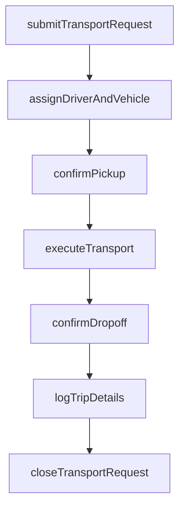
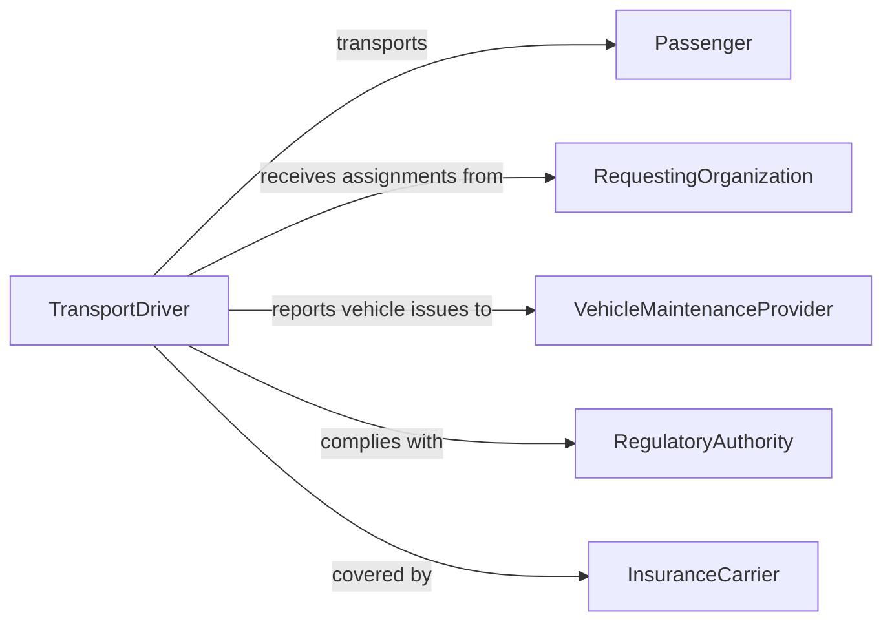

# Provide Escort Transportation

> Business-as-Code definition for providing escort or transportation services. Models the request intake, vehicle dispatch, passenger pickup, and trip completion workflow.

## Overview

Providing escort or transportation involves receiving transport requests, dispatching appropriate vehicles and personnel, safely conveying passengers to their destinations, and documenting trip details. This definition exposes actions for managing transport requests, assigning drivers and vehicles, tracking trips in progress, and logging completed journeys for billing and compliance.

## Actors

| Actor | Description |
|-------|-------------|
| Passenger | The individual or group being transported |
| RequestingOrganization | The agency or department authorizing the transport |
| VehicleMaintenanceProvider | Services and maintains the transport fleet |
| RegulatoryAuthority | Sets standards for passenger transport licensing and safety |
| InsuranceCarrier | Provides liability coverage for transport operations |

## Roles

| Role | Description |
|------|-------------|
| TransportDriver | Operates the vehicle and ensures passenger safety |
| DispatchCoordinator | Receives requests and assigns drivers and vehicles |
| FleetSupervisor | Oversees vehicle availability and driver scheduling |
| ComplianceOfficer | Ensures transport operations meet regulatory requirements |

## Entities

| Entity | Description |
|--------|-------------|
| TransportRequest | A formal request to move a passenger between locations |
| TripRecord | Documentation of a completed transport including route and times |
| Vehicle | The car, van, or bus assigned to the transport |
| DriverAssignment | The pairing of a driver to a specific transport request |
| PassengerManifest | A list of individuals being transported on a trip |
| MileageLog | Distance and fuel tracking for the transport vehicle |

## Actions

| Action | Description |
|--------|-------------|
| submitTransportRequest | Create a request for passenger escort or transportation |
| assignDriverAndVehicle | Designate a driver and vehicle for the transport |
| confirmPickup | Verify the passenger has been picked up at the origin |
| executeTransport | Drive the passenger to the destination safely |
| confirmDropoff | Verify the passenger has been delivered to the destination |
| logTripDetails | Record mileage, times, route, and any notes for the trip |
| closeTransportRequest | Finalize the request and submit for billing or reporting |

## Events

| Event | Description |
|-------|-------------|
| transportRequested | A new transport request has been submitted |
| driverAssigned | A driver and vehicle have been designated for the trip |
| pickupConfirmed | The passenger has been picked up at the origin |
| transportInProgress | The vehicle is en route to the destination |
| dropoffConfirmed | The passenger has been delivered to the destination |
| tripDetailsLogged | Mileage, times, and notes have been recorded |
| transportRequestClosed | The transport request has been finalized |

## Searches

| Search | Description |
|--------|-------------|
| findTransportRequests | List requests by passenger, date, status, or route |
| getAvailableDrivers | Retrieve drivers available for assignment at a given time |
| getTripHistory | Look up completed trips for a passenger or vehicle |
| getFleetStatus | Check current availability and location of transport vehicles |

## Workflow



## Actor Relationships



## Usage

### Calling Actions

```typescript
import { provideEscortTransportation } from '@headlessly/provide-escort-transportation'

const transport = provideEscortTransportation()

// Submit a transport request for a medical appointment
const request = await transport.submitTransportRequest({
  passengerId: 'PAX-2024-0331',
  origin: '450 Oak Street, Apt 12',
  destination: 'Regional Medical Center',
  scheduledTime: '2026-05-10T09:00:00',
  specialNeeds: 'wheelchair-accessible'
})

// Assign a driver and vehicle
await transport.assignDriverAndVehicle({
  requestId: request.id,
  driverId: 'DRV-045',
  vehicleId: 'VAN-ADA-03'
})

// Execute the trip
await transport.confirmPickup({ requestId: request.id })
await transport.executeTransport({ requestId: request.id })
await transport.confirmDropoff({ requestId: request.id })
await transport.logTripDetails({
  requestId: request.id,
  mileage: 14.2,
  notes: 'Passenger delivered on time, no issues.'
})
```

### Event-Driven Automation

```typescript
// Notify passenger when driver is assigned
transport.driverAssigned(async ({ requestId, driverId, vehicleId }) => {
  const request = await transport.findTransportRequests({ id: requestId })
  await sendNotification({
    to: request.passengerId,
    message: `Your transport has been confirmed. Driver ${driverId} will arrive at ${request.scheduledTime}.`
  })
})

// Alert fleet supervisor when vehicle mileage threshold is reached
transport.tripDetailsLogged(async ({ vehicleId, mileage }) => {
  const vehicle = await getVehicle(vehicleId)
  if (vehicle.totalMileage + mileage > vehicle.serviceThreshold) {
    await notify({
      to: 'fleet-supervisor',
      message: `Vehicle ${vehicleId} has exceeded its maintenance mileage threshold. Schedule service.`
    })
  }
})
```
