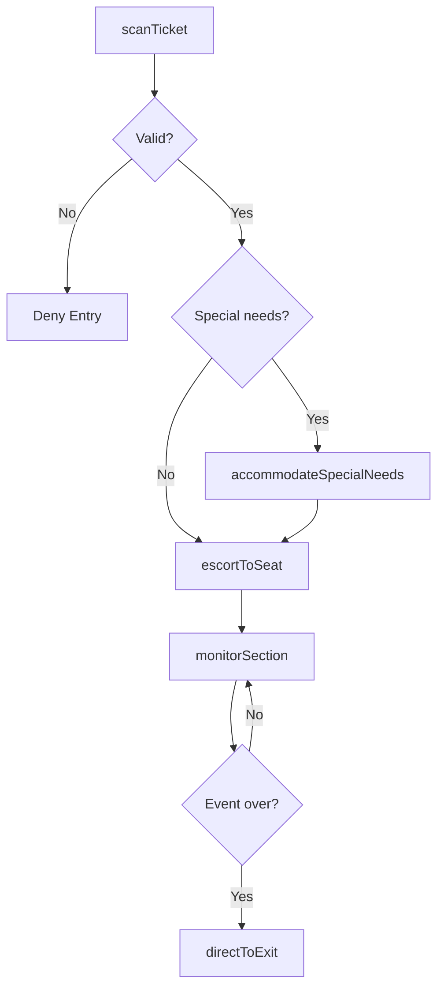
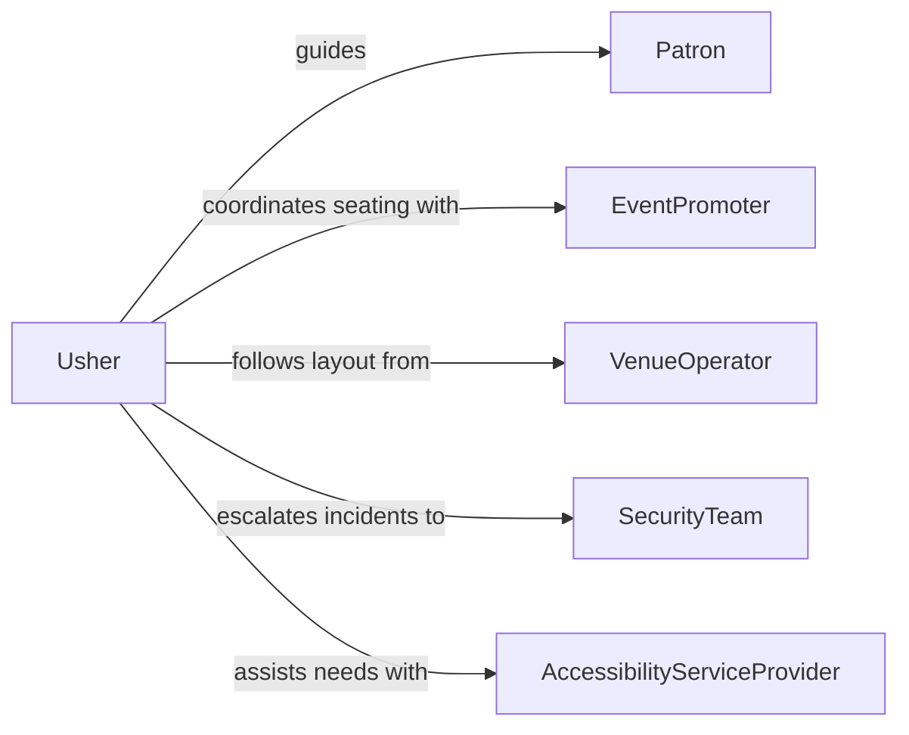

# Usher Patrons Seats Exits

> Business-as-Code definition for ushering patrons to seats or exits. Models the ticket verification, seating assignment, crowd guidance, and venue capacity management workflow.

## Overview

Ushering patrons to seats or exits involves verifying tickets, guiding guests to their assigned seating areas, managing crowd flow during entry and exit, and ensuring patron safety within the venue. This definition exposes actions for ticket scanning, seat assignment, aisle management, and emergency evacuation coordination at theaters, stadiums, and event venues.

## Actors

| Actor | Description |
|-------|-------------|
| Patron | The ticket holder attending the event |
| EventPromoter | Organizes and markets the event at the venue |
| VenueOperator | Manages the physical facility and seating layout |
| SecurityTeam | Handles crowd control and responds to safety incidents |
| AccessibilityServiceProvider | Assists patrons with mobility or sensory needs |

## Roles

| Role | Description |
|------|-------------|
| Usher | Guides patrons to seats and manages aisle traffic |
| HeadUsher | Coordinates the ushering team and handles escalations |
| TicketScanner | Verifies ticket validity at entry points |
| EvacuationCoordinator | Directs patrons to exits during emergency situations |

## Entities

| Entity | Description |
|--------|-------------|
| Ticket | A validated admission pass with section and seat information |
| SeatingAssignment | The specific section, row, and seat designated for a patron |
| VenueSection | A defined area of the venue with its own entry and exit points |
| CapacityCount | Real-time tracking of occupied seats and available capacity |
| EvacuationPlan | Documented procedures for directing patrons to exits in emergencies |
| IncidentLog | A record of patron issues, complaints, or safety events |

## Actions

| Action | Description |
|--------|-------------|
| scanTicket | Verify the ticket is valid and retrieve seating information |
| escortToSeat | Guide the patron to their assigned seat location |
| manageAisleFlow | Direct foot traffic to prevent congestion in aisles |
| accommodateSpecialNeeds | Assist patrons requiring accessibility or mobility support |
| monitorSection | Observe the assigned venue section for safety or seating issues |
| directToExit | Guide patrons to the nearest exit during dismissal or emergency |
| logIncident | Record any patron complaints, disruptions, or safety concerns |

## Events

| Event | Description |
|-------|-------------|
| ticketScanned | A patron ticket has been verified at the entry point |
| patronSeated | A patron has been guided to their assigned seat |
| aisleFlowManaged | Foot traffic has been directed to prevent congestion |
| specialNeedsAccommodated | An accessibility request has been fulfilled |
| sectionMonitored | A routine check of the venue section has been completed |
| patronsDirectedToExit | Patrons have been guided to exits for dismissal or evacuation |
| incidentLogged | A patron issue or safety event has been documented |

## Searches

| Search | Description |
|--------|-------------|
| findSeatAvailability | Check available seats by section, row, or accessibility type |
| getCapacityCounts | Retrieve real-time occupancy data for venue sections |
| getIncidentLogs | Search incident records by event, section, or date |
| findPatronByTicket | Look up patron seating details from a ticket identifier |

## Workflow



## Actor Relationships



## Usage

### Calling Actions

```typescript
import { usherPatronsSeatsExits } from '@headlessly/usher-patrons-seats-exits'

const ushering = usherPatronsSeatsExits()

// Scan and validate a patron ticket
const scan = await ushering.scanTicket({
  ticketCode: 'TKT-2026-0412-SEC-A-ROW-12-SEAT-5',
  entryGate: 'Gate-A'
})

// Escort the patron to their seat
await ushering.escortToSeat({
  patronId: scan.patronId,
  section: scan.section,
  row: scan.row,
  seat: scan.seat
})

// Monitor section during the event
await ushering.monitorSection({ sectionId: 'A', usherId: 'USH-014' })

// Direct patrons to exits at event conclusion
await ushering.directToExit({
  sectionId: 'A',
  exitType: 'standard-dismissal',
  exitRoutes: ['Exit-A1', 'Exit-A2']
})
```

### Event-Driven Automation

```typescript
// Alert security when an incident is logged
ushering.incidentLogged(async ({ sectionId, incidentType, description }) => {
  if (incidentType === 'disruption' || incidentType === 'safety') {
    await dispatch({
      to: 'security-team',
      section: sectionId,
      message: description
    })
  }
})

// Trigger evacuation procedure when emergency detected
ushering.patronsDirectedToExit(async ({ sectionId, exitType }) => {
  if (exitType === 'emergency') {
    await activateEvacuationPlan({ section: sectionId })
    await notify({
      to: 'head-usher',
      message: `Emergency evacuation initiated for section ${sectionId}.`
    })
  }
})
```
