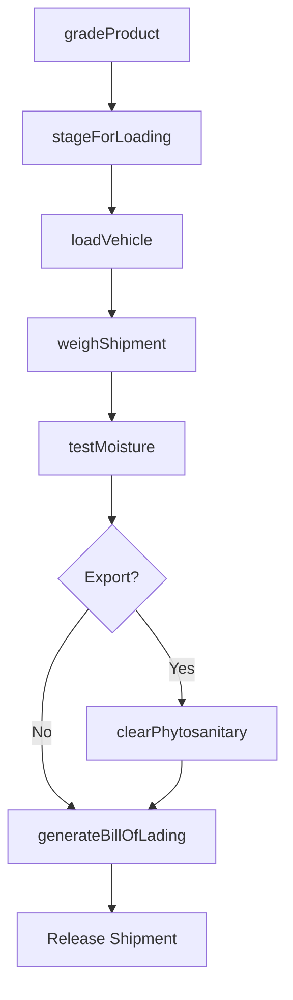
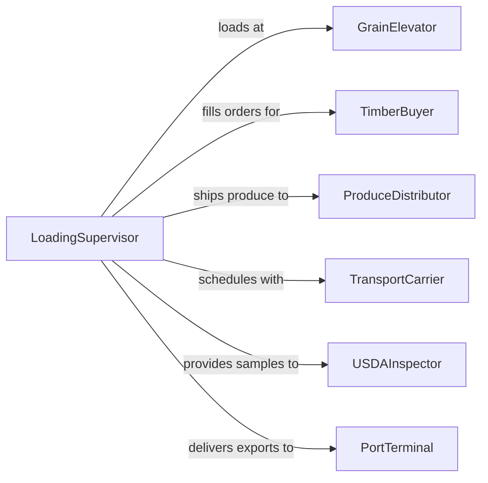

# Load Agricultural or Forestry Products for Shipment

> Business-as-Code definition for loading grain, produce, livestock, timber, logs, and other agricultural and forestry products onto trucks, railcars, and vessels for transport to markets, processors, and ports.

## Overview

Loading agricultural and forestry products for shipment involves grading and sorting products, operating grain augers, conveyors, log loaders, and forklifts to transfer goods onto transport vehicles, and documenting weight, moisture, and quality for buyer and regulatory requirements. This definition models product staging, grading verification, loading equipment operation, weight certification, and bill of lading generation for farm-to-market, mill, and export supply chains.

## Actors

| Actor | Description |
|-------|-------------|
| GrainElevator | Receives, stores, and loads bulk grain for transport |
| TimberBuyer | Purchases logs and lumber for processing at sawmills |
| ProduceDistributor | Accepts fresh produce shipments for wholesale and retail markets |
| TransportCarrier | Provides trucks, railcars, and container chassis for shipment |
| USDA Inspector | Certifies grade, quality, and phytosanitary compliance for shipments |
| PortTerminal | Receives agricultural exports for vessel loading |

## Roles

| Role | Description |
|------|-------------|
| LoadingSupervisor | Coordinates loading crews, equipment, and transport schedules |
| GrainHandler | Operates augers, conveyors, and bin gates for bulk grain loading |
| LogLoader Operator | Runs knuckleboom or grapple loaders for timber |
| ScaleOperator | Weighs loaded vehicles and issues certified weight tickets |

## Entities

| Entity | Description |
|--------|-------------|
| GradeReport | A quality assessment of the agricultural product being shipped |
| WeightTicket | A certified record of vehicle weight from a certified scale |
| BillOfLading | A shipping document detailing cargo, origin, and destination |
| PhytosanitaryCertificate | A government certificate confirming pest and disease compliance |
| LoadingTally | A count of units, bundles, or bins loaded onto the vehicle |
| MoistureTest | A measurement of grain or timber moisture content |

## Actions

| Action | Description |
|--------|-------------|
| gradeProduct | Assess product quality, size, and condition for shipment |
| stageForLoading | Move sorted products to the loading dock, silo, or log deck |
| loadVehicle | Transfer products onto the truck, railcar, or container |
| weighShipment | Obtain certified weight from the facility scale |
| testMoisture | Measure moisture content for grain or timber products |
| generateBillOfLading | Create shipping documentation for the loaded cargo |
| clearPhytosanitary | Obtain government certification for export shipments |

## Events

| Event | Description |
|-------|-------------|
| productGraded | Quality assessment of the shipment has been completed |
| productStaged | Items have been moved to the loading area |
| vehicleLoaded | Products have been transferred onto the transport vehicle |
| shipmentWeighed | Certified weight has been recorded |
| moistureTested | Moisture content has been measured and documented |
| billOfLadingGenerated | Shipping documentation has been created |
| phytosanitaryCleared | Government export certification has been obtained |

## Searches

| Search | Description |
|--------|-------------|
| findReadyShipments | List products staged and awaiting loading |
| getWeightHistory | Retrieve weight tickets by date, product, or destination |
| getGradeReports | Pull quality assessments by lot or shipment |
| findExportPending | Locate shipments awaiting phytosanitary clearance |

## Workflow



## Actor Relationships



## Usage

### Calling Actions

```typescript
import { loadAgriculturalForestryProductsShipment } from '@headlessly/load-agricultural-forestry-products-shipment'

const shipping = loadAgriculturalForestryProductsShipment()

// Grade and stage soybeans for export
const grade = await shipping.gradeProduct({
  productType: 'soybeans',
  lotId: 'SOY-2026-HARVEST-14',
  tests: ['test-weight', 'damage-percent', 'foreign-material']
})

await shipping.stageForLoading({
  lotId: 'SOY-2026-HARVEST-14',
  siloId: 'SILO-EAST-04',
  targetVolume: { bushels: 1000 }
})

// Load hopper car and weigh
await shipping.loadVehicle({
  lotId: 'SOY-2026-HARVEST-14',
  vehicleType: 'hopper-railcar',
  vehicleId: 'BNSF-HC-447291',
  method: 'gravity-spout'
})

const weight = await shipping.weighShipment({
  vehicleId: 'BNSF-HC-447291',
  scaleId: 'SCALE-TRACK-01'
})

// Test moisture and generate docs
await shipping.testMoisture({
  lotId: 'SOY-2026-HARVEST-14',
  targetMoisture: { percent: 13 }
})

await shipping.generateBillOfLading({
  vehicleId: 'BNSF-HC-447291',
  product: 'soybeans-us-no2',
  weightLbs: weight.grossMinusTare,
  destination: 'NOLA-EXPORT-TERMINAL'
})
```

### Event-Driven Automation

```typescript
// Auto-request phytosanitary cert for export shipments
shipping.vehicleLoaded(async ({ lotId, destination }) => {
  if (destination.includes('EXPORT')) {
    await shipping.clearPhytosanitary({ lotId })
  }
})

// Alert on moisture failures
shipping.moistureTested(async ({ lotId, moisturePercent, targetPercent }) => {
  if (moisturePercent > targetPercent) {
    await notify({
      to: 'grain-manager',
      message: `Lot ${lotId} moisture at ${moisturePercent}% exceeds target ${targetPercent}% - drying required`
    })
  }
})
```
