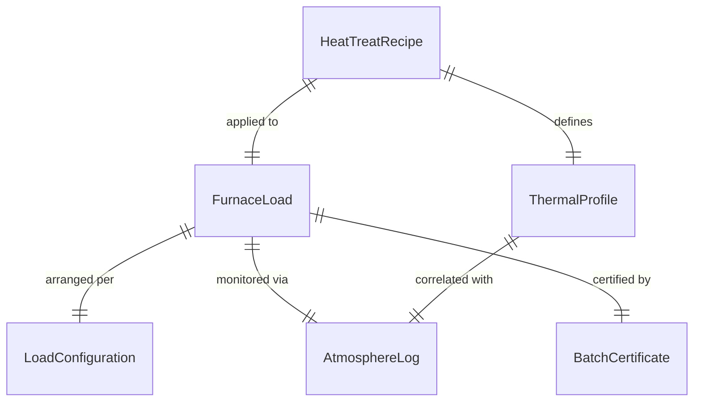
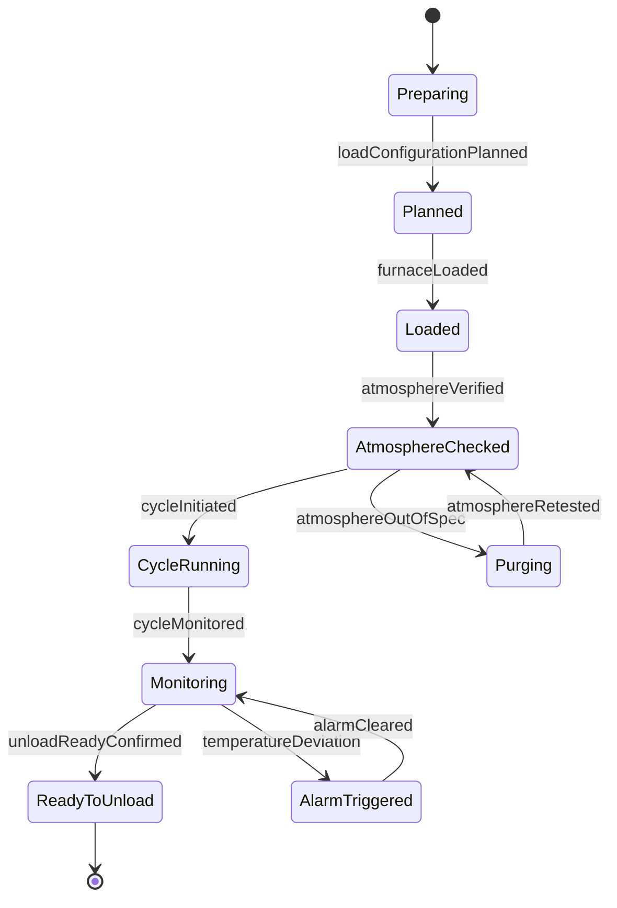
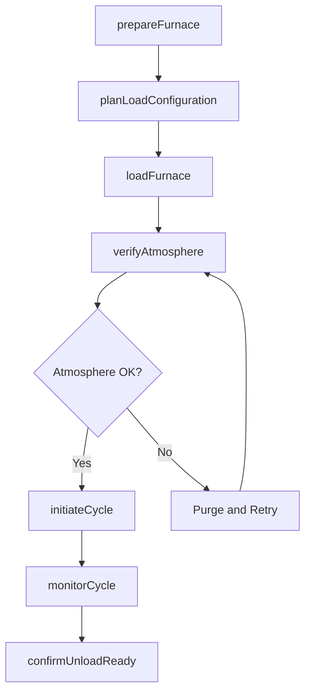
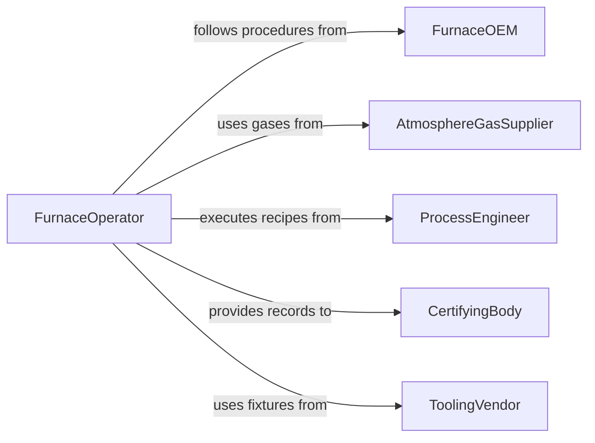

# Load Items into Ovens or Furnaces

> Business-as-Code definition for loading parts, materials, and products into industrial ovens and furnaces for heat treatment, curing, drying, sintering, or thermal processing operations.

## Overview

Loading items into ovens or furnaces involves arranging workpieces on racks, trays, or conveyors, positioning them within the heating chamber according to thermal profiles, and initiating the heating cycle. This definition models load arrangement planning, furnace preparation, item placement, atmosphere control verification, cycle initiation, and unloading readiness for heat treating, ceramics firing, powder coating curing, and food baking operations.

## Actors

| Actor | Description |
|-------|-------------|
| FurnaceOEM | Manufactures the oven or furnace and specifies loading procedures |
| AtmosphereGasSupplier | Provides protective or reactive gases for controlled atmosphere furnaces |
| ProcessEngineer | Defines heat treat recipes, thermal profiles, and load configurations |
| CertifyingBody | Audits heat treatment processes for Nadcap or ISO compliance |
| ToolingVendor | Supplies fixtures, racks, and trays for furnace loading |

## Roles

| Role | Description |
|------|-------------|
| FurnaceOperator | Loads and unloads the furnace and initiates heating cycles |
| HeatTreatSupervisor | Oversees furnace operations and ensures recipe compliance |
| LoadPlanner | Determines item arrangement and rack configurations for the batch |
| QualityMetallurgist | Verifies heat treatment results meet specification |

## Entities

| Entity | Description |
|--------|-------------|
| HeatTreatRecipe | A defined set of temperature, time, atmosphere, and quench parameters |
| FurnaceLoad | A batch of items arranged for a single heating cycle |
| LoadConfiguration | The spatial arrangement of items on racks within the furnace chamber |
| ThermalProfile | A time-temperature curve the load must follow during the cycle |
| AtmosphereLog | A record of furnace gas composition during the heating cycle |
| BatchCertificate | Documentation certifying the heat treatment met specification |

## Actions

| Action | Description |
|--------|-------------|
| prepareFurnace | Verify furnace is clean, at standby temperature, and atmosphere is set |
| planLoadConfiguration | Determine item placement on racks for uniform heat distribution |
| loadFurnace | Place racks and items into the furnace chamber |
| verifyAtmosphere | Confirm gas composition is within specification before ramping |
| initiateCycle | Start the programmed heating cycle per the heat treat recipe |
| monitorCycle | Track temperature, time, and atmosphere throughout the process |
| confirmUnloadReady | Verify the cycle is complete and items can be safely removed |

## Events

| Event | Description |
|-------|-------------|
| furnacePrepared | Chamber is clean, at standby temperature, and atmosphere set |
| loadConfigurationPlanned | Item arrangement on racks has been determined |
| furnaceLoaded | Items have been placed in the furnace chamber |
| atmosphereVerified | Gas composition confirmed within specification |
| cycleInitiated | Heating program has been started |
| cycleMonitored | Temperature and atmosphere data have been recorded |
| unloadReadyConfirmed | Cycle complete and items safe for removal |

## Searches

| Search | Description |
|--------|-------------|
| findActiveFurnaces | List furnaces currently in cycle with estimated completion times |
| getRecipeLibrary | Retrieve heat treat recipes by material or specification |
| getBatchHistory | Pull batch certificates by part number, date, or furnace |
| findLoadConfigurations | Locate proven rack arrangements for a given part geometry |

## Entity Relationships



## State Diagram



## Workflow



## Actor Relationships



## Usage

### Calling Actions

```typescript
import { loadItemsIntoOvensFurnaces } from '@headlessly/load-items-into-ovens-furnaces'

const furnace = loadItemsIntoOvensFurnaces()

// Prepare a vacuum furnace for aerospace part hardening
await furnace.prepareFurnace({
  furnaceId: 'VAC-FURNACE-02',
  targetStandby: { fahrenheit: 200 },
  atmosphere: 'vacuum',
  vacuumLevel: { torr: 0.001 }
})

// Plan and load the batch
await furnace.planLoadConfiguration({
  furnaceId: 'VAC-FURNACE-02',
  parts: [
    { partNumber: 'TURBINE-BLADE-A7', quantity: 48, material: 'Inconel-718' }
  ],
  rackType: 'molybdenum-grid',
  layers: 3
})

await furnace.loadFurnace({
  furnaceId: 'VAC-FURNACE-02',
  rackIds: ['RACK-MO-01', 'RACK-MO-02', 'RACK-MO-03'],
  totalPieces: 48
})

// Verify atmosphere and start cycle
await furnace.verifyAtmosphere({
  furnaceId: 'VAC-FURNACE-02',
  type: 'vacuum',
  level: { torr: 0.001 }
})

await furnace.initiateCycle({
  furnaceId: 'VAC-FURNACE-02',
  recipe: 'AMS-5663-SOLUTION-TREAT',
  profile: { rampRate: 25, holdTemp: 1750, holdTime: 60, quench: 'argon-gas' }
})
```

### Event-Driven Automation

```typescript
// Auto-monitor cycle after initiation
furnace.cycleInitiated(async ({ furnaceId, recipe }) => {
  await furnace.monitorCycle({
    furnaceId,
    samplingInterval: { seconds: 30 },
    alarms: { overTemp: 10, underTemp: 10 }
  })
})

// Notify quality when cycle completes
furnace.unloadReadyConfirmed(async ({ furnaceId, batchId }) => {
  await notify({
    to: 'quality-metallurgist',
    message: `Furnace ${furnaceId} batch ${batchId} cycle complete - ready for hardness testing`
  })
})
```
