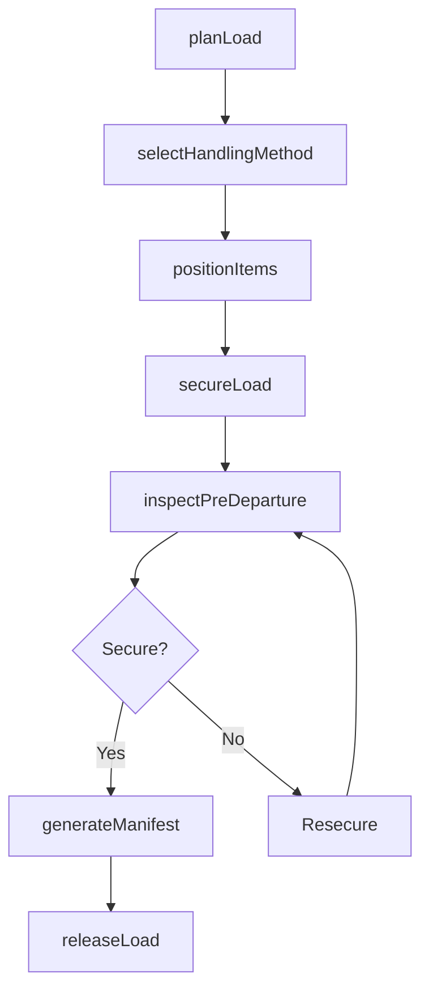
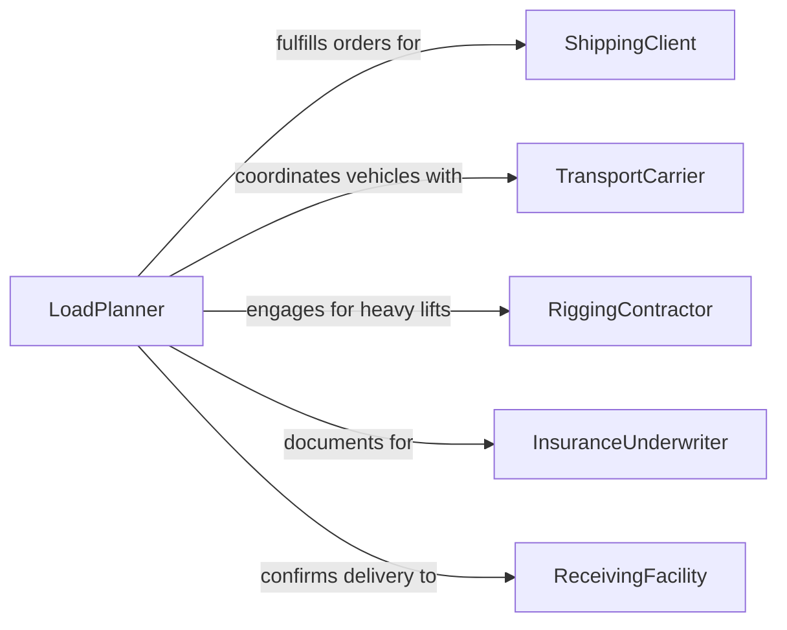

# Load Materials or Equipment

> Business-as-Code definition for the general loading of materials and equipment onto transport vehicles, conveyors, and staging platforms across warehouse, logistics, and field operations.

## Overview

Loading materials or equipment involves selecting the correct handling method based on item weight, dimensions, and fragility, positioning items onto trucks, railcars, or containers, and verifying load integrity before transport. This definition models load planning, equipment selection, lifting and placement operations, securement, and dispatch documentation for general freight, industrial equipment, and supply chain operations.

## Actors

| Actor | Description |
|-------|-------------|
| ShippingClient | Originates the materials or equipment to be loaded and shipped |
| TransportCarrier | Provides vehicles and drivers for material transport |
| RiggingContractor | Supplies specialized lifting equipment for oversized or heavy loads |
| InsuranceUnderwriter | Provides cargo coverage and requires proper loading documentation |
| ReceivingFacility | Accepts the loaded shipment at the destination |

## Roles

| Role | Description |
|------|-------------|
| LoadPlanner | Determines load sequence, weight distribution, and handling methods |
| LoadingCrewLead | Directs the loading team and coordinates with drivers |
| ForkliftOperator | Operates powered industrial trucks to move palletized loads |
| CraneOperator | Runs overhead or mobile cranes for heavy equipment lifts |

## Entities

| Entity | Description |
|--------|-------------|
| LoadManifest | A document listing all items, weights, and placement positions |
| HandlingInstruction | Special requirements for fragile, hazardous, or oversized items |
| LiftPlan | Engineering documentation for heavy or critical lifts |
| TieDownConfiguration | The strapping, chaining, or blocking arrangement securing the load |
| DepartureInspection | A pre-transport check verifying load security and vehicle condition |
| DamageWaiver | Documentation noting pre-existing damage before loading |

## Actions

| Action | Description |
|--------|-------------|
| planLoad | Determine item sequence, placement, and weight distribution |
| selectHandlingMethod | Choose manual, forklift, crane, or conveyor based on item specs |
| positionItems | Place materials or equipment onto the vehicle or platform |
| secureLoad | Apply straps, chains, dunnage, and blocking to prevent shifting |
| inspectPreDeparture | Verify load security, vehicle condition, and documentation |
| generateManifest | Create the load manifest with item details and positions |
| releaseLoad | Authorize the vehicle to depart with the loaded shipment |

## Events

| Event | Description |
|-------|-------------|
| loadPlanned | Item sequence and placement have been determined |
| handlingMethodSelected | Appropriate loading equipment has been identified |
| itemsPositioned | Materials or equipment have been placed on the vehicle |
| loadSecured | Strapping and blocking have been applied and inspected |
| preDepartureInspected | Load security and vehicle condition have been verified |
| manifestGenerated | Load documentation has been created |
| loadReleased | Vehicle has been authorized to depart |

## Searches

| Search | Description |
|--------|-------------|
| findPendingLoads | List shipments awaiting loading by priority or schedule |
| getEquipmentAvailability | Check forklift, crane, and conveyor availability |
| getLoadHistory | Retrieve past loading records by client, date, or destination |
| findDamageIncidents | Locate loading damage claims by period or item type |

## Workflow



## Actor Relationships



## Usage

### Calling Actions

```typescript
import { loadMaterialsEquipment } from '@headlessly/load-materials-equipment'

const loading = loadMaterialsEquipment()

// Plan a mixed load of palletized goods and crated equipment
const plan = await loading.planLoad({
  shipmentId: 'SHIP-2026-8834',
  items: [
    { type: 'palletized-goods', count: 14, totalWeight: 18000, unit: 'lbs' },
    { type: 'crated-generator', count: 1, weight: 4500, unit: 'lbs', oversized: true }
  ],
  vehicleType: '53ft-dry-van'
})

// Select handling and load
await loading.selectHandlingMethod({
  planId: plan.id,
  methods: [
    { itemType: 'palletized-goods', method: 'forklift' },
    { itemType: 'crated-generator', method: 'crane' }
  ]
})

await loading.positionItems({ planId: plan.id })
await loading.secureLoad({
  planId: plan.id,
  tiedowns: { straps: 8, loadBars: 4, dunnage: true }
})

// Inspect and release
await loading.inspectPreDeparture({ planId: plan.id })
await loading.releaseLoad({ planId: plan.id })
```

### Event-Driven Automation

```typescript
// Auto-generate manifest after load is secured
loading.loadSecured(async ({ planId }) => {
  await loading.generateManifest({ planId })
})

// Alert safety on oversized load departures
loading.loadReleased(async ({ planId, items }) => {
  const oversized = items.filter(i => i.oversized)
  if (oversized.length > 0) {
    await notify({
      to: 'safety-coordinator',
      message: `Oversized load departing on plan ${planId} - verify route clearance`
    })
  }
})
```
