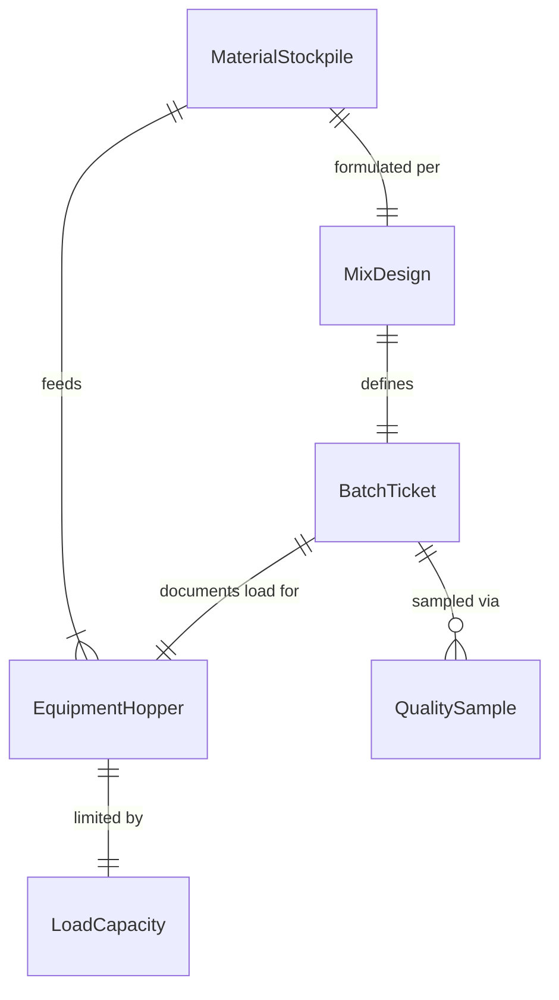
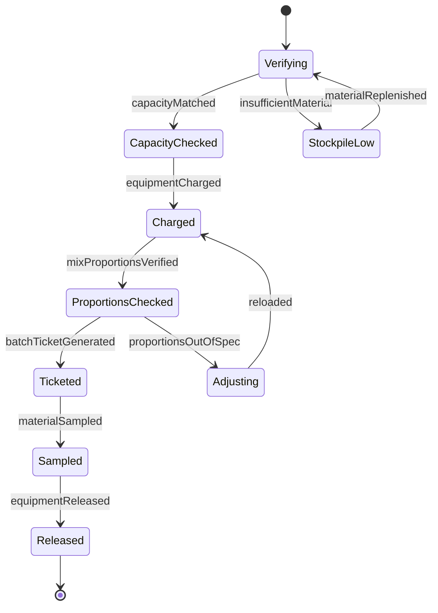
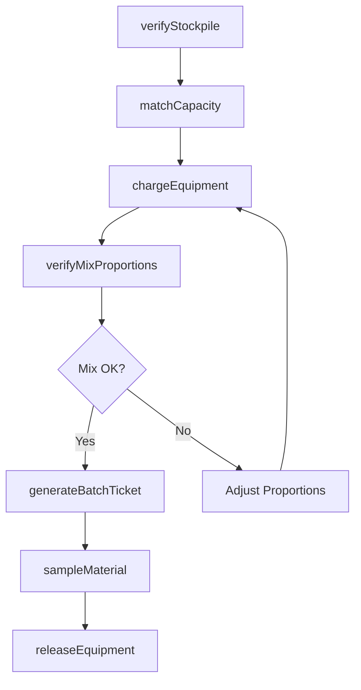
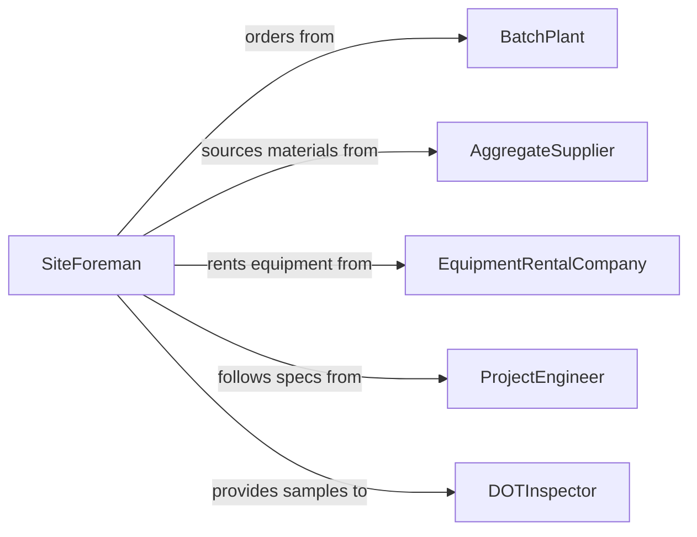

# Load Materials into Construction Equipment

> Business-as-Code definition for loading aggregate, concrete, asphalt, soil, and other bulk materials into construction equipment such as mixers, pavers, spreaders, and dump trucks for site operations.

## Overview

Loading materials into construction equipment involves coordinating material stockpile management, operating loaders and conveyors to charge equipment hoppers and drums, verifying mix proportions, and confirming equipment readiness before deployment. This definition models stockpile inventory, equipment capacity matching, loading sequences, batch ticket generation, and quality verification for paving, concrete placement, earthwork, and road construction operations.

## Actors

| Actor | Description |
|-------|-------------|
| BatchPlant | Produces and delivers ready-mix concrete or hot-mix asphalt |
| AggregateSupplier | Provides sand, gravel, crushed stone, and fill materials |
| EquipmentRentalCompany | Supplies loaders, pavers, and other construction machinery |
| ProjectEngineer | Specifies material mix designs and placement requirements |
| DOTInspector | Verifies material quality and placement compliance on public works |

## Roles

| Role | Description |
|------|-------------|
| LoaderOperator | Runs wheel loaders and excavators to charge equipment hoppers |
| BatchOperator | Controls material proportioning at the batch or mixing plant |
| SiteForeman | Directs loading sequences and coordinates with paving or placement crews |
| MaterialTester | Samples materials during loading for quality assurance testing |

## Entities

| Entity | Description |
|--------|-------------|
| MaterialStockpile | A stored quantity of aggregate, soil, or other bulk material on site |
| BatchTicket | A record of material proportions, quantities, and loading time |
| EquipmentHopper | The intake bin or drum on construction equipment receiving material |
| MixDesign | Engineering specifications for material proportions |
| LoadCapacity | The rated maximum weight or volume for the target equipment |
| QualitySample | A material sample taken during loading for lab testing |

## Actions

| Action | Description |
|--------|-------------|
| verifyStockpile | Check available material quantity and quality before loading |
| matchCapacity | Confirm the equipment can handle the planned load size |
| chargeEquipment | Load materials into the equipment hopper, drum, or bed |
| verifyMixProportions | Check that material ratios match the specified mix design |
| generateBatchTicket | Create a record documenting the loaded materials and quantities |
| sampleMaterial | Collect a quality sample during the loading operation |
| releaseEquipment | Clear the loaded equipment for deployment to the work area |

## Events

| Event | Description |
|-------|-------------|
| stockpileVerified | Material availability and quality have been confirmed |
| capacityMatched | Equipment load limits have been verified against the planned charge |
| equipmentCharged | Materials have been loaded into the equipment |
| mixProportionsVerified | Material ratios confirmed within mix design tolerances |
| batchTicketGenerated | Loading documentation has been created |
| materialSampled | Quality sample has been collected for testing |
| equipmentReleased | Loaded equipment has been cleared for deployment |

## Searches

| Search | Description |
|--------|-------------|
| getStockpileLevels | Check current material inventory at the site or plant |
| findBatchTickets | Retrieve loading records by date, equipment, or mix design |
| getEquipmentStatus | Check which equipment is available and ready for loading |
| getSampleResults | Pull quality test results for materials loaded on a given day |

## Entity Relationships



## State Diagram



## Workflow



## Actor Relationships



## Usage

### Calling Actions

```typescript
import { loadMaterialsIntoConstructionEquipment } from '@headlessly/load-materials-into-construction-equipment'

const loading = loadMaterialsIntoConstructionEquipment()

// Verify stockpile before paving operations
await loading.verifyStockpile({
  siteId: 'HWY-42-REPAVE',
  material: 'hot-mix-asphalt-SP12.5',
  requiredTons: 200
})

// Load the paver hopper
await loading.chargeEquipment({
  equipmentId: 'PAVER-CAT-AP1055F',
  material: 'hot-mix-asphalt-SP12.5',
  loadSize: { tons: 12 },
  method: 'dump-truck-transfer'
})

await loading.verifyMixProportions({
  batchPlantId: 'PLANT-SOUTH-03',
  mixDesign: 'SP12.5-PG64-22',
  tolerances: { asphaltContent: 0.3, airVoids: 0.5 }
})

// Generate ticket and release
const ticket = await loading.generateBatchTicket({
  equipmentId: 'PAVER-CAT-AP1055F',
  material: 'hot-mix-asphalt-SP12.5',
  tons: 12,
  temperature: { fahrenheit: 310 }
})

await loading.releaseEquipment({
  equipmentId: 'PAVER-CAT-AP1055F',
  batchTicketId: ticket.id
})
```

### Event-Driven Automation

```typescript
// Auto-sample when loading high-volume batches
loading.equipmentCharged(async ({ equipmentId, tons }) => {
  if (tons >= 10) {
    await loading.sampleMaterial({
      equipmentId,
      tests: ['gradation', 'asphalt-content', 'temperature']
    })
  }
})

// Alert foreman when stockpile runs low
loading.stockpileVerified(async ({ material, remainingTons, requiredTons }) => {
  if (remainingTons < requiredTons * 1.5) {
    await notify({
      to: 'site-foreman',
      message: `${material} stockpile at ${remainingTons} tons - order replenishment`
    })
  }
})
```
