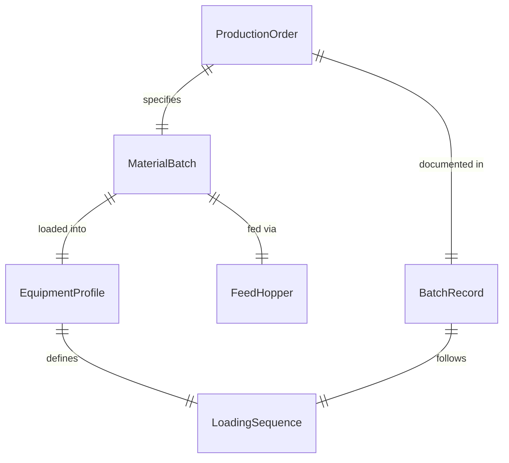
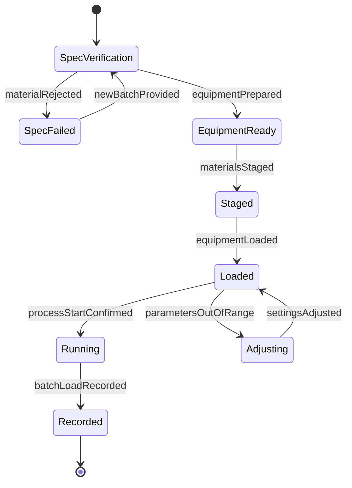
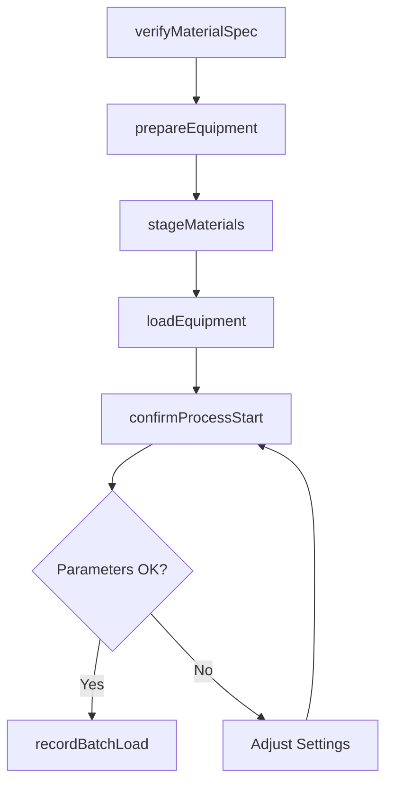
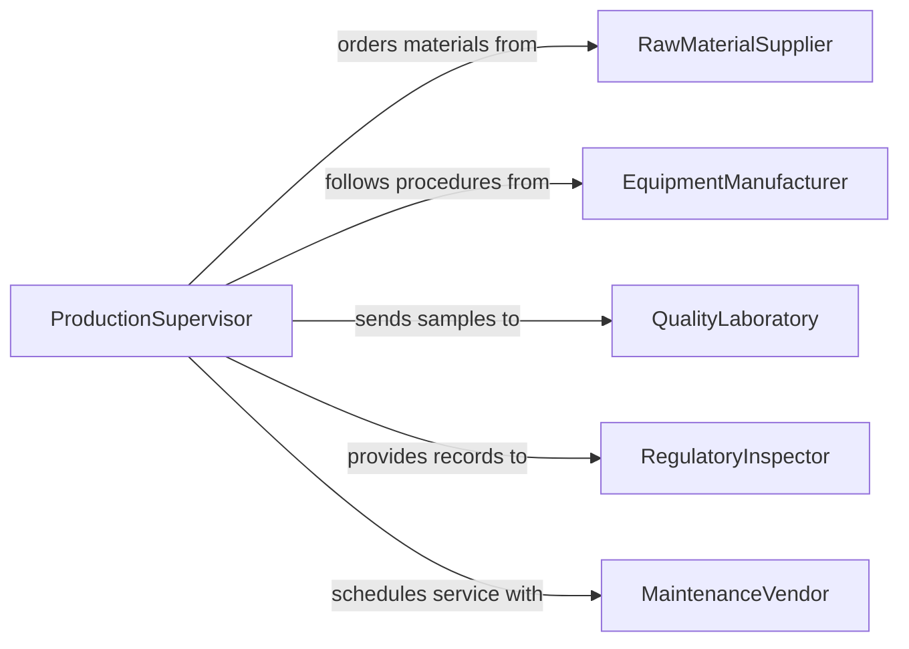

# Load Materials into Equipment for Processing

> Business-as-Code definition for feeding raw materials, components, and work-in-progress items into processing equipment such as mixers, grinders, presses, and CNC machines.

## Overview

Loading materials into processing equipment involves preparing feedstock, verifying material specifications against the production order, physically charging or feeding the machine, and monitoring the initial processing cycle. This definition models material staging, equipment readiness checks, batch loading sequences, process parameter verification, and production start confirmation for manufacturing, chemical processing, and food production operations.

## Actors

| Actor | Description |
|-------|-------------|
| RawMaterialSupplier | Provides feedstock and bulk materials for processing |
| EquipmentManufacturer | Specifies loading procedures and capacity limits for machinery |
| QualityLaboratory | Tests incoming materials for specification compliance |
| RegulatoryInspector | Verifies material handling meets industry-specific standards |
| MaintenanceVendor | Services equipment to ensure safe loading mechanisms |

## Roles

| Role | Description |
|------|-------------|
| ProductionSupervisor | Authorizes material loading and monitors production schedules |
| MachineOperator | Feeds materials into equipment and monitors initial processing |
| MaterialHandler | Stages raw materials at the machine and manages feedstock flow |
| QualityTechnician | Verifies incoming material specifications before loading |

## Entities

| Entity | Description |
|--------|-------------|
| ProductionOrder | A work order specifying material type, quantity, and processing parameters |
| MaterialBatch | A tracked lot of raw material with certifications and test results |
| EquipmentProfile | Machine specifications including capacity, feed rate, and loading method |
| LoadingSequence | The prescribed order and rate for introducing materials to the equipment |
| BatchRecord | Documentation of materials loaded, quantities, and processing conditions |
| FeedHopper | The intake mechanism where materials are introduced to the machine |

## Actions

| Action | Description |
|--------|-------------|
| verifyMaterialSpec | Check incoming materials against production order requirements |
| prepareEquipment | Confirm machine is clean, calibrated, and ready for the next batch |
| stageMaterials | Position feedstock at the equipment loading point |
| loadEquipment | Feed materials into the machine per the loading sequence |
| confirmProcessStart | Verify equipment has engaged and processing parameters are within range |
| recordBatchLoad | Document material lot numbers, quantities, and loading timestamps |

## Events

| Event | Description |
|-------|-------------|
| materialSpecVerified | Incoming materials have passed specification checks |
| equipmentPrepared | Machine is clean, calibrated, and ready for loading |
| materialsStaged | Feedstock has been positioned at the equipment loading point |
| equipmentLoaded | Materials have been fed into the processing machine |
| processStartConfirmed | Equipment is running and parameters are within specification |
| batchLoadRecorded | Material loading details have been documented |

## Searches

| Search | Description |
|--------|-------------|
| findPendingOrders | List production orders awaiting material loading |
| getEquipmentReadiness | Check machine status and readiness for the next batch |
| getBatchHistory | Retrieve loading records by equipment, date, or material type |
| findMaterialCertifications | Locate test certificates for incoming material lots |

## Entity Relationships



## State Diagram



## Workflow



## Actor Relationships



## Usage

### Calling Actions

```typescript
import { loadMaterialsIntoEquipmentProcessing } from '@headlessly/load-materials-into-equipment-processing'

const processing = loadMaterialsIntoEquipmentProcessing()

// Verify material spec for a plastics extrusion run
await processing.verifyMaterialSpec({
  orderId: 'PO-2026-1147',
  materialBatch: 'HDPE-LOT-4421',
  checks: ['melt-flow-index', 'density', 'moisture-content']
})

// Prepare and load the extruder
await processing.prepareEquipment({
  equipmentId: 'EXTRUDER-03',
  cleaningVerified: true,
  dieConfiguration: '4-inch-pipe'
})

await processing.loadEquipment({
  equipmentId: 'EXTRUDER-03',
  materialBatch: 'HDPE-LOT-4421',
  feedRate: { lbsPerHour: 450 },
  hopperFill: { percent: 80 }
})

await processing.confirmProcessStart({
  equipmentId: 'EXTRUDER-03',
  parameters: { temperature: 380, pressure: 2200, speed: 45 }
})
```

### Event-Driven Automation

```typescript
// Auto-stage next batch when equipment is prepared
processing.equipmentPrepared(async ({ equipmentId }) => {
  const nextOrder = await processing.findPendingOrders({ equipmentId, limit: 1 })
  if (nextOrder.length > 0) {
    await processing.stageMaterials({
      equipmentId,
      orderId: nextOrder[0].id
    })
  }
})

// Alert quality when material spec fails
processing.materialSpecVerified(async ({ materialBatch, passed }) => {
  if (!passed) {
    await notify({
      to: 'quality-lab',
      message: `Material batch ${materialBatch} failed specification - hold for retest`
    })
  }
})
```
