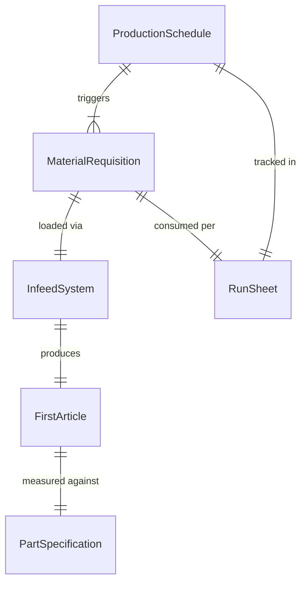
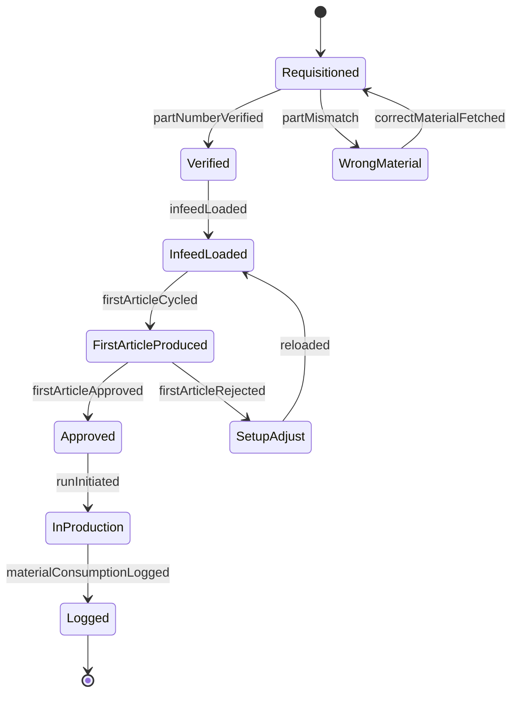
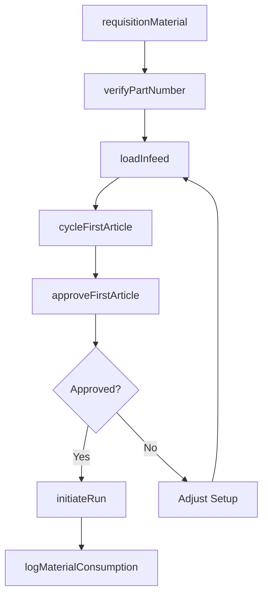
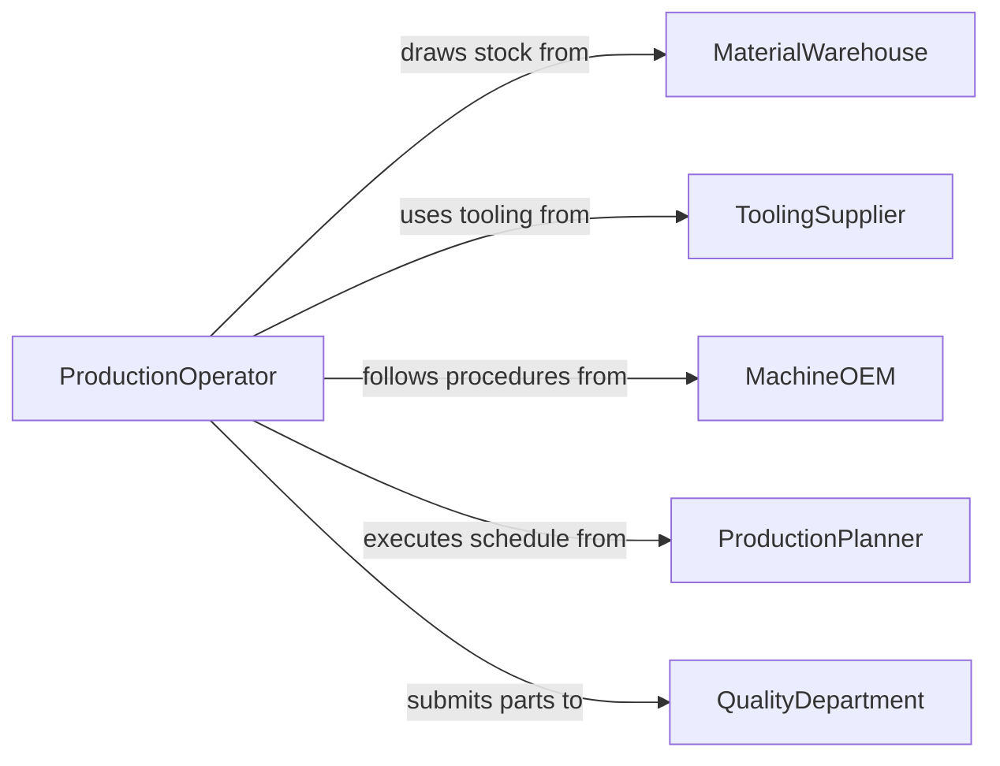

# Load Materials into Production Equipment

> Business-as-Code definition for charging production machinery such as stamping presses, injection molders, lathes, and assembly machines with raw materials, blanks, and components for manufacturing operations.

## Overview

Loading materials into production equipment involves retrieving stock from warehouse or staging areas, verifying part numbers and quantities against the production schedule, feeding materials into machine infeed systems, and confirming the machine is cycling correctly. This definition models material requisition, part verification, machine infeed loading, first-article confirmation, and production run initiation for discrete and batch manufacturing environments.

## Actors

| Actor | Description |
|-------|-------------|
| MaterialWarehouse | Stores raw materials and issues stock to the production floor |
| ToolingSupplier | Provides dies, fixtures, and tooling matched to the material being loaded |
| MachineOEM | Specifies infeed requirements, capacity, and loading procedures |
| ProductionPlanner | Schedules production runs and material requirements |
| QualityDepartment | Approves first-article parts before full production begins |

## Roles

| Role | Description |
|------|-------------|
| ProductionOperator | Loads materials into the machine and monitors the initial cycle |
| MaterialRunner | Retrieves and delivers materials from the warehouse to the machine |
| SetupTechnician | Configures machine tooling and infeed mechanisms for the production run |
| ShiftSupervisor | Authorizes production start and monitors throughput |

## Entities

| Entity | Description |
|--------|-------------|
| ProductionSchedule | A plan listing jobs, materials, and machine assignments for the shift |
| MaterialRequisition | A request to withdraw specific materials from the warehouse |
| InfeedSystem | The mechanical mechanism that introduces material into the machine |
| FirstArticle | The initial part produced after loading to verify quality |
| RunSheet | Documentation tracking material consumption and output per production run |
| PartSpecification | Engineering drawings and tolerances for the material being processed |

## Actions

| Action | Description |
|--------|-------------|
| requisitionMaterial | Request materials from the warehouse for the scheduled production run |
| verifyPartNumber | Confirm the retrieved material matches the production order specification |
| loadInfeed | Place materials into the machine infeed hopper, magazine, or coil cradle |
| cycleFirstArticle | Run the machine for the first piece and submit for quality check |
| approveFirstArticle | Confirm the first piece meets specification before full production |
| initiateRun | Start the full production run after first-article approval |
| logMaterialConsumption | Record material quantities used during the production run |

## Events

| Event | Description |
|-------|-------------|
| materialRequisitioned | Stock has been requested from the warehouse |
| partNumberVerified | Retrieved material has been confirmed correct |
| infeedLoaded | Materials have been placed into the machine infeed system |
| firstArticleCycled | Initial part has been produced and submitted for inspection |
| firstArticleApproved | Quality has confirmed the first piece meets specification |
| runInitiated | Full production run has begun |
| materialConsumptionLogged | Material usage has been recorded |

## Searches

| Search | Description |
|--------|-------------|
| findScheduledJobs | List production jobs awaiting material loading by machine or shift |
| getMaterialAvailability | Check warehouse stock for required materials |
| getFirstArticleHistory | Retrieve first-article results by machine or product |
| getConsumptionRates | Pull material usage rates by product or machine |

## Entity Relationships



## State Diagram



## Workflow



## Actor Relationships



## Usage

### Calling Actions

```typescript
import { loadMaterialsIntoProductionEquipment } from '@headlessly/load-materials-into-production-equipment'

const production = loadMaterialsIntoProductionEquipment()

// Requisition sheet metal for a stamping press run
await production.requisitionMaterial({
  jobId: 'JOB-STAMP-2026-0441',
  material: 'cold-rolled-steel-16ga',
  quantity: { coils: 2, lbs: 8000 },
  machineId: 'PRESS-MINSTER-400T'
})

// Verify and load the coil
await production.verifyPartNumber({
  jobId: 'JOB-STAMP-2026-0441',
  materialLot: 'CRS-LOT-2026-1147',
  specification: 'ASTM-A1008-CS-B'
})

await production.loadInfeed({
  machineId: 'PRESS-MINSTER-400T',
  materialLot: 'CRS-LOT-2026-1147',
  infeedType: 'coil-cradle-and-straightener',
  coilWidth: { inches: 24 }
})

// First article and production start
const firstPiece = await production.cycleFirstArticle({
  machineId: 'PRESS-MINSTER-400T',
  jobId: 'JOB-STAMP-2026-0441'
})

await production.approveFirstArticle({
  firstArticleId: firstPiece.id,
  inspector: 'QC-TECH-07',
  measurements: { length: 12.005, width: 8.002, thickness: 0.059 }
})

await production.initiateRun({
  jobId: 'JOB-STAMP-2026-0441',
  targetQuantity: 5000
})
```

### Event-Driven Automation

```typescript
// Auto-deliver materials when jobs are scheduled
production.materialRequisitioned(async ({ jobId, material }) => {
  await notify({
    to: 'material-runner',
    message: `Deliver ${material} to machine for job ${jobId}`
  })
})

// Alert supervisor on first-article rejection
production.firstArticleCycled(async ({ firstArticleId, machineId, passed }) => {
  if (!passed) {
    await notify({
      to: 'shift-supervisor',
      message: `First article rejected on ${machineId} - setup adjustment required`
    })
  }
})
```
