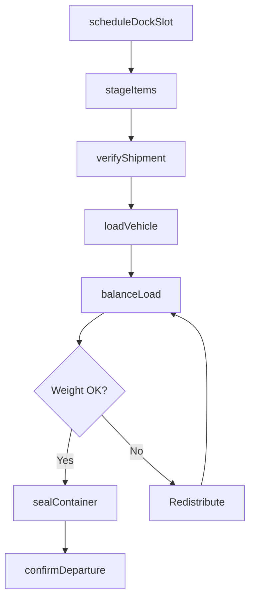
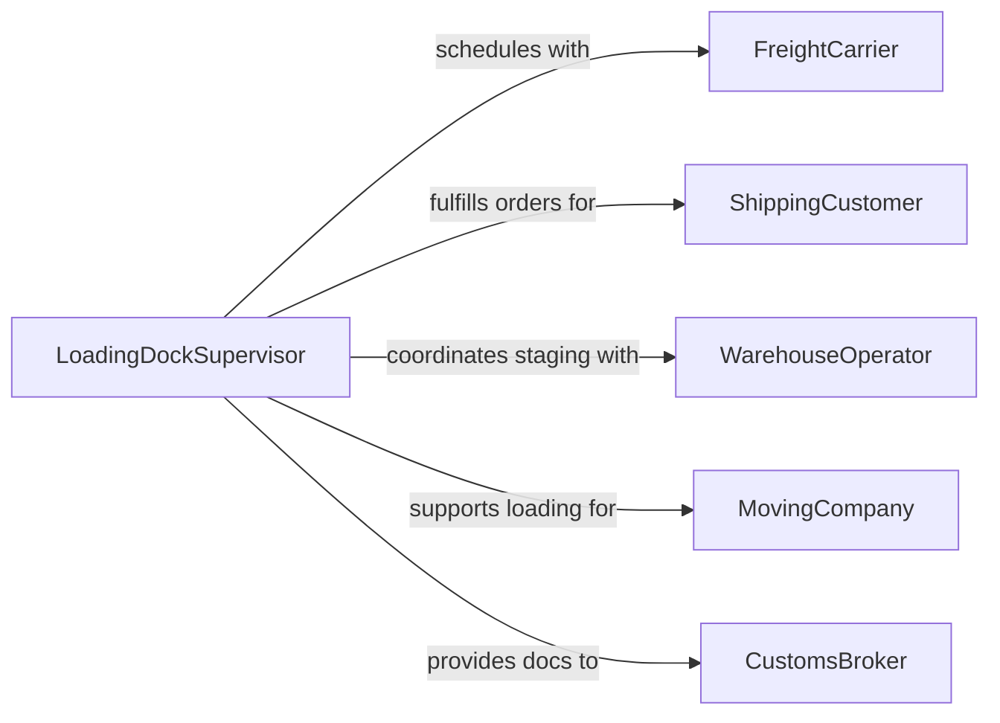

# Load Shipments, Belongings, or Materials

> Business-as-Code definition for loading packaged shipments, personal belongings, and bulk materials onto trucks, containers, and transport vehicles for delivery, relocation, or warehouse transfer.

## Overview

Loading shipments, belongings, and materials involves receiving items at a staging area, verifying quantities against shipping documents, physically placing items onto vehicles using manual or mechanical methods, and securing loads for safe transit. This definition models dock scheduling, load planning, weight distribution verification, carrier handoff documentation, and departure confirmation for warehousing, moving, and freight operations.

## Actors

| Actor | Description |
|-------|-------------|
| FreightCarrier | Operates transport vehicles and accepts loaded shipments |
| ShippingCustomer | Originates shipments or belongings to be loaded and transported |
| WarehouseOperator | Stores items prior to loading and manages staging areas |
| MovingCompany | Provides labor and vehicles for personal belongings relocation |
| CustomsBroker | Handles documentation for international shipments |

## Roles

| Role | Description |
|------|-------------|
| LoadingDockSupervisor | Coordinates dock assignments, crew scheduling, and load sequencing |
| Loader | Physically places items onto vehicles using hand trucks, forklifts, or conveyors |
| ShippingClerk | Verifies shipment contents against bills of lading and packing lists |
| ForkliftOperator | Operates powered equipment to move pallets and heavy items |

## Entities

| Entity | Description |
|--------|-------------|
| BillOfLading | A shipping document listing cargo contents and destination |
| LoadPlan | A diagram specifying item placement and weight distribution in the vehicle |
| PackingList | An itemized list of contents for a specific shipment |
| DockAssignment | A scheduled time slot and bay number for a loading operation |
| WeightTicket | A certified record of vehicle weight before and after loading |
| SealRecord | Documentation of tamper-evident seal numbers applied to loaded containers |

## Actions

| Action | Description |
|--------|-------------|
| scheduleDockSlot | Reserve a loading bay and time window for an outbound shipment |
| stageItems | Move items from storage to the dock staging area |
| verifyShipment | Check items against the packing list and bill of lading |
| loadVehicle | Place items onto the truck, container, or trailer |
| balanceLoad | Distribute weight evenly to meet axle weight limits |
| sealContainer | Apply tamper-evident seals and record seal numbers |
| confirmDeparture | Sign off on the bill of lading and release the vehicle |

## Events

| Event | Description |
|-------|-------------|
| dockSlotScheduled | Loading bay and time window have been reserved |
| itemsStaged | Shipment items have been moved to the dock area |
| shipmentVerified | Contents have been confirmed against shipping documents |
| vehicleLoaded | Items have been placed onto the transport vehicle |
| loadBalanced | Weight distribution has been verified within limits |
| containerSealed | Tamper-evident seals have been applied and recorded |
| departureConfirmed | Bill of lading signed and vehicle released for transit |

## Searches

| Search | Description |
|--------|-------------|
| findScheduledLoads | List upcoming loading operations by dock, date, or carrier |
| getStagedShipments | Retrieve items staged and awaiting loading |
| getLoadHistory | Pull completed loading records by date or destination |
| findWeightDiscrepancies | Locate loads that exceeded or approached weight limits |

## Workflow



## Actor Relationships



## Usage

### Calling Actions

```typescript
import { loadShipmentsBelongingsMaterials } from '@headlessly/load-shipments-belongings-materials'

const loading = loadShipmentsBelongingsMaterials()

// Schedule a dock slot for an outbound shipment
const slot = await loading.scheduleDockSlot({
  warehouseId: 'DC-EAST-01',
  bay: 'DOCK-14',
  carrierId: 'FEDEX-FREIGHT',
  window: { start: '2026-02-06T08:00', end: '2026-02-06T10:00' }
})

// Stage and verify
await loading.stageItems({
  slotId: slot.id,
  orders: ['ORD-44521', 'ORD-44522', 'ORD-44530'],
  palletCount: 18
})

await loading.verifyShipment({
  slotId: slot.id,
  bolNumber: 'BOL-2026-02-0891'
})

// Load and seal
await loading.loadVehicle({
  slotId: slot.id,
  trailerId: 'TRL-FEDEX-7744',
  method: 'forklift'
})

await loading.sealContainer({
  trailerId: 'TRL-FEDEX-7744',
  sealNumbers: ['SEAL-A9921', 'SEAL-A9922']
})

await loading.confirmDeparture({ slotId: slot.id })
```

### Event-Driven Automation

```typescript
// Auto-notify carrier when staging is complete
loading.itemsStaged(async ({ slotId, carrierId }) => {
  await notify({
    to: carrierId,
    message: `Dock slot ${slotId} staged and ready for loading`
  })
})

// Alert dispatch on weight issues
loading.loadBalanced(async ({ trailerId, axleWeights, overLimit }) => {
  if (overLimit) {
    await notify({
      to: 'dispatch',
      message: `Trailer ${trailerId} exceeds axle weight limits - redistribution required`
    })
  }
})
```
