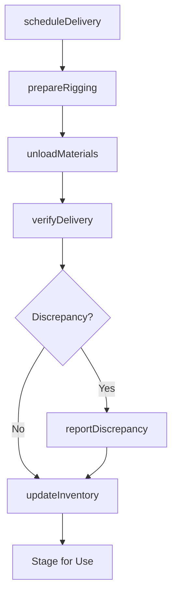
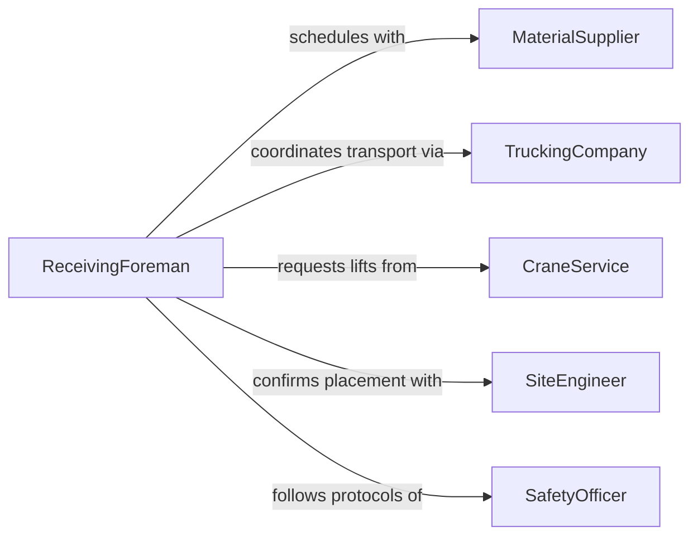

# Load or Unload Materials Used in Construction or Extraction

> Business-as-Code definition for loading and unloading construction and extraction materials such as lumber, steel, aggregate, pipe, and mining supplies at job sites, yards, and staging areas.

## Overview

Loading and unloading construction and extraction materials involves coordinating material deliveries to and from active sites, operating cranes, forklifts, and conveyors to transfer heavy goods, and verifying delivery quantities against purchase orders. This definition models delivery scheduling, equipment rigging, material placement, receiving inspection, and inventory updates for construction projects, quarry operations, and mining supply chains.

## Actors

| Actor | Description |
|-------|-------------|
| MaterialSupplier | Delivers construction materials such as steel, lumber, and aggregate |
| TruckingCompany | Provides flatbed, dump truck, and heavy-haul transport services |
| CraneService | Supplies mobile cranes and certified operators for heavy lifts |
| SiteEngineer | Specifies material placement locations and structural requirements |
| SafetyOfficer | Enforces safe lifting, rigging, and unloading practices on site |

## Roles

| Role | Description |
|------|-------------|
| ReceivingForeman | Coordinates deliveries and directs unloading crews |
| Rigger | Attaches slings, chains, and rigging hardware for crane lifts |
| EquipmentOperator | Runs forklifts, loaders, and cranes during loading operations |
| MaterialClerk | Verifies delivery tickets against purchase orders and updates inventory |

## Entities

| Entity | Description |
|--------|-------------|
| DeliveryTicket | A document listing materials, quantities, and delivery destination |
| PurchaseOrder | A procurement record specifying materials ordered for the project |
| RiggingPlan | A lift plan specifying equipment, sling angles, and load weights |
| MaterialStagingArea | A designated location on site for storing delivered materials |
| ReceivingReport | A document confirming quantities received and noting any discrepancies |
| WeightCertificate | A certified record of material weight from the supplier or scale |

## Actions

| Action | Description |
|--------|-------------|
| scheduleDelivery | Coordinate material delivery timing with the trucking company |
| prepareRigging | Set up slings, chains, and crane configuration for the lift |
| unloadMaterials | Transfer materials from the delivery vehicle to the staging area |
| loadMaterials | Place materials onto vehicles for transport to other sites or returns |
| verifyDelivery | Check received quantities and condition against the purchase order |
| updateInventory | Record received materials in the project inventory system |
| reportDiscrepancy | Document shortages, damages, or incorrect materials received |

## Events

| Event | Description |
|-------|-------------|
| deliveryScheduled | Material delivery time and site have been confirmed |
| riggingPrepared | Lifting equipment and hardware are configured and inspected |
| materialsUnloaded | Materials have been transferred from the vehicle to the staging area |
| materialsLoaded | Materials have been placed onto a vehicle for outbound transport |
| deliveryVerified | Received quantities have been confirmed against the purchase order |
| inventoryUpdated | Project inventory records have been refreshed |
| discrepancyReported | A shortage or damage issue has been documented |

## Searches

| Search | Description |
|--------|-------------|
| findScheduledDeliveries | List upcoming material deliveries by site, date, or supplier |
| getReceivingHistory | Retrieve completed receiving reports by project or material type |
| findOpenDiscrepancies | Locate unresolved delivery shortage or damage claims |
| getInventoryLevels | Check current material stock levels at a project site |

## Workflow



## Actor Relationships



## Usage

### Calling Actions

```typescript
import { loadUnloadMaterialsUsedConstruction } from '@headlessly/load-unload-materials-used-construction'

const materials = loadUnloadMaterialsUsedConstruction()

// Schedule a steel delivery for a bridge project
await materials.scheduleDelivery({
  projectId: 'BRIDGE-I95-SPAN-3',
  supplierId: 'NUCOR-STEEL-SE',
  materials: [
    { type: 'W24x76-beam', quantity: 12, unit: 'each' },
    { type: 'rebar-no8', quantity: 40, unit: 'tons' }
  ],
  deliveryDate: '2026-02-10',
  truckType: 'flatbed'
})

// Prepare rigging and unload
await materials.prepareRigging({
  projectId: 'BRIDGE-I95-SPAN-3',
  craneId: 'CRANE-MOBILE-200T',
  rigging: { slingType: 'wire-rope', angle: 60, capacity: 25 }
})

await materials.unloadMaterials({
  projectId: 'BRIDGE-I95-SPAN-3',
  deliveryTicket: 'DT-2026-4478',
  stagingArea: 'YARD-NORTH'
})

// Verify and record
const receiving = await materials.verifyDelivery({
  deliveryTicket: 'DT-2026-4478',
  purchaseOrder: 'PO-BRIDGE-0092'
})

if (receiving.discrepancies.length > 0) {
  await materials.reportDiscrepancy({
    deliveryTicket: 'DT-2026-4478',
    issues: receiving.discrepancies
  })
}
```

### Event-Driven Automation

```typescript
// Auto-update inventory when deliveries are verified
materials.deliveryVerified(async ({ projectId, deliveryTicket }) => {
  await materials.updateInventory({ projectId, deliveryTicket })
})

// Alert procurement on delivery discrepancies
materials.discrepancyReported(async ({ deliveryTicket, issues }) => {
  await notify({
    to: 'procurement',
    message: `Delivery ${deliveryTicket} has ${issues.length} discrepancies requiring resolution`
  })
})
```
