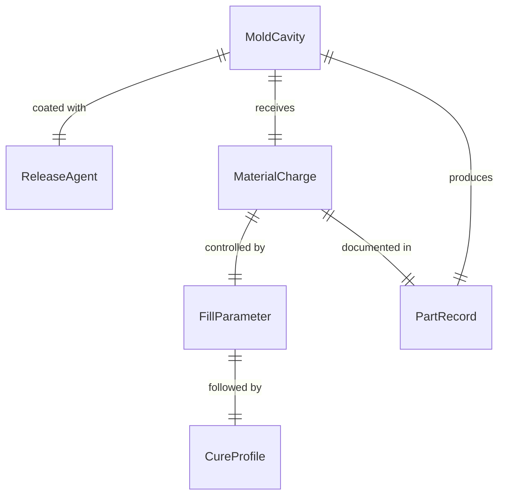
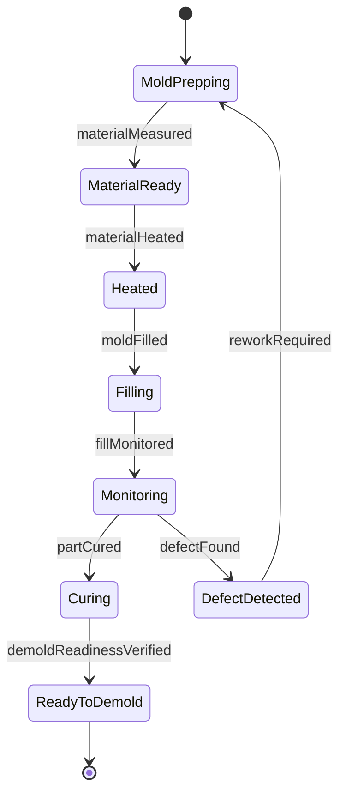
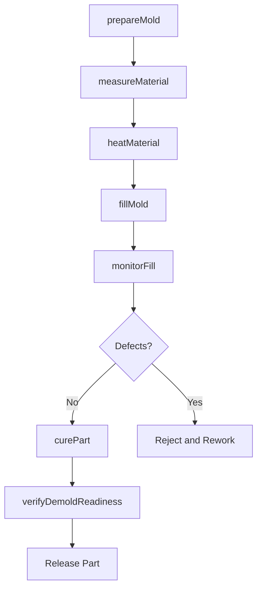
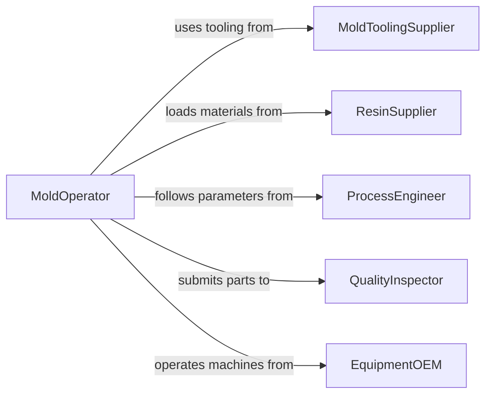

# Place Materials into Molds

> Business-as-Code definition for preparing and placing raw materials such as molten metal, plastic resin, concrete, or composite layups into molds for casting, injection molding, or forming operations.

## Overview

Placing materials into molds involves preparing the mold cavity with release agents, measuring and heating materials to the correct state, pouring or injecting the material, and monitoring the fill to prevent voids, flashing, or defects. This definition models mold preparation, material metering, fill sequencing, cure or cooling monitoring, and demolding readiness verification for foundry, plastics, concrete precasting, and composites manufacturing.

## Actors

| Actor | Description |
|-------|-------------|
| MoldToolingSupplier | Provides and maintains mold tooling and cavity inserts |
| ResinSupplier | Delivers casting resins, plastics pellets, and composite materials |
| ProcessEngineer | Specifies fill parameters, temperatures, and cycle times |
| QualityInspector | Verifies part dimensions and surface quality after demolding |
| EquipmentOEM | Provides molding machines and technical support |

## Roles

| Role | Description |
|------|-------------|
| MoldOperator | Prepares molds and places materials into the cavity |
| ProcessTechnician | Monitors fill parameters and adjusts settings during the cycle |
| MoldSetupSpecialist | Installs mold tooling and verifies alignment and clamping |
| MaterialPrepper | Measures, mixes, and heats materials to the required state |

## Entities

| Entity | Description |
|--------|-------------|
| MoldCavity | The shaped cavity that forms the final part geometry |
| MaterialCharge | A measured quantity of material prepared for a single mold fill |
| ReleaseAgent | A coating applied to mold surfaces to prevent material adhesion |
| FillParameter | Temperature, pressure, and flow rate settings for the fill cycle |
| CureProfile | Time and temperature schedule for material solidification |
| PartRecord | Documentation of materials, parameters, and quality for each molded part |

## Actions

| Action | Description |
|--------|-------------|
| prepareMold | Clean the cavity and apply release agent for the next cycle |
| measureMaterial | Weigh or meter the correct quantity of material for the charge |
| heatMaterial | Bring material to the required temperature or molten state |
| fillMold | Pour, inject, or lay material into the mold cavity |
| monitorFill | Track fill progress and adjust parameters to prevent defects |
| curePart | Allow the material to solidify per the specified cure profile |
| verifyDemoldReadiness | Confirm the part has cured sufficiently for safe mold release |

## Events

| Event | Description |
|-------|-------------|
| moldPrepared | Cavity has been cleaned and release agent applied |
| materialMeasured | Correct charge quantity has been weighed or metered |
| materialHeated | Material has reached the required temperature |
| moldFilled | Material has been placed into the mold cavity |
| fillMonitored | Fill parameters have been tracked and verified |
| partCured | Material has solidified per the cure profile |
| demoldReadinessVerified | Part is confirmed ready for mold release |

## Searches

| Search | Description |
|--------|-------------|
| findActiveMolds | List molds currently in production with cycle status |
| getMaterialCharges | Retrieve charge records by material type or batch |
| getDefectHistory | Pull defect records by mold, material, or parameter |
| getCureStatus | Check cure progress for parts currently in molds |

## Entity Relationships



## State Diagram



## Workflow



## Actor Relationships



## Usage

### Calling Actions

```typescript
import { placeMaterialsIntoMolds } from '@headlessly/place-materials-into-molds'

const molding = placeMaterialsIntoMolds()

// Prepare mold for an aluminum casting
await molding.prepareMold({
  moldId: 'MOLD-HOUSING-A7',
  releaseAgent: 'graphite-spray',
  coreInserts: ['CORE-A7-LEFT', 'CORE-A7-RIGHT']
})

// Measure and heat the aluminum charge
await molding.measureMaterial({
  materialType: 'A356-aluminum',
  chargeWeight: { lbs: 45 },
  batchId: 'AL-LOT-2026-0219'
})

await molding.heatMaterial({
  materialType: 'A356-aluminum',
  targetTemp: { fahrenheit: 1350 },
  furnaceId: 'FURNACE-02'
})

// Fill and cure
await molding.fillMold({
  moldId: 'MOLD-HOUSING-A7',
  method: 'gravity-pour',
  pourRate: { lbsPerSecond: 3 }
})

await molding.curePart({
  moldId: 'MOLD-HOUSING-A7',
  cooldownMinutes: 45
})
```

### Event-Driven Automation

```typescript
// Auto-start cure timer when mold is filled
molding.moldFilled(async ({ moldId }) => {
  await molding.curePart({ moldId })
})

// Alert quality when defects are detected during fill
molding.fillMonitored(async ({ moldId, defectsDetected }) => {
  if (defectsDetected) {
    await notify({
      to: 'quality-inspector',
      message: `Mold ${moldId} fill defect detected - inspect before proceeding`
    })
  }
})
```
