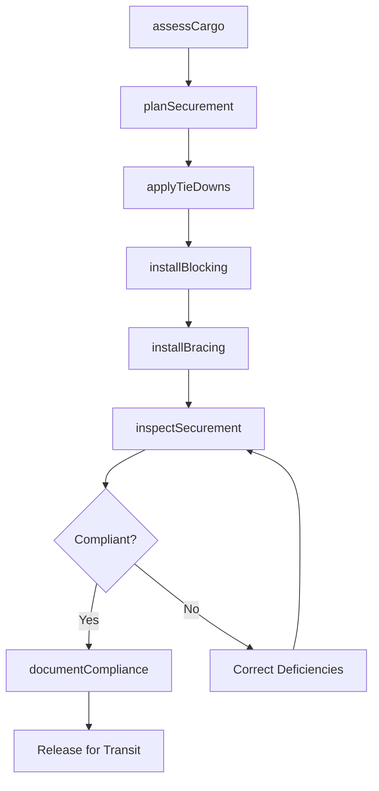
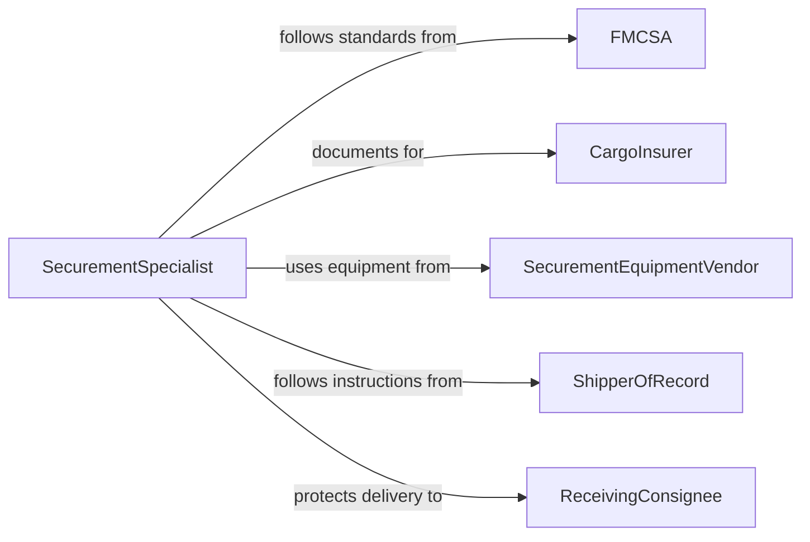

# Secure Cargo

> Business-as-Code definition for properly restraining, blocking, and bracing cargo on trucks, railcars, ships, and aircraft to prevent shifting, damage, or loss during transport in compliance with DOT and FMCSA regulations.

## Overview

Securing cargo involves selecting appropriate restraint methods based on cargo type, weight, and transport mode, then applying tie-downs, chains, blocking, bracing, and dunnage to prevent load movement during transit. This definition models cargo assessment, restraint planning, securement application, inspection verification, and en-route monitoring to meet FMCSA cargo securement rules, AAR loading standards, and IMDG maritime requirements.

## Actors

| Actor | Description |
|-------|-------------|
| FMCSA | Sets federal motor carrier cargo securement standards |
| CargoInsurer | Underwrites cargo coverage and requires documented securement |
| SecurementEquipmentVendor | Provides straps, chains, winches, dunnage, and blocking materials |
| ShipperOfRecord | Originates the cargo and specifies handling requirements |
| ReceivingConsignee | Accepts delivery and reports any securement failures or damage |

## Roles

| Role | Description |
|------|-------------|
| SecurementSpecialist | Plans and applies cargo restraint systems |
| DriverOperator | Performs pre-trip and en-route securement inspections |
| LoadingSupervisor | Verifies securement meets regulatory and shipper requirements |
| SafetyManager | Audits securement practices and maintains compliance records |

## Entities

| Entity | Description |
|--------|-------------|
| SecurementPlan | A document specifying restraint types, quantities, and placement for a load |
| TieDown | A strap, chain, or cable used to restrain cargo to the vehicle |
| BlockingDevice | Lumber, chocks, or cradles preventing cargo from sliding |
| BracingSystem | Vertical or horizontal supports preventing cargo from tipping |
| SecurementInspection | A recorded check of all restraints before and during transit |
| WorkingLoadLimit | The rated maximum force a tie-down can withstand in service |
| DunnageMaterial | Padding, airbags, or void fill preventing cargo-to-cargo contact |

## Actions

| Action | Description |
|--------|-------------|
| assessCargo | Evaluate cargo weight, dimensions, center of gravity, and fragility |
| planSecurement | Determine tie-down count, type, and placement per FMCSA rules |
| applyTieDowns | Attach straps, chains, or cables and tension to working load limits |
| installBlocking | Place blocks, chocks, and cradles to prevent sliding |
| installBracing | Set vertical or horizontal supports to prevent tipping |
| inspectSecurement | Verify all restraints meet the securement plan and regulations |
| documentCompliance | Record securement details for the driver, carrier, and insurer |

## Events

| Event | Description |
|-------|-------------|
| cargoAssessed | Cargo characteristics have been evaluated for securement planning |
| securementPlanned | Restraint types and placement have been determined |
| tieDownsApplied | Straps, chains, or cables have been attached and tensioned |
| blockingInstalled | Blocks and chocks have been placed to prevent sliding |
| bracingInstalled | Supports have been set to prevent tipping |
| securementInspected | All restraints have been verified compliant |
| complianceDocumented | Securement records have been filed |

## Searches

| Search | Description |
|--------|-------------|
| findSecurementPlans | Retrieve securement plans by cargo type or transport mode |
| getInspectionHistory | Pull securement inspection records by vehicle or date |
| findEquipmentInventory | Check available straps, chains, and blocking materials |
| getFailureReports | Locate documented securement failures or cargo damage incidents |

## Workflow



## Actor Relationships



## Usage

### Calling Actions

```typescript
import { secureCargo } from '@headlessly/secure-cargo'

const cargo = secureCargo()

// Assess a flatbed load of steel coils
const assessment = await cargo.assessCargo({
  loadId: 'LOAD-2026-7791',
  items: [
    { type: 'steel-coil', weight: 42000, unit: 'lbs', diameter: 72, width: 48 }
  ],
  vehicleType: 'flatbed-48ft'
})

// Plan and apply securement
const plan = await cargo.planSecurement({
  assessmentId: assessment.id,
  method: 'direct-tiedown',
  tieDowns: { type: 'chain-grade-70', count: 8, wll: 6600 },
  blocking: { type: 'coil-cradle', count: 3 },
  bracing: { type: 'coil-rack', count: 3 }
})

await cargo.applyTieDowns({
  planId: plan.id,
  chains: 8,
  binders: 8,
  tensionVerified: true
})

await cargo.installBlocking({
  planId: plan.id,
  cradles: ['CRADLE-01', 'CRADLE-02', 'CRADLE-03']
})

// Inspect and document
await cargo.inspectSecurement({ planId: plan.id })
await cargo.documentCompliance({
  planId: plan.id,
  driverId: 'DRV-SMITH-044',
  carrierId: 'CARRIER-HEAVY-HAUL-12'
})
```

### Event-Driven Automation

```typescript
// Auto-schedule en-route inspection reminders
cargo.complianceDocumented(async ({ planId, driverId }) => {
  await scheduleTask({
    action: 'enRouteInspection',
    planId,
    driverId,
    interval: '150mi',
    message: 'Perform cargo securement check per FMCSA 393.100'
  })
})

// Alert safety on securement failures
cargo.securementInspected(async ({ planId, compliant, deficiencies }) => {
  if (!compliant) {
    await notify({
      to: 'safety-manager',
      message: `Load ${planId} securement deficient: ${deficiencies.join(', ')} - hold for correction`
    })
  }
})
```
