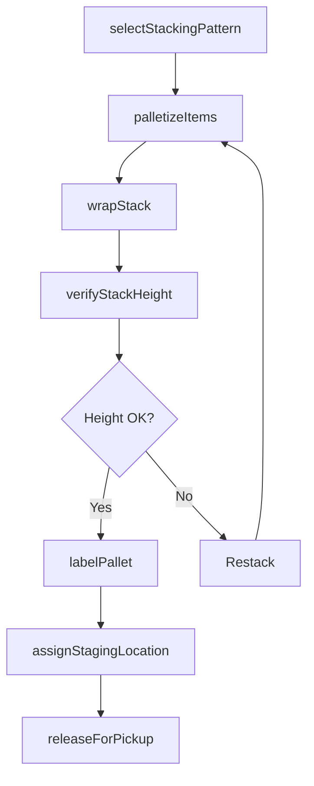
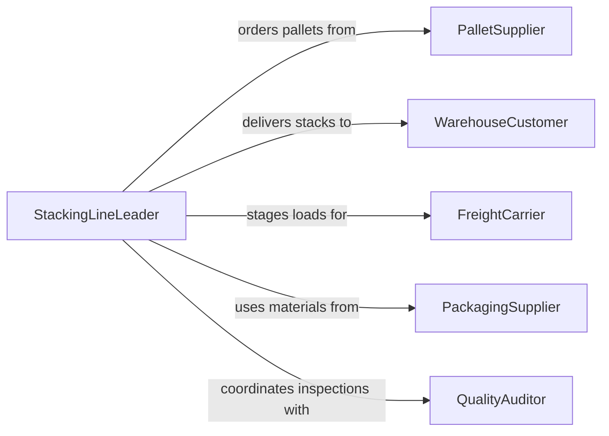

# Stack Finished Items for Further Processing or Shipment

> Business-as-Code definition for arranging, palletizing, and stacking finished goods and work-in-progress items in preparation for the next production stage, warehouse storage, or outbound shipment.

## Overview

Stacking finished items involves arranging products in stable configurations on pallets, racks, or staging areas following specific stacking patterns to maximize space utilization while preventing product damage. This definition models stacking pattern selection, palletizing operations, stack height verification, labeling, and staging area assignment for manufacturing, food processing, and distribution center operations.

## Actors

| Actor | Description |
|-------|-------------|
| PalletSupplier | Provides pallets, slip sheets, and stacking materials |
| WarehouseCustomer | Receives stacked goods for storage or further distribution |
| FreightCarrier | Loads stacked pallets onto transport vehicles |
| PackagingSupplier | Provides stretch wrap, banding, and corner protectors |
| QualityAuditor | Inspects stacking patterns for product protection compliance |

## Roles

| Role | Description |
|------|-------------|
| StackingLineLeader | Directs stacking operations and verifies pattern compliance |
| Palletizer | Arranges items onto pallets following prescribed patterns |
| ForkliftOperator | Moves completed stacks to staging or storage locations |
| InventoryClerk | Labels stacks and updates warehouse management system records |

## Entities

| Entity | Description |
|--------|-------------|
| StackingPattern | A prescribed arrangement specifying how items are layered on a pallet |
| PalletLoad | A completed stack of items on a pallet ready for movement |
| StackHeightLimit | The maximum safe stacking height based on product and storage constraints |
| StagingLocation | A designated area for completed stacks awaiting pickup or processing |
| PalletLabel | A barcode or RFID tag identifying the stack contents and destination |
| WrapSpecification | Requirements for stretch wrapping or banding to secure the stack |

## Actions

| Action | Description |
|--------|-------------|
| selectStackingPattern | Choose the arrangement pattern based on product type and destination |
| palletizeItems | Arrange finished items onto pallets following the selected pattern |
| wrapStack | Apply stretch wrap or banding to secure the palletized load |
| verifyStackHeight | Confirm the stack does not exceed height limits for storage or transport |
| labelPallet | Apply identification labels with contents, weight, and destination |
| assignStagingLocation | Direct the completed stack to the appropriate staging area |
| releaseForPickup | Mark the stack as ready for forklift movement to storage or shipping |

## Events

| Event | Description |
|-------|-------------|
| stackingPatternSelected | Arrangement pattern has been determined for the product run |
| itemsPalletized | Finished items have been arranged onto the pallet |
| stackWrapped | Stretch wrap or banding has been applied |
| stackHeightVerified | Stack confirmed within height limits |
| palletLabeled | Identification labels have been applied to the stack |
| stagingLocationAssigned | Stack has been directed to its staging area |
| stackReleasedForPickup | Stack is marked ready for movement |

## Searches

| Search | Description |
|--------|-------------|
| findCompletedStacks | List stacks awaiting pickup by staging area or product type |
| getStackingPatterns | Retrieve approved patterns for a given product |
| getStagingCapacity | Check available space in staging areas |
| getPalletInventory | Track available pallet and wrap supply levels |

## Workflow



## Actor Relationships



## Usage

### Calling Actions

```typescript
import { stackFinishedItemsFurtherProcessing } from '@headlessly/stack-finished-items-further-processing'

const stacking = stackFinishedItemsFurtherProcessing()

// Select pattern for bottled beverages
await stacking.selectStackingPattern({
  productId: 'BEV-SPARKLING-12OZ',
  palletType: 'GMA-48x40',
  pattern: 'column-stack-5-high',
  casesPerLayer: 12
})

// Palletize and wrap
await stacking.palletizeItems({
  productId: 'BEV-SPARKLING-12OZ',
  quantity: 60,
  unit: 'cases',
  palletId: 'PLT-2026-44871'
})

await stacking.wrapStack({
  palletId: 'PLT-2026-44871',
  method: 'stretch-wrap',
  revolutions: 3,
  cornerProtectors: true
})

// Verify, label, and stage
await stacking.verifyStackHeight({
  palletId: 'PLT-2026-44871',
  maxHeight: { inches: 60 }
})

await stacking.labelPallet({
  palletId: 'PLT-2026-44871',
  destination: 'DC-CENTRAL-02',
  weight: { lbs: 2100 }
})

await stacking.assignStagingLocation({
  palletId: 'PLT-2026-44871',
  location: 'STAGE-OUTBOUND-B3'
})
```

### Event-Driven Automation

```typescript
// Auto-assign staging when stack is wrapped and verified
stacking.stackHeightVerified(async ({ palletId, withinLimits }) => {
  if (withinLimits) {
    const location = await stacking.getStagingCapacity({ zone: 'outbound' })
    await stacking.assignStagingLocation({
      palletId,
      location: location[0].id
    })
  }
})

// Notify shipping when stacks are ready for pickup
stacking.stackReleasedForPickup(async ({ palletId, destination }) => {
  await notify({
    to: 'shipping-dock',
    message: `Pallet ${palletId} ready for pickup - destination: ${destination}`
  })
})
```
