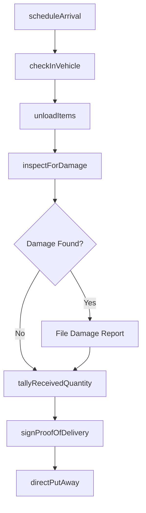
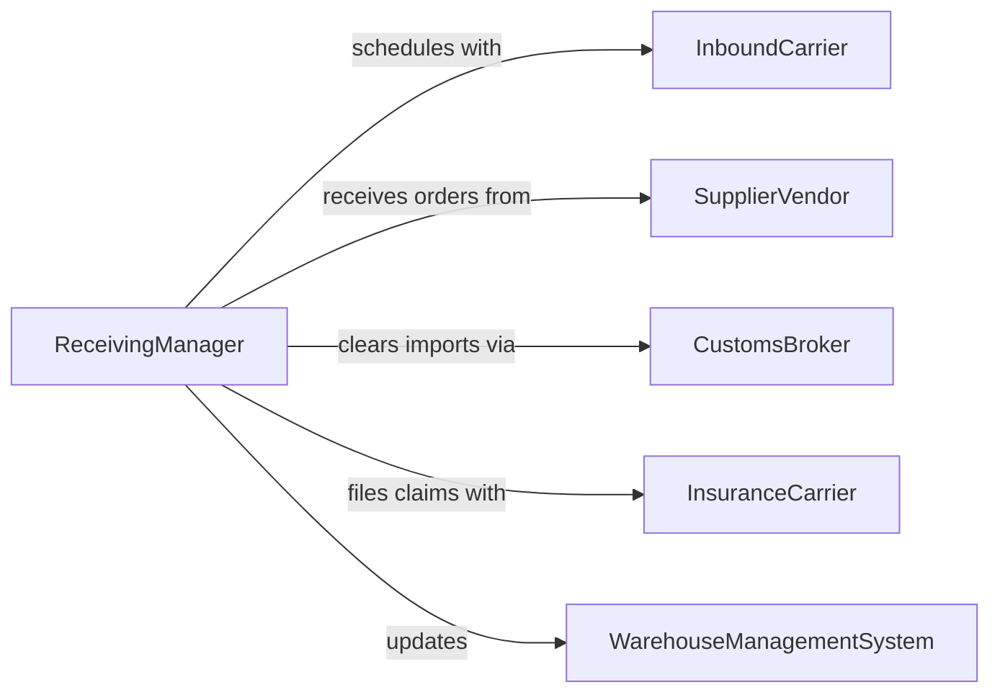

# Unload Materials or Equipment

> Business-as-Code definition for receiving and unloading materials and equipment from trucks, railcars, containers, and vessels at warehouses, job sites, and receiving docks.

## Overview

Unloading materials or equipment involves scheduling inbound deliveries, assigning dock doors or unloading areas, operating forklifts, cranes, and conveyors to remove items from vehicles, inspecting for damage, and recording received quantities. This definition models receiving scheduling, unloading crew coordination, damage inspection, quantity verification, and inventory put-away for distribution centers, manufacturing plants, and field receiving operations.

## Actors

| Actor | Description |
|-------|-------------|
| InboundCarrier | Delivers materials and equipment to the receiving location |
| SupplierVendor | Ships materials against purchase orders |
| CustomsBroker | Processes import documentation for international shipments |
| InsuranceCarrier | Covers cargo damage claims discovered during unloading |
| WarehouseManagementSystem | Directs put-away locations for received inventory |

## Roles

| Role | Description |
|------|-------------|
| ReceivingManager | Schedules inbound deliveries and assigns dock resources |
| UnloadingCrewLead | Directs workers in safely removing items from vehicles |
| ForkliftOperator | Operates powered equipment to move pallets and heavy items |
| ReceivingInspector | Checks delivered items for damage, quantity, and specification compliance |

## Entities

| Entity | Description |
|--------|-------------|
| DeliveryAppointment | A scheduled time slot for an inbound vehicle to arrive |
| ReceivingOrder | A document listing expected items, quantities, and purchase order references |
| DamageReport | Documentation of any shipping damage discovered during unloading |
| ReceivingTally | A count of items physically unloaded versus the order quantity |
| PutAwayDirective | Instructions for moving received items to their storage location |
| ProofOfDelivery | A signed document confirming receipt of the shipment |

## Actions

| Action | Description |
|--------|-------------|
| scheduleArrival | Book a delivery appointment and assign a dock door |
| checkInVehicle | Verify driver credentials, seal numbers, and shipment documentation |
| unloadItems | Remove materials and equipment from the vehicle |
| inspectForDamage | Examine items for shipping damage or defects |
| tallyReceivedQuantity | Count unloaded items and compare against the receiving order |
| signProofOfDelivery | Acknowledge receipt and release the driver |
| directPutAway | Route received items to their designated storage locations |

## Events

| Event | Description |
|-------|-------------|
| arrivalScheduled | Delivery appointment and dock assignment have been confirmed |
| vehicleCheckedIn | Driver and shipment documentation have been verified |
| itemsUnloaded | Materials and equipment have been removed from the vehicle |
| damageInspected | Items have been examined for shipping damage |
| quantityTallied | Received quantities have been counted and verified |
| proofOfDeliverySigned | Receipt has been acknowledged and driver released |
| putAwayDirected | Items have been routed to storage locations |

## Searches

| Search | Description |
|--------|-------------|
| findScheduledArrivals | List inbound deliveries by date, carrier, or dock |
| getReceivingHistory | Retrieve completed receiving records by supplier or date |
| findOpenDamageReports | Locate unresolved damage claims from recent deliveries |
| getQuantityDiscrepancies | Find deliveries with shortages or overages |

## Workflow



## Actor Relationships



## Usage

### Calling Actions

```typescript
import { unloadMaterialsEquipment } from '@headlessly/unload-materials-equipment'

const receiving = unloadMaterialsEquipment()

// Schedule an inbound delivery
const appointment = await receiving.scheduleArrival({
  warehouseId: 'DC-WEST-02',
  carrierId: 'XPO-LOGISTICS',
  date: '2026-02-07',
  dock: 'DOOR-12',
  purchaseOrders: ['PO-2026-5571', 'PO-2026-5572']
})

// Check in and unload
await receiving.checkInVehicle({
  appointmentId: appointment.id,
  sealNumber: 'SEAL-XPO-44891',
  bolNumber: 'BOL-XPO-2026-7821'
})

await receiving.unloadItems({
  appointmentId: appointment.id,
  method: 'forklift',
  palletCount: 22
})

// Inspect and tally
const inspection = await receiving.inspectForDamage({
  appointmentId: appointment.id,
  items: 22
})

await receiving.tallyReceivedQuantity({
  appointmentId: appointment.id,
  expected: 22,
  received: 21,
  discrepancy: { type: 'shortage', count: 1 }
})

// Sign off and put away
await receiving.signProofOfDelivery({ appointmentId: appointment.id })
await receiving.directPutAway({
  appointmentId: appointment.id,
  locations: [
    { pallets: 12, zone: 'RACK-A-ROW-14' },
    { pallets: 9, zone: 'RACK-B-ROW-22' }
  ]
})
```

### Event-Driven Automation

```typescript
// Auto-file damage claim when damage is found
receiving.damageInspected(async ({ appointmentId, damageFound, items }) => {
  if (damageFound) {
    await notify({
      to: 'claims-coordinator',
      message: `Delivery ${appointmentId} has ${items.length} damaged items - initiate carrier claim`
    })
  }
})

// Alert procurement on quantity shortages
receiving.quantityTallied(async ({ appointmentId, discrepancy }) => {
  if (discrepancy && discrepancy.type === 'shortage') {
    await notify({
      to: 'procurement',
      message: `Delivery ${appointmentId} short ${discrepancy.count} units - contact supplier`
    })
  }
})
```
