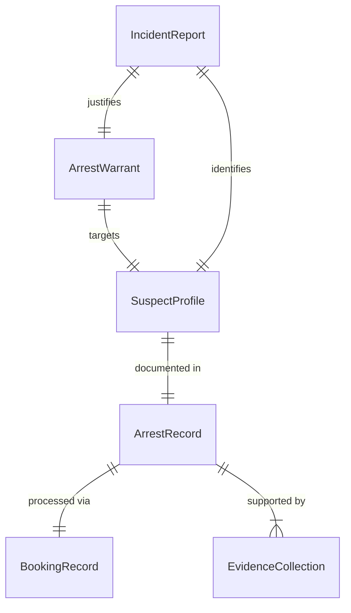
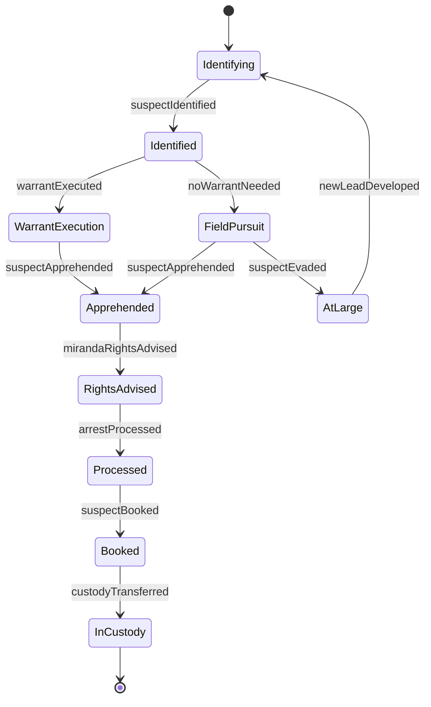
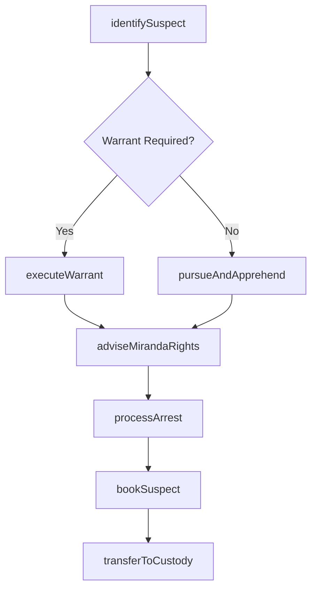
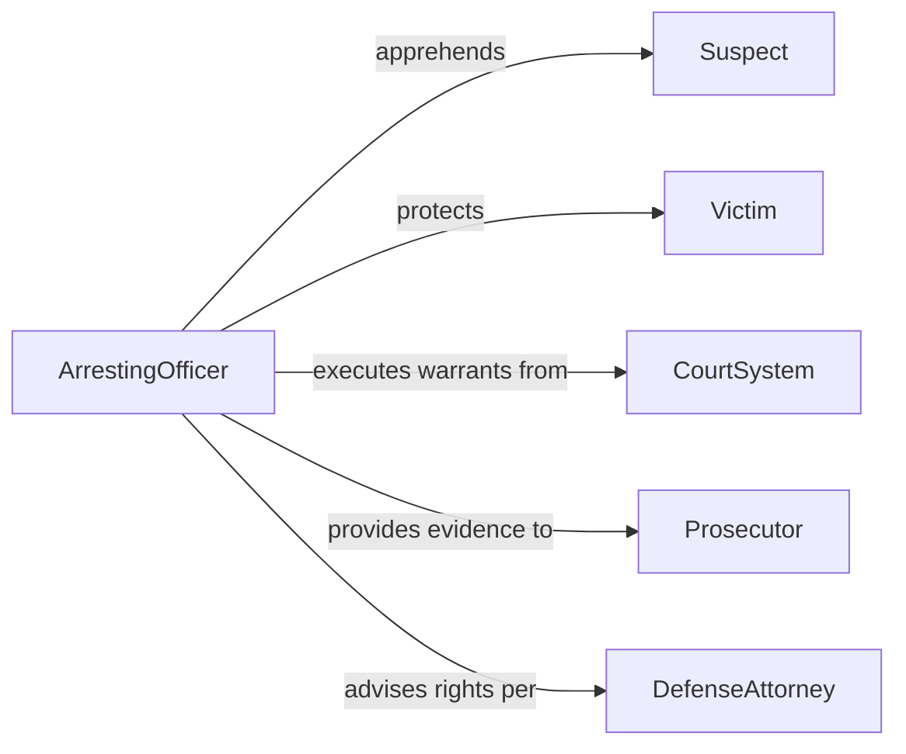

# Apprehend Criminal Suspects

> Business-as-Code definition for apprehending criminal suspects. Models the identification, pursuit, arrest, and booking process for individuals suspected of criminal activity.

## Overview

Apprehending criminal suspects involves the identification, pursuit, and physical arrest of individuals suspected of committing crimes. This activity encompasses warrant execution, field arrests, suspect processing, and the formal transfer of arrested individuals into the criminal justice system through booking and custody procedures.

## Actors

| Actor | Description |
|-------|-------------|
| Suspect | Individual believed to have committed a criminal offense |
| Victim | Person who suffered harm from the suspected criminal act |
| CourtSystem | Judicial body issuing warrants and processing arraignments |
| Prosecutor | Attorney directing charges based on arrest evidence |
| DefenseAttorney | Legal representative of the arrested individual |

## Roles

| Role | Description |
|------|-------------|
| ArrestingOfficer | Executes the physical apprehension of the suspect |
| DetectiveInvestigator | Identifies suspects through investigation and evidence |
| BookingOfficer | Processes arrested individuals into the custody system |
| FieldSupervisor | Authorizes arrest actions and coordinates pursuit operations |
| DispatchOperator | Coordinates officer response and suspect location information |

## Entities

| Entity | Description |
|--------|-------------|
| ArrestWarrant | Court-issued authorization to apprehend a specific individual |
| ArrestRecord | Official documentation of the apprehension event |
| SuspectProfile | Collected information identifying the individual |
| BookingRecord | Processing documentation for intake into custody |
| EvidenceCollection | Physical and testimonial evidence supporting the arrest |
| IncidentReport | Report of the criminal activity leading to the arrest |

## Actions

| Action | Description |
|--------|-------------|
| identifySuspect | Confirm the identity of the individual to be apprehended |
| executeWarrant | Carry out an arrest based on a court-issued warrant |
| pursueAndApprehend | Conduct a pursuit and physically arrest the suspect |
| adviseMirandaRights | Inform the arrested individual of their legal rights |
| processArrest | Complete arrest documentation and evidence collection |
| bookSuspect | Process the individual into the custody and booking system |
| transferToCustody | Hand the arrested individual to a detention facility |

## Events

| Event | Description |
|-------|-------------|
| suspectIdentified | A criminal suspect has been positively identified |
| warrantExecuted | An arrest warrant has been carried out |
| suspectApprehended | A suspect has been physically arrested |
| mirandaRightsAdvised | The arrested individual has been informed of their rights |
| arrestProcessed | All arrest documentation has been completed |
| suspectBooked | The individual has been processed into the booking system |
| custodyTransferred | The arrested person has been delivered to a detention facility |

## Searches

| Search | Description |
|--------|-------------|
| findArrestRecords | List arrests by officer, suspect, date, or offense type |
| getActiveWarrants | Retrieve outstanding arrest warrants by suspect or jurisdiction |
| getSuspectProfile | Look up identifying information for a known suspect |
| findBookingRecords | Search booking records by date, facility, or individual |

## Entity Relationships



## State Diagram



## Workflow



## Actor Relationships



## Usage

### Calling Actions

```typescript
import { apprehendCriminalSuspects } from '@headlessly/apprehend-criminal-suspects'

const apprehension = apprehendCriminalSuspects()

// Identify a suspect from investigation
const suspect = await apprehension.identifySuspect({
  name: 'John Smith',
  description: 'Male, 35, brown hair, 180cm',
  caseId: 'case-20260205-042',
  evidenceBasis: 'Surveillance footage and witness identification'
})

// Execute an arrest warrant
await apprehension.executeWarrant({
  warrantId: 'warrant-2026-1184',
  suspectId: suspect.id,
  location: '1420 Oak Street, Apt 3B',
  officerId: 'officer-rodriguez'
})

// Book the suspect into custody
await apprehension.bookSuspect({
  suspectId: suspect.id,
  facility: 'county-detention-center',
  charges: ['burglary-second-degree', 'possession-stolen-property'],
  arrestingOfficer: 'officer-rodriguez'
})
```

### Event-Driven Automation

```typescript
// Notify prosecutor after booking
apprehension.suspectBooked(async ({ suspectId, charges, caseId }) => {
  await notify({
    to: 'district-attorney-office',
    message: `Suspect ${suspectId} booked on ${charges.join(', ')} - case ${caseId}`
  })
})

// Alert victim services upon apprehension
apprehension.suspectApprehended(async ({ caseId, suspectId }) => {
  await notify({
    to: 'victim-services',
    message: `Suspect apprehended in case ${caseId} - notify affected victim`
  })
})
```
