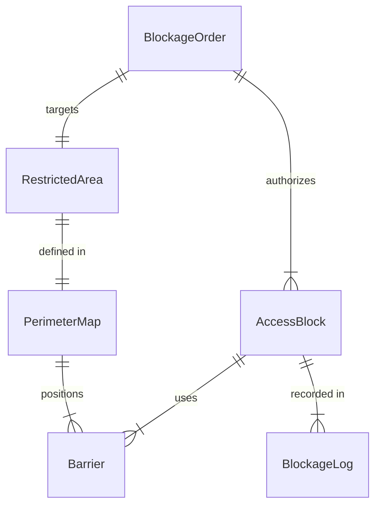
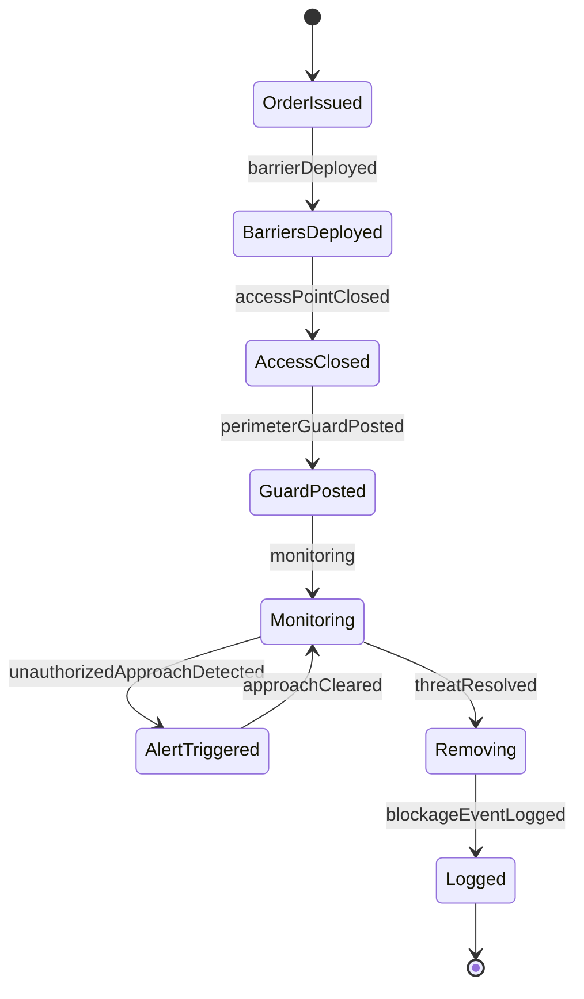
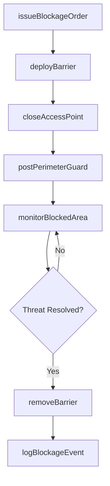
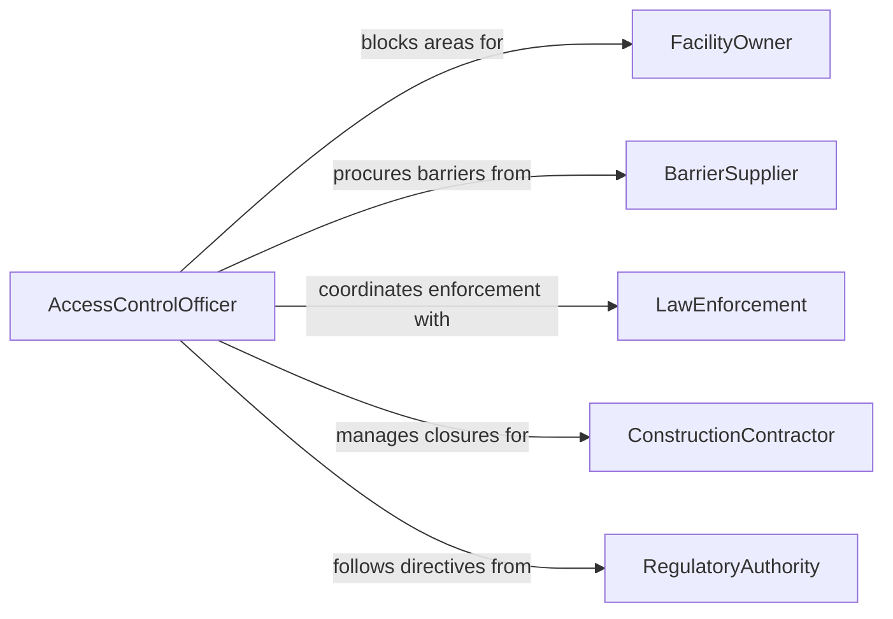

# Block Physical Access Restricted Areas

> Business-as-Code definition for blocking physical access to restricted areas. Models barrier deployment, perimeter control, and access denial procedures.

## Overview

Blocking physical access to restricted areas involves deploying barriers, locks, and personnel to prevent unauthorized entry into controlled zones. This activity covers the installation and management of physical security measures, temporary closures for emergencies or construction, and the coordination of access denial with surveillance and alert systems.

## Actors

| Actor | Description |
|-------|-------------|
| FacilityOwner | Entity responsible for the property and its restricted zones |
| BarrierSupplier | Vendor providing physical barriers, locks, and fencing |
| LawEnforcement | Agency assisting with enforcement at restricted perimeters |
| ConstructionContractor | External party requiring temporary area closures |
| RegulatoryAuthority | Body mandating access restrictions for safety or compliance |

## Roles

| Role | Description |
|------|-------------|
| AccessControlOfficer | Manages physical barriers and denies unauthorized entry |
| SecuritySupervisor | Directs access blocking operations and personnel deployment |
| FacilitiesTechnician | Installs and maintains physical access control hardware |
| PerimeterGuard | Staffs blocked access points to enforce denial |

## Entities

| Entity | Description |
|--------|-------------|
| Barrier | Physical obstruction such as a gate, bollard, or fence |
| RestrictedArea | Defined zone where access is controlled or denied |
| AccessBlock | Active configuration denying entry at a specific point |
| BlockageOrder | Directive authorizing the closure of an access point |
| PerimeterMap | Layout showing barrier positions and restricted boundaries |
| BlockageLog | Record of when and why an access point was blocked |

## Actions

| Action | Description |
|--------|-------------|
| deployBarrier | Install or activate a physical barrier at an access point |
| issueBlockageOrder | Authorize the closure of a specific area or entry point |
| closeAccessPoint | Shut and secure a gate, door, or passage |
| postPerimeterGuard | Station personnel to enforce a physical access block |
| removeBarrier | Deactivate or dismantle a barrier when no longer needed |
| monitorBlockedArea | Observe a restricted zone for unauthorized access attempts |
| logBlockageEvent | Record the deployment or removal of an access block |

## Events

| Event | Description |
|-------|-------------|
| barrierDeployed | A physical barrier has been installed or activated |
| blockageOrderIssued | An access closure has been formally authorized |
| accessPointClosed | A gate, door, or passage has been shut and secured |
| perimeterGuardPosted | Personnel have been stationed at a blocked access point |
| barrierRemoved | A physical barrier has been deactivated or dismantled |
| unauthorizedApproachDetected | An individual has been observed approaching a blocked area |
| blockageEventLogged | A barrier deployment or removal has been recorded |

## Searches

| Search | Description |
|--------|-------------|
| findActiveBlocks | List currently active access blocks by area or type |
| getBlockageLogs | Retrieve history of access point closures and openings |
| getBarrierInventory | List available barriers by type, location, or status |
| findBlockageOrders | Search closure directives by area, date, or authority |

## Entity Relationships



## State Diagram



## Workflow



## Actor Relationships



## Usage

### Calling Actions

```typescript
import { blockPhysicalAccessRestrictedAreas } from '@headlessly/block-physical-access-restricted-areas'

const access = blockPhysicalAccessRestrictedAreas()

// Issue a blockage order for a construction zone
const order = await access.issueBlockageOrder({
  area: 'building-c-wing-2',
  reason: 'Structural renovation - unsafe conditions',
  authorizedBy: 'facilities-director',
  effectiveFrom: '2026-02-05',
  effectiveUntil: '2026-03-15'
})

// Deploy barriers
await access.deployBarrier({
  orderId: order.id,
  barrierType: 'temporary-fencing',
  locations: ['entrance-c2-north', 'entrance-c2-south', 'corridor-c2-east']
})

// Station a guard at the primary entry
await access.postPerimeterGuard({
  orderId: order.id,
  accessPoint: 'entrance-c2-north',
  guardId: 'guard-thompson',
  shift: 'day'
})
```

### Event-Driven Automation

```typescript
// Alert security on unauthorized approach
access.unauthorizedApproachDetected(async ({ area, timestamp }) => {
  await notify({
    to: 'security-supervisor',
    message: `Unauthorized approach to blocked area ${area} at ${timestamp}`
  })
})

// Auto-remove barriers when blockage order expires
access.blockageOrderIssued(async ({ orderId, effectiveUntil }) => {
  schedule(effectiveUntil, async () => {
    const blocks = await access.findActiveBlocks({ orderId })
    for (const block of blocks) {
      await access.removeBarrier({ blockId: block.id })
    }
  })
})
```
