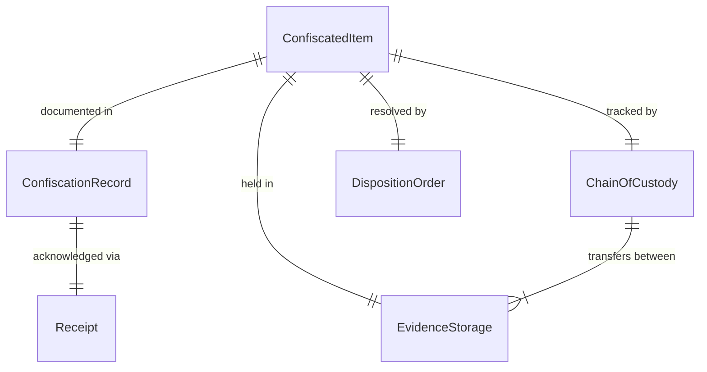
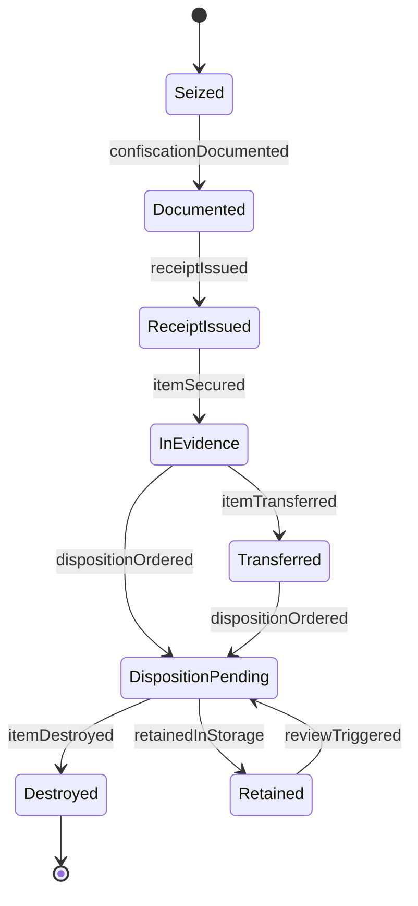
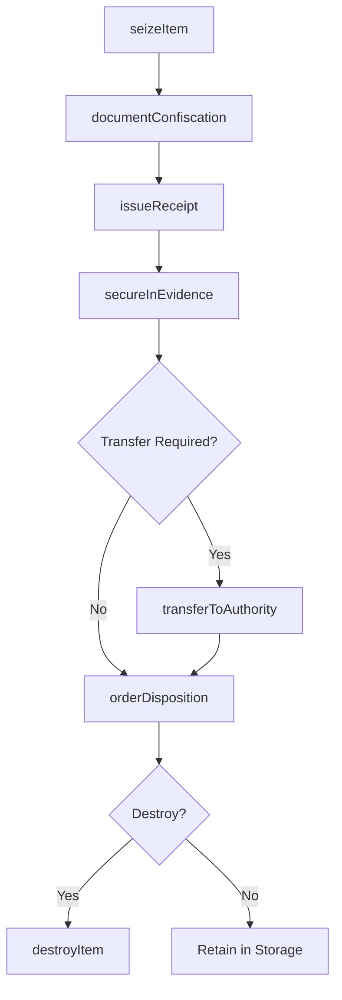
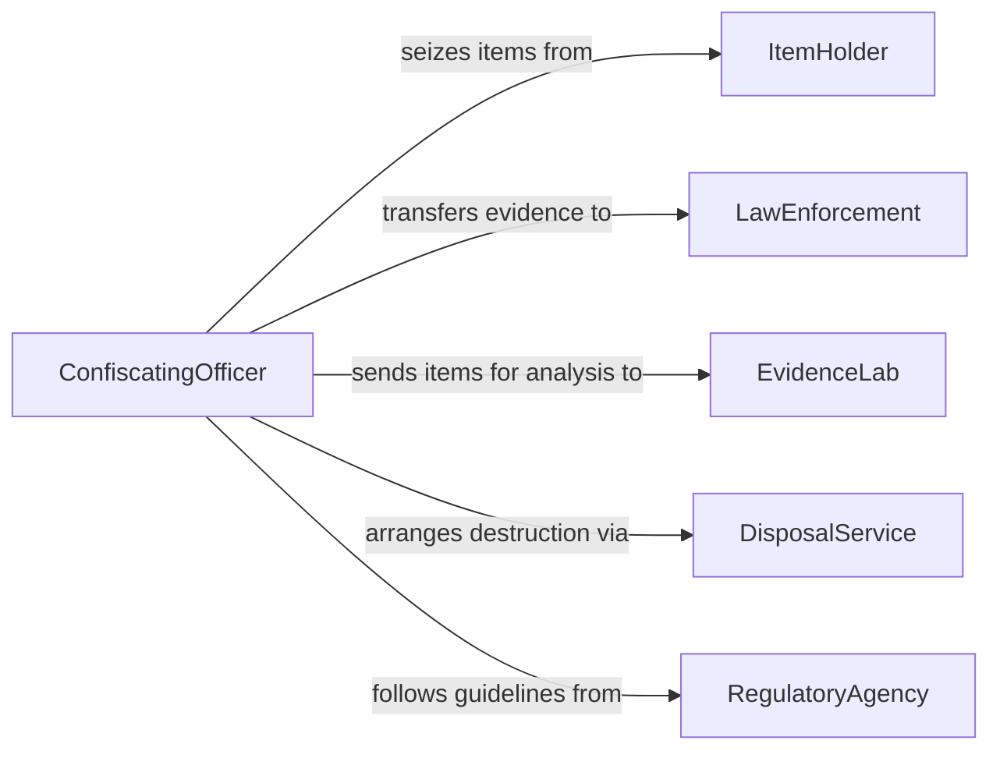

# Confiscate Prohibited Dangerous Items

> Business-as-Code definition for confiscating prohibited or dangerous items. Models the seizure, documentation, chain of custody, and disposition of contraband or hazardous materials.

## Overview

Confiscating prohibited or dangerous items involves the lawful seizure, secure handling, and proper disposition of contraband, weapons, or hazardous materials discovered during searches, inspections, or patrols. This activity covers the identification of prohibited items, the formal confiscation process, evidence chain maintenance, and final disposition through destruction, return, or transfer to authorities.

## Actors

| Actor | Description |
|-------|-------------|
| ItemHolder | Individual from whom the prohibited item is confiscated |
| LawEnforcement | Police agency that may receive confiscated items as evidence |
| EvidenceLab | Facility that analyzes or stores confiscated items |
| DisposalService | Vendor handling safe destruction of hazardous materials |
| RegulatoryAgency | Authority defining what constitutes prohibited items |

## Roles

| Role | Description |
|------|-------------|
| ConfiscatingOfficer | Seizes the item and initiates the documentation process |
| EvidenceCustodian | Secures, logs, and maintains chain of custody for items |
| SupervisingOfficer | Authorizes confiscation and oversees handling procedures |
| DisposalCoordinator | Arranges for the safe destruction or transfer of items |

## Entities

| Entity | Description |
|--------|-------------|
| ConfiscatedItem | The prohibited or dangerous object that has been seized |
| ConfiscationRecord | Official documentation of the seizure event |
| ChainOfCustody | Chronological log of every individual who handled the item |
| EvidenceStorage | Secure location where confiscated items are held |
| DispositionOrder | Directive specifying the final handling of a confiscated item |
| Receipt | Document issued to the item holder acknowledging confiscation |

## Actions

| Action | Description |
|--------|-------------|
| seizeItem | Physically take possession of a prohibited or dangerous item |
| documentConfiscation | Create a formal record of the seizure event |
| issueReceipt | Provide the item holder with acknowledgment of confiscation |
| secureInEvidence | Place the item in controlled evidence storage |
| transferToAuthority | Hand the item over to law enforcement or regulatory agency |
| orderDisposition | Determine and authorize the final handling of the item |
| destroyItem | Safely dispose of a hazardous or illegal item |

## Events

| Event | Description |
|-------|-------------|
| itemSeized | A prohibited item has been physically confiscated |
| confiscationDocumented | The seizure has been formally recorded |
| receiptIssued | The item holder has been given a confiscation receipt |
| itemSecured | The confiscated item has been placed in evidence storage |
| itemTransferred | The item has been handed to another authority |
| dispositionOrdered | A final handling decision has been made for the item |
| itemDestroyed | A hazardous or illegal item has been safely disposed of |

## Searches

| Search | Description |
|--------|-------------|
| findConfiscatedItems | List confiscated items by type, date, or officer |
| getChainOfCustody | Retrieve the full custody history for a specific item |
| getDispositionOrders | Search disposition directives by status or item type |
| findItemsByStorage | List items currently held in a specific evidence location |

## Entity Relationships



## State Diagram



## Workflow



## Actor Relationships



## Usage

### Calling Actions

```typescript
import { confiscateProhibitedDangerousItems } from '@headlessly/confiscate-prohibited-dangerous-items'

const confiscation = confiscateProhibitedDangerousItems()

// Seize a prohibited item
const item = await confiscation.seizeItem({
  holderId: 'individual-5523',
  description: 'Unregistered firearm - 9mm handgun',
  category: 'weapon',
  location: 'checkpoint-alpha',
  officerId: 'officer-park'
})

// Document and issue receipt
await confiscation.documentConfiscation({
  itemId: item.id,
  caseId: 'case-20260205-017',
  circumstances: 'Found during routine security screening'
})

await confiscation.issueReceipt({
  itemId: item.id,
  holderId: 'individual-5523'
})

// Secure in evidence storage
await confiscation.secureInEvidence({
  itemId: item.id,
  storageLocation: 'evidence-locker-b-14',
  custodianId: 'custodian-reyes'
})
```

### Event-Driven Automation

```typescript
// Notify law enforcement on weapon seizure
confiscation.itemSeized(async ({ itemId, category, holderId }) => {
  if (category === 'weapon') {
    await confiscation.transferToAuthority({
      itemId,
      agency: 'local-police-dept',
      priority: 'immediate'
    })
  }
})

// Schedule destruction for perishable contraband
confiscation.itemSecured(async ({ itemId, category }) => {
  if (category === 'controlled-substance') {
    await confiscation.orderDisposition({
      itemId,
      action: 'destroy',
      scheduledDate: new Date(Date.now() + 30 * 24 * 60 * 60 * 1000).toISOString()
    })
  }
})
```
