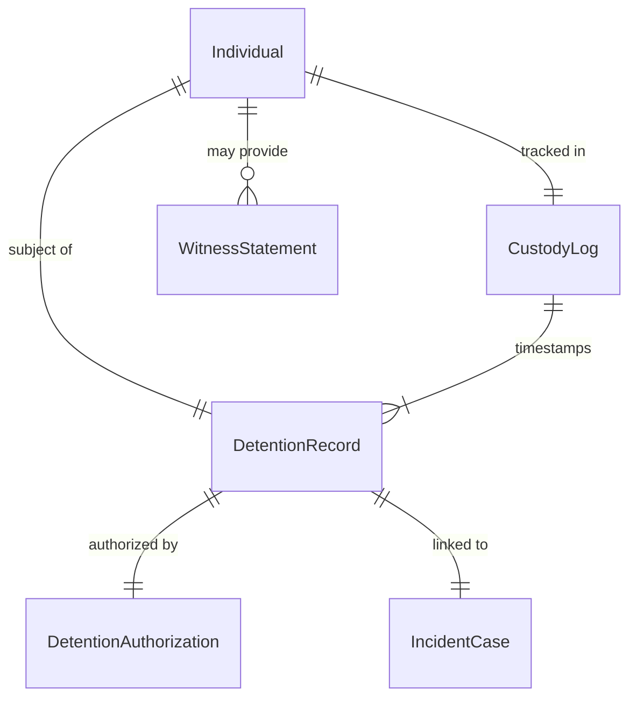
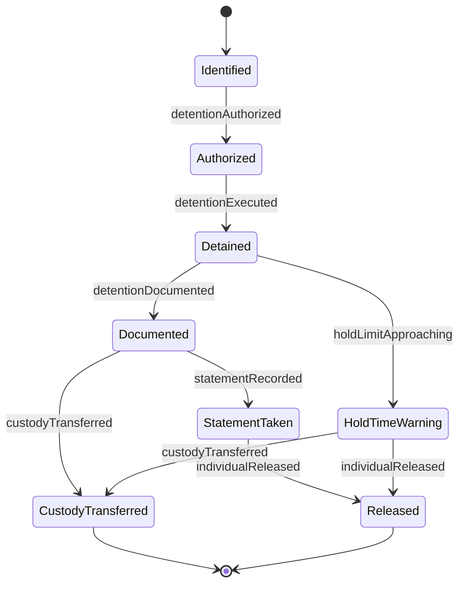
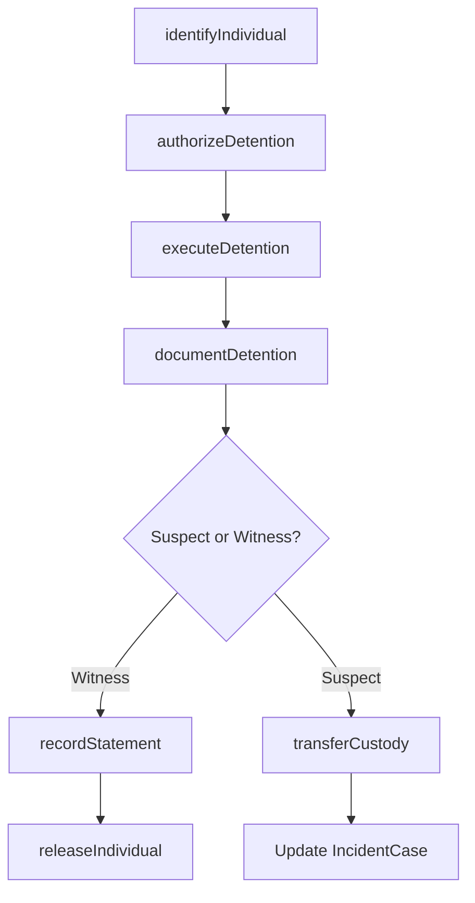
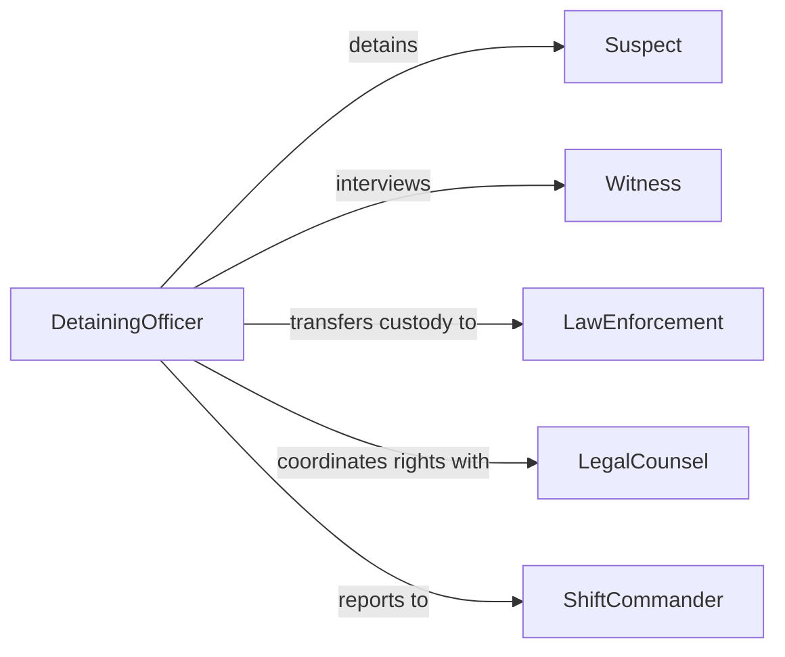

# Detain Suspects Witnesses

> Business-as-Code definition for detaining suspects or witnesses. Models the identification, lawful detention, documentation, and custody transfer process.

## Overview

Detaining suspects or witnesses involves the lawful holding of individuals in connection with an investigation, security incident, or law enforcement action. This activity covers the identification of persons of interest, the execution of a lawful detention, proper documentation of the event, and the transfer of custody to appropriate authorities.

## Actors

| Actor | Description |
|-------|-------------|
| Suspect | Individual believed to have committed an offense |
| Witness | Individual who observed a relevant event |
| LawEnforcement | Police or investigative agency receiving custody |
| LegalCounsel | Attorney representing the detained individual's rights |
| Prosecutor | Government attorney directing charges and case proceedings |

## Roles

| Role | Description |
|------|-------------|
| DetainingOfficer | Executes the lawful detention of an individual |
| ShiftCommander | Authorizes and oversees detention decisions |
| CustodyOfficer | Manages individuals in temporary holding |
| ReportingOfficer | Documents detention details and witness statements |

## Entities

| Entity | Description |
|--------|-------------|
| DetentionRecord | Official documentation of a detention event |
| Individual | Person being detained as a suspect or witness |
| DetentionAuthorization | Legal basis or warrant authorizing the detention |
| CustodyLog | Time-stamped record of individual's custody status |
| WitnessStatement | Recorded account from a witness |
| IncidentCase | Associated investigation or security event |

## Actions

| Action | Description |
|--------|-------------|
| identifyIndividual | Confirm the identity of a suspect or witness |
| authorizeDetention | Obtain or verify legal authority to detain |
| executeDetention | Physically detain and secure the individual |
| documentDetention | Record all details of the detention event |
| recordStatement | Take a formal statement from a witness |
| transferCustody | Hand the individual over to law enforcement or judicial authorities |
| releaseIndividual | Release a detained person when no longer required |

## Events

| Event | Description |
|-------|-------------|
| individualIdentified | A suspect or witness has been positively identified |
| detentionAuthorized | Legal authority to detain has been confirmed |
| detentionExecuted | An individual has been physically detained |
| detentionDocumented | All detention details have been recorded |
| statementRecorded | A formal witness statement has been taken |
| custodyTransferred | The individual has been handed to another authority |
| individualReleased | A detained person has been formally released |

## Searches

| Search | Description |
|--------|-------------|
| findDetentionRecords | List detentions by individual, date, or case |
| getCustodyLog | Retrieve the custody timeline for a detained individual |
| getWitnessStatements | Search statements by case, individual, or date |
| findOpenDetentions | List individuals currently in temporary custody |

## Entity Relationships



## State Diagram



## Workflow



## Actor Relationships



## Usage

### Calling Actions

```typescript
import { detainSuspectsWitnesses } from '@headlessly/detain-suspects-witnesses'

const detention = detainSuspectsWitnesses()

// Identify an individual at the scene
const individual = await detention.identifyIndividual({
  name: 'Jane Doe',
  idType: 'drivers-license',
  idNumber: 'DL-9283741',
  role: 'suspect'
})

// Execute a lawful detention
await detention.executeDetention({
  individualId: individual.id,
  caseId: 'case-20260205-001',
  location: 'building-a-lobby',
  authorization: 'warrant-5542'
})

// Transfer custody to law enforcement
await detention.transferCustody({
  individualId: individual.id,
  receivingAgency: 'metro-police-dept',
  officerName: 'Det. Williams',
  badgeNumber: 'MPD-3321'
})
```

### Event-Driven Automation

```typescript
// Notify legal counsel when detention is executed
detention.detentionExecuted(async ({ individualId, caseId }) => {
  await notify({
    to: 'public-defender-office',
    message: `Individual ${individualId} detained in case ${caseId} - rights notification required`
  })
})

// Auto-flag detentions exceeding hold time limits
detention.detentionDocumented(async ({ individualId, detainedAt }) => {
  const maxHoldMs = 24 * 60 * 60 * 1000
  setTimeout(async () => {
    const log = await detention.getCustodyLog({ individualId })
    if (log.status === 'detained') {
      await notify({
        to: 'shift-commander',
        message: `Detention of ${individualId} approaching maximum hold time`
      })
    }
  }, maxHoldMs - 60 * 60 * 1000)
})
```
