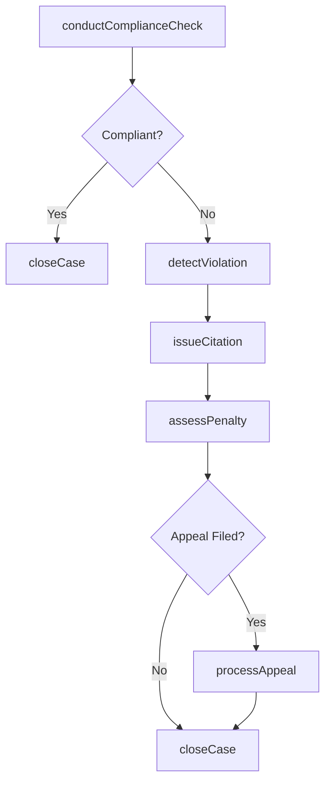
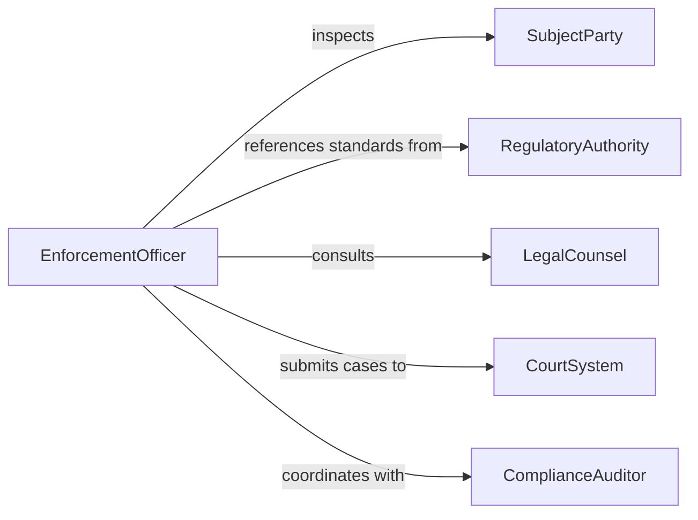

# Enforce Rules Regulations

> Business-as-Code definition for enforcing rules or regulations. Models the compliance monitoring, violation detection, and corrective enforcement lifecycle.

## Overview

Enforcing rules or regulations involves monitoring adherence to established policies, laws, and organizational standards, and taking corrective action when violations are detected. This activity spans routine compliance checks, formal citation issuance, and escalation to authorities when necessary.

## Actors

| Actor | Description |
|-------|-------------|
| RegulatoryAuthority | Government body that establishes enforceable rules |
| LegalCounsel | Attorney providing guidance on enforcement actions |
| SubjectParty | Individual or organization being inspected for compliance |
| ComplianceAuditor | External reviewer who evaluates regulatory adherence |
| CourtSystem | Judicial body that adjudicates contested violations |

## Roles

| Role | Description |
|------|-------------|
| EnforcementOfficer | Conducts inspections and issues citations |
| ComplianceManager | Oversees enforcement programs and policy interpretation |
| InvestigationsLead | Directs deeper inquiry into serious violations |
| RecordsClerk | Maintains violation records and case documentation |

## Entities

| Entity | Description |
|--------|-------------|
| Rule | A specific regulation, policy, or standard to be enforced |
| Violation | A documented instance of non-compliance |
| Citation | Formal notice issued for a detected violation |
| InspectionReport | Record of a compliance review with findings |
| Penalty | Fine, suspension, or other consequence for a violation |
| AppealCase | Formal challenge to an issued citation or penalty |

## Actions

| Action | Description |
|--------|-------------|
| conductComplianceCheck | Perform a scheduled or targeted inspection for rule adherence |
| detectViolation | Identify and document a non-compliance event |
| issueCitation | Issue a formal notice for a detected violation |
| assessPenalty | Determine and assign the appropriate consequence |
| escalateViolation | Refer a serious violation to higher authority or legal channels |
| processAppeal | Review and adjudicate a challenged citation |
| closeCase | Finalize enforcement action after resolution |

## Events

| Event | Description |
|-------|-------------|
| complianceCheckCompleted | A compliance inspection has been finished |
| violationDetected | A non-compliance event has been identified |
| citationIssued | A formal violation notice has been delivered |
| penaltyAssessed | A consequence has been assigned for a violation |
| violationEscalated | A serious violation has been referred for higher action |
| appealProcessed | A challenged citation has been reviewed and decided |
| caseClosed | An enforcement case has been finalized |

## Searches

| Search | Description |
|--------|-------------|
| findViolations | List violations by rule, party, severity, or date |
| getCitations | Retrieve citations by status, officer, or subject |
| getComplianceHistory | Search inspection and compliance records for a party |
| findOpenCases | List enforcement cases that are still pending resolution |

## Workflow



## Actor Relationships



## Usage

### Calling Actions

```typescript
import { enforceRulesRegulations } from '@headlessly/enforce-rules-regulations'

const enforcement = enforceRulesRegulations()

// Conduct a compliance check
const report = await enforcement.conductComplianceCheck({
  subjectId: 'facility-1234',
  ruleSet: 'fire-safety-code-2025',
  inspector: 'officer-chen'
})

// Issue a citation for a detected violation
const citation = await enforcement.issueCitation({
  violationId: 'viol-8821',
  subjectId: 'facility-1234',
  rule: 'FSC-4.2.1',
  description: 'Emergency exits blocked by stored materials',
  deadline: '2026-02-15'
})

// Assess a penalty
await enforcement.assessPenalty({
  citationId: citation.id,
  type: 'fine',
  amount: 5000,
  currency: 'USD'
})
```

### Event-Driven Automation

```typescript
// Notify compliance manager on serious violations
enforcement.violationDetected(async ({ violationId, severity, subjectId }) => {
  if (severity === 'critical') {
    await notify({
      to: 'compliance-manager',
      message: `Critical violation ${violationId} detected for ${subjectId}`
    })
    await enforcement.escalateViolation({ violationId })
  }
})

// Auto-close case when penalty is paid
enforcement.penaltyAssessed(async ({ citationId, status }) => {
  if (status === 'paid') {
    await enforcement.closeCase({ citationId })
  }
})
```
