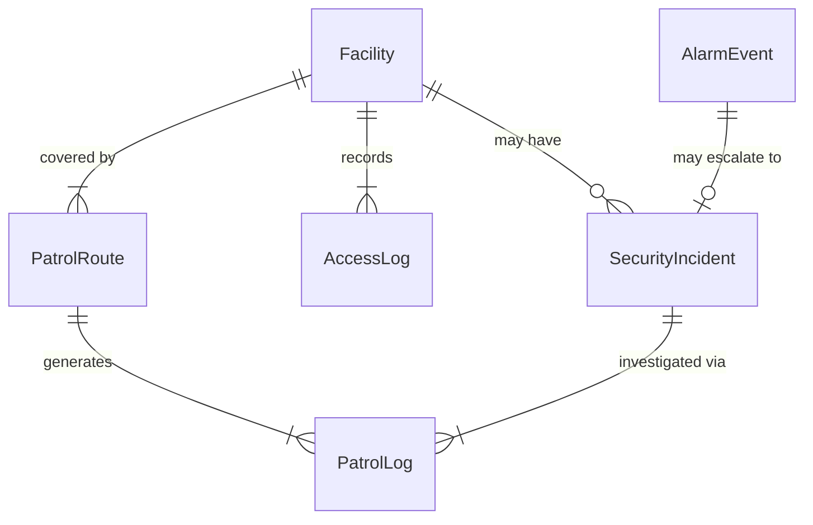
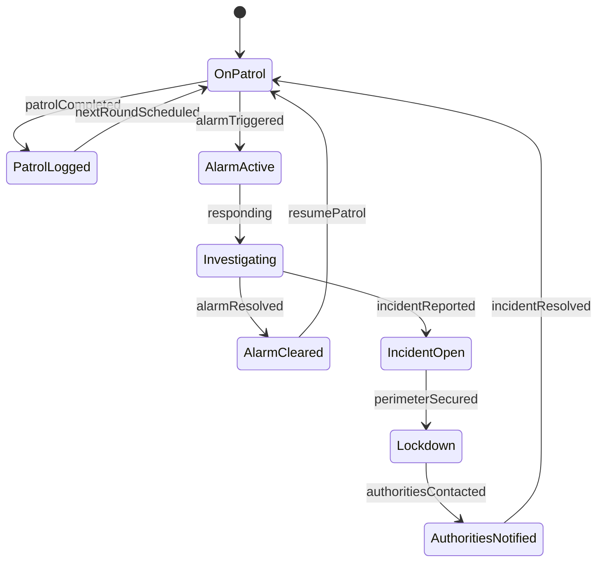
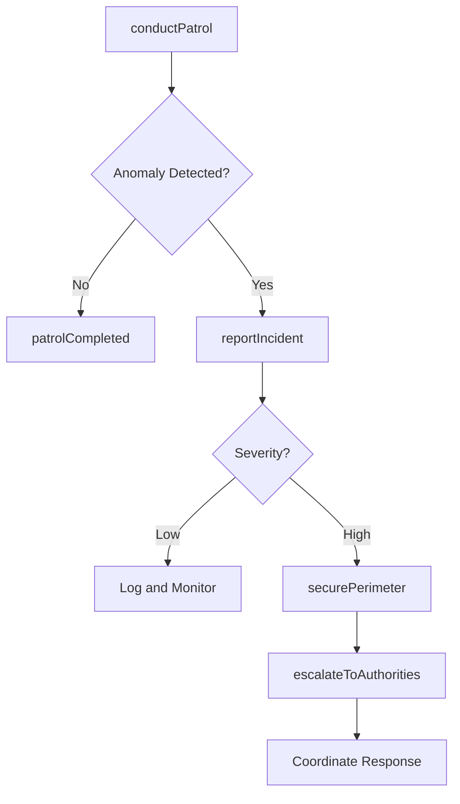
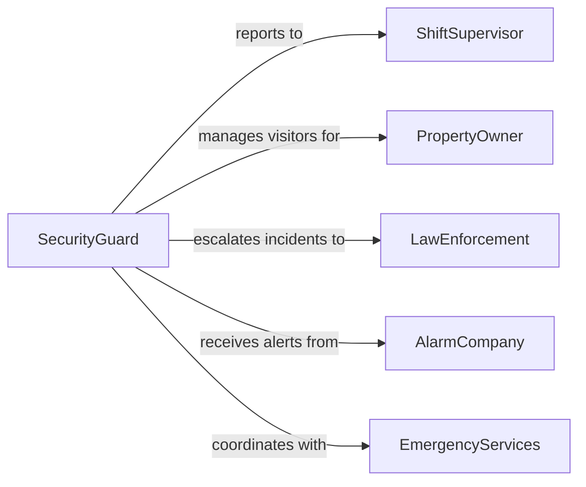

# Guard Facilities

> Business-as-Code definition for guarding facilities. Models patrol operations, surveillance monitoring, access control, and incident response at physical sites.

## Overview

Guarding facilities involves maintaining a physical security presence to protect buildings, grounds, and assets from unauthorized access, theft, vandalism, and other threats. This activity covers patrol routines, surveillance system operation, visitor management, and coordination with emergency responders.

## Actors

| Actor | Description |
|-------|-------------|
| PropertyOwner | Entity that owns or leases the facility being guarded |
| Visitor | Individual arriving at the facility for legitimate business |
| LawEnforcement | Police or security agency responding to escalated incidents |
| AlarmCompany | Third-party provider of alarm and monitoring systems |
| EmergencyServices | Fire, medical, and rescue responders |

## Roles

| Role | Description |
|------|-------------|
| SecurityGuard | Conducts patrols and monitors facility entry points |
| ShiftSupervisor | Manages guard assignments and shift coverage |
| ControlRoomOperator | Monitors surveillance feeds and alarm systems |
| PatrolOfficer | Performs scheduled rounds of the facility perimeter and interior |

## Entities

| Entity | Description |
|--------|-------------|
| Facility | Building or site under protection |
| PatrolRoute | Defined path and checkpoints for guard rounds |
| PatrolLog | Time-stamped record of a completed patrol round |
| SecurityIncident | Documented event involving a threat or breach |
| AccessLog | Record of individuals entering or exiting the facility |
| AlarmEvent | Alert triggered by surveillance or intrusion detection systems |

## Actions

| Action | Description |
|--------|-------------|
| conductPatrol | Execute a scheduled or ad-hoc round of the facility |
| monitorSurveillance | Observe camera feeds and sensor data for anomalies |
| logVisitorEntry | Record a visitor's arrival and purpose of visit |
| respondToAlarm | Investigate and address a triggered alarm event |
| reportIncident | Document a security event with details and actions taken |
| escalateToAuthorities | Contact law enforcement or emergency services |
| securePerimeter | Lock down facility boundaries during a threat |

## Events

| Event | Description |
|-------|-------------|
| patrolCompleted | A guard round has been finished and logged |
| alarmTriggered | An intrusion or safety alarm has activated |
| alarmResolved | A triggered alarm has been investigated and cleared |
| visitorEntryLogged | A visitor's arrival has been recorded |
| incidentReported | A security event has been formally documented |
| perimeterSecured | Facility boundaries have been locked down |
| authoritiesContacted | Law enforcement or emergency services have been notified |

## Searches

| Search | Description |
|--------|-------------|
| findPatrolLogs | List patrol records by guard, route, or date |
| getAlarmEvents | Retrieve alarm events by type, zone, or time range |
| getAccessLogs | Search entry and exit records by individual or time |
| findIncidents | List security incidents by severity, type, or status |

## Entity Relationships



## State Diagram



## Workflow



## Actor Relationships



## Usage

### Calling Actions

```typescript
import { guardFacilities } from '@headlessly/guard-facilities'

const guard = guardFacilities()

// Conduct a scheduled patrol
const patrol = await guard.conductPatrol({
  routeId: 'route-perimeter-a',
  guardId: 'guard-johnson',
  startTime: new Date().toISOString()
})

// Respond to an alarm event
await guard.respondToAlarm({
  alarmId: 'alarm-zone3-0142',
  responderId: 'guard-johnson',
  zone: 'warehouse-east'
})

// Report a security incident
await guard.reportIncident({
  type: 'unauthorized-access-attempt',
  location: 'loading-dock-2',
  description: 'Individual attempted to enter through unsecured door',
  severity: 'medium'
})
```

### Event-Driven Automation

```typescript
// Dispatch nearest guard on alarm
guard.alarmTriggered(async ({ alarmId, zone }) => {
  const available = await guard.findPatrolLogs({
    status: 'on-patrol',
    nearestTo: zone
  })
  if (available.length > 0) {
    await guard.respondToAlarm({
      alarmId,
      responderId: available[0].guardId,
      zone
    })
  }
})

// Auto-escalate unresolved alarms
guard.alarmTriggered(async ({ alarmId, zone, triggeredAt }) => {
  setTimeout(async () => {
    const events = await guard.getAlarmEvents({ alarmId })
    if (events[0]?.status !== 'resolved') {
      await guard.escalateToAuthorities({ alarmId, zone })
    }
  }, 10 * 60 * 1000)
})
```
