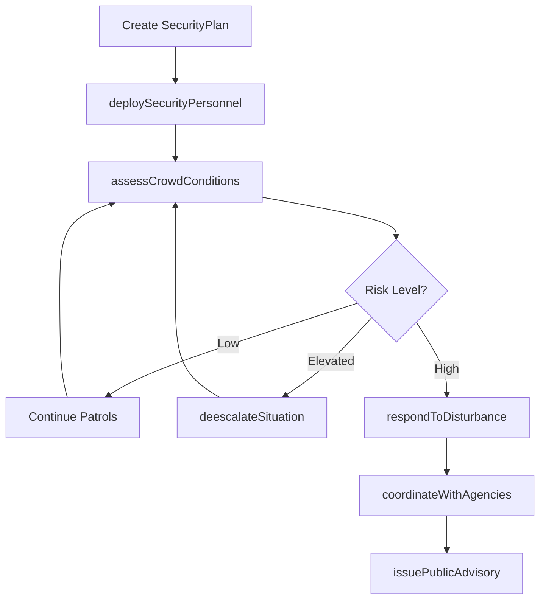
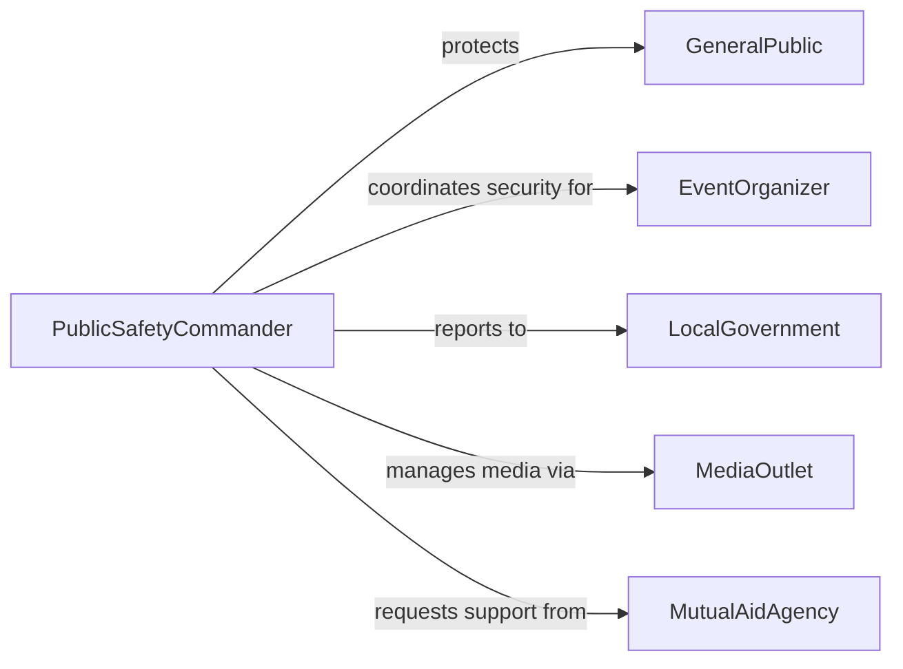

# Maintain Public Order Security

> Business-as-Code definition for maintaining public order or security. Models crowd management, civil disturbance response, and public safety operations at events and in communities.

## Overview

Maintaining public order or security involves the deployment of personnel and resources to ensure safe and peaceful conditions in public spaces, at events, and during civil disturbances. This activity covers crowd management, civil unrest response, event security planning, and the coordination of public safety operations across multiple agencies and jurisdictions.

## Actors

| Actor | Description |
|-------|-------------|
| GeneralPublic | Citizens and visitors present in the secured area |
| EventOrganizer | Entity hosting a public gathering or event |
| LocalGovernment | Municipal authority authorizing public safety operations |
| MediaOutlet | News organization covering events or disturbances |
| MutualAidAgency | Neighboring jurisdiction providing supplemental resources |

## Roles

| Role | Description |
|------|-------------|
| PublicSafetyCommander | Directs overall order maintenance operations |
| PatrolOfficer | Conducts foot or vehicle patrols to maintain visible presence |
| CrowdControlOfficer | Manages crowd flow and prevents dangerous congestion |
| LiaisonOfficer | Coordinates between agencies, organizers, and the public |
| DispatchCoordinator | Routes resources and communications during operations |

## Entities

| Entity | Description |
|--------|-------------|
| SecurityPlan | Operational plan detailing personnel deployment and procedures |
| PatrolZone | Defined geographic area assigned for order maintenance |
| IncidentReport | Documentation of a public order event or disturbance |
| CrowdAssessment | Evaluation of crowd size, mood, and potential risks |
| DeploymentOrder | Directive assigning resources to specific zones or tasks |
| CommunicationsLog | Record of inter-agency and field communications |

## Actions

| Action | Description |
|--------|-------------|
| deploySecurityPersonnel | Assign officers and resources to patrol zones |
| assessCrowdConditions | Evaluate crowd behavior, density, and risk factors |
| manageTrafficFlow | Direct vehicle and pedestrian movement for public safety |
| respondToDisturbance | Address a developing civil unrest or public order event |
| coordinateWithAgencies | Align operations across law enforcement and emergency services |
| deescalateSituation | Apply techniques to reduce tension and prevent escalation |
| issuePublicAdvisory | Communicate safety instructions to the public |

## Events

| Event | Description |
|-------|-------------|
| personnelDeployed | Security resources have been assigned to their positions |
| crowdConditionsAssessed | Crowd behavior and risk levels have been evaluated |
| trafficFlowManaged | Vehicle and pedestrian routes have been directed |
| disturbanceDetected | A civil unrest or public order incident has been identified |
| agenciesCoordinated | Multi-agency operations have been synchronized |
| situationDeescalated | Tensions have been reduced through intervention |
| publicAdvisoryIssued | Safety information has been communicated to the public |

## Searches

| Search | Description |
|--------|-------------|
| findDeployments | List personnel deployments by zone, event, or date |
| getIncidentReports | Retrieve public order incidents by type, severity, or location |
| getCrowdAssessments | Search crowd evaluations by event, location, or risk level |
| findActiveOperations | List ongoing public safety operations by jurisdiction |

## Workflow



## Actor Relationships



## Usage

### Calling Actions

```typescript
import { maintainPublicOrderSecurity } from '@headlessly/maintain-public-order-security'

const publicSafety = maintainPublicOrderSecurity()

// Deploy security for a public event
await publicSafety.deploySecurityPersonnel({
  eventId: 'city-marathon-2026',
  zones: [
    { zoneId: 'start-line', officers: 12, type: 'crowd-control' },
    { zoneId: 'route-midpoint', officers: 8, type: 'patrol' },
    { zoneId: 'finish-area', officers: 15, type: 'crowd-control' }
  ]
})

// Assess crowd conditions during the event
const assessment = await publicSafety.assessCrowdConditions({
  eventId: 'city-marathon-2026',
  zoneId: 'finish-area',
  estimatedAttendees: 25000,
  mood: 'positive'
})

// Respond to a developing situation
await publicSafety.respondToDisturbance({
  eventId: 'city-marathon-2026',
  location: 'finish-area-south-entrance',
  type: 'overcrowding',
  severity: 'medium'
})
```

### Event-Driven Automation

```typescript
// Request mutual aid when disturbance severity is high
publicSafety.disturbanceDetected(async ({ eventId, severity, location }) => {
  if (severity === 'high') {
    await publicSafety.coordinateWithAgencies({
      eventId,
      request: 'mutual-aid',
      resourcesNeeded: 'additional-officers',
      location
    })
  }
})

// Issue public advisory on crowd risk escalation
publicSafety.crowdConditionsAssessed(async ({ eventId, zoneId, riskLevel }) => {
  if (riskLevel === 'elevated') {
    await publicSafety.issuePublicAdvisory({
      eventId,
      message: `Congestion in ${zoneId} - please use alternate entrances`,
      channels: ['public-address', 'social-media', 'mobile-alert']
    })
  }
})
```
