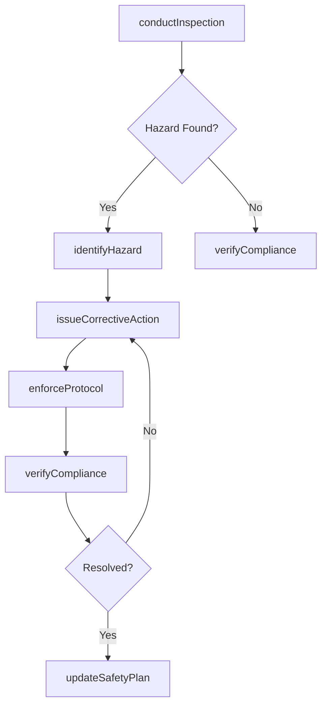
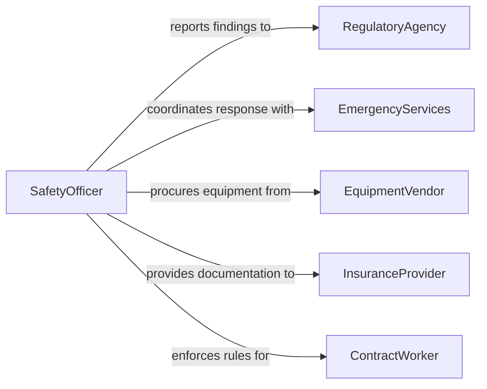

# Maintain Safety

> Business-as-Code definition for maintaining safety across facilities and operations. Models hazard identification, safety protocol enforcement, and incident response procedures.

## Overview

Maintaining safety encompasses the continuous monitoring, inspection, and enforcement activities that keep people, property, and operations free from harm. This definition covers hazard identification, safety protocol compliance, emergency preparedness, and corrective action when unsafe conditions are detected.

## Actors

| Actor | Description |
|-------|-------------|
| RegulatoryAgency | Government body that sets and enforces safety standards |
| InsuranceProvider | Carrier that assesses risk and requires safety compliance |
| EmergencyServices | Fire, medical, and rescue responders for incidents |
| EquipmentVendor | Supplier of safety equipment and protective gear |
| ContractWorker | External laborer who must comply with site safety rules |

## Roles

| Role | Description |
|------|-------------|
| SafetyOfficer | Leads safety inspections and enforces protocols |
| FacilityManager | Oversees building and site conditions |
| SafetyCommitteeMember | Participates in safety reviews and policy development |
| IncidentCoordinator | Manages response when a safety event occurs |

## Entities

| Entity | Description |
|--------|-------------|
| SafetyInspection | Scheduled or ad-hoc review of conditions and compliance |
| Hazard | An identified risk to health or physical safety |
| SafetyProtocol | Documented procedure for preventing or responding to hazards |
| IncidentReport | Record of a safety event including details and resolution |
| CorrectiveAction | Step taken to eliminate or mitigate a hazard |
| SafetyEquipment | Protective gear or device used to reduce risk |

## Actions

| Action | Description |
|--------|-------------|
| conductInspection | Perform a scheduled or ad-hoc safety inspection |
| identifyHazard | Document and classify a newly discovered hazard |
| enforceProtocol | Ensure personnel adhere to established safety procedures |
| issueCorrectiveAction | Assign and track remediation for an identified hazard |
| reportIncident | Document a safety event with details and context |
| updateSafetyPlan | Revise safety protocols based on new findings |
| verifyCompliance | Confirm that corrective actions and protocols are in effect |

## Events

| Event | Description |
|-------|-------------|
| inspectionCompleted | A safety inspection has been finished and documented |
| hazardIdentified | A new hazard has been discovered and classified |
| protocolEnforced | A safety protocol has been actively enforced |
| correctiveActionIssued | A remediation task has been assigned for a hazard |
| incidentReported | A safety event has been formally documented |
| safetyPlanUpdated | Safety protocols have been revised |
| complianceVerified | Corrective actions have been confirmed as effective |

## Searches

| Search | Description |
|--------|-------------|
| findInspections | List safety inspections by date, area, or result |
| getOpenHazards | Retrieve unresolved hazards by severity or location |
| getIncidentHistory | Search incident reports by type, date, or area |
| findCorrectiveActions | List corrective actions by status or assigned party |

## Workflow



## Actor Relationships



## Usage

### Calling Actions

```typescript
import { maintainSafety } from '@headlessly/maintain-safety'

const safety = maintainSafety()

// Conduct a routine facility inspection
const inspection = await safety.conductInspection({
  area: 'warehouse-b',
  type: 'routine',
  inspector: 'officer-martinez'
})

// Log a discovered hazard
const hazard = await safety.identifyHazard({
  inspectionId: inspection.id,
  description: 'Exposed wiring near loading dock entrance',
  severity: 'high',
  location: 'warehouse-b-dock-3'
})

// Issue a corrective action
await safety.issueCorrectiveAction({
  hazardId: hazard.id,
  assignee: 'facilities-team',
  deadline: '2026-02-10',
  action: 'Replace exposed wiring conduit and install protective covers'
})
```

### Event-Driven Automation

```typescript
// Notify management on high-severity hazards
safety.hazardIdentified(async ({ hazardId, severity, location }) => {
  if (severity === 'high' || severity === 'critical') {
    await notify({
      to: 'safety-committee',
      message: `High-severity hazard at ${location} requires immediate attention`
    })
  }
})

// Schedule re-inspection after corrective action
safety.correctiveActionIssued(async ({ hazardId, deadline }) => {
  await safety.conductInspection({
    area: hazardId,
    type: 'follow-up',
    scheduledDate: deadline
  })
})
```
