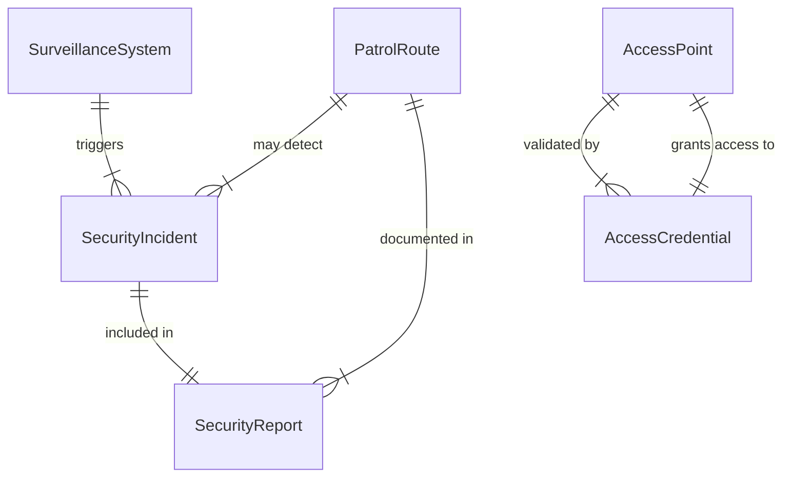
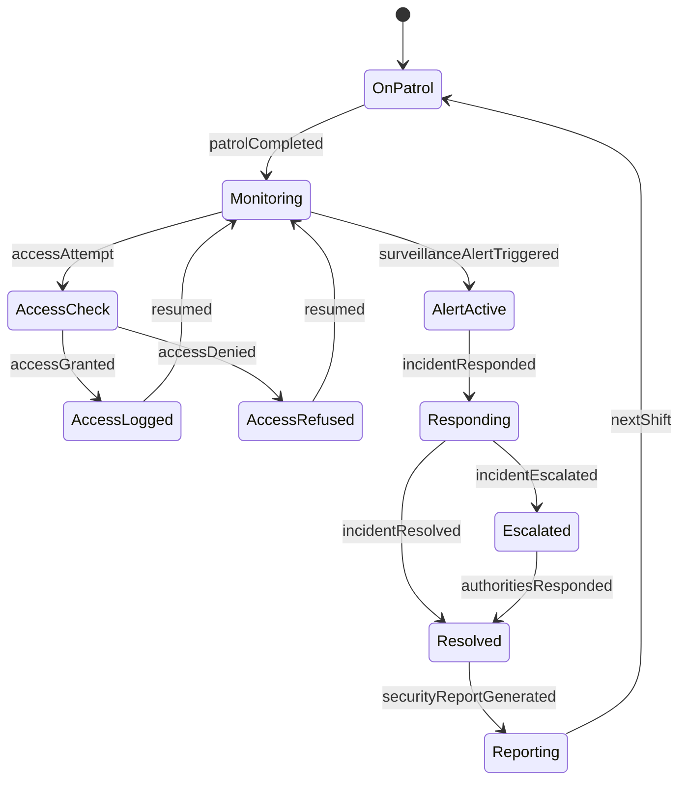
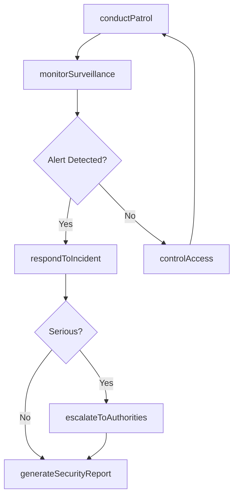
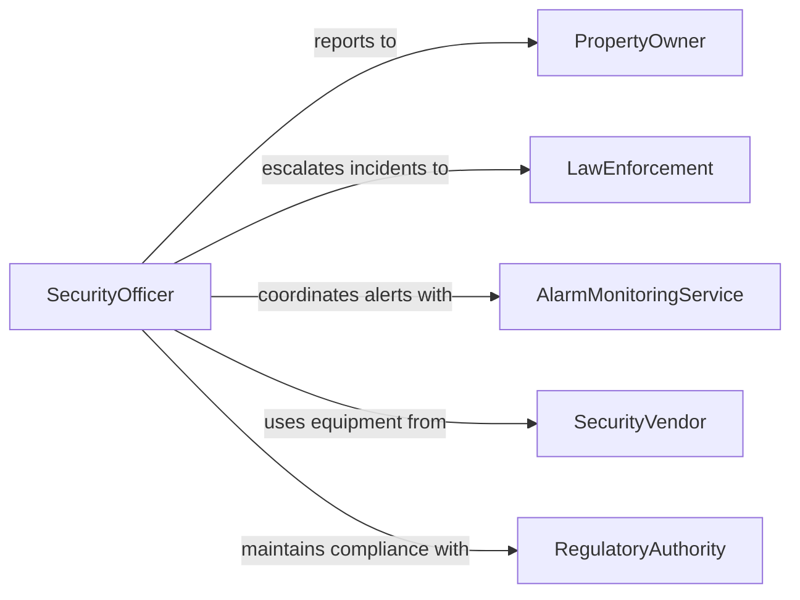

# Maintain Security

> Business-as-Code definition for maintaining security across facilities, premises, and assets. Models patrol operations, access control, surveillance monitoring, incident response, and security reporting.

## Overview

Maintaining security involves conducting patrols, monitoring surveillance systems, enforcing access control, responding to security incidents, and reporting on conditions across protected premises. This definition exposes actions for security operations management, events for incident tracking and status changes, and searches for patrol logs, access records, and incident history.

## Actors

| Actor | Description |
|-------|-------------|
| PropertyOwner | Contracts security services and defines protection requirements |
| LawEnforcement | Responds to escalated security incidents and criminal activity |
| AlarmMonitoringService | Provides remote monitoring of intrusion and fire alarm systems |
| SecurityVendor | Supplies surveillance cameras, access control hardware, and equipment |
| RegulatoryAuthority | Sets security licensing requirements and compliance standards |

## Roles

| Role | Description |
|------|-------------|
| SecurityOfficer | Conducts patrols, monitors premises, and responds to incidents |
| SecuritySupervisor | Manages shift schedules, reviews reports, and coordinates team operations |
| SurveillanceOperator | Monitors camera feeds and alarm systems from a control room |
| AccessControlAdministrator | Manages credentials, badges, and entry permissions |
| SecurityDirector | Sets security policies and oversees the overall security program |

## Entities

| Entity | Description |
|--------|-------------|
| PatrolRoute | A defined path through a facility for scheduled security rounds |
| SecurityIncident | A documented event involving a breach, threat, or suspicious activity |
| AccessPoint | A controlled entry or exit location such as a gate, door, or turnstile |
| SurveillanceSystem | Camera and sensor network used for monitoring premises |
| SecurityReport | A shift or daily summary of security activities and observations |
| AccessCredential | A badge, key card, or code granting entry to controlled areas |

## Actions

| Action | Description |
|--------|-------------|
| conductPatrol | Walk or drive a designated patrol route and report observations |
| monitorSurveillance | Observe camera feeds and sensor alerts for security threats |
| controlAccess | Verify credentials and grant or deny entry at access points |
| respondToIncident | Investigate and address a security breach, alarm, or disturbance |
| escalateToAuthorities | Contact law enforcement or emergency services for serious incidents |
| generateSecurityReport | Compile shift observations, incidents, and patrol data into a report |
| updateAccessPermissions | Modify badge credentials and access levels for personnel |

## Events

| Event | Description |
|-------|-------------|
| patrolCompleted | A scheduled patrol route has been walked and observations logged |
| surveillanceAlertTriggered | A camera or sensor has detected anomalous activity |
| accessGranted | Entry has been authorized at a controlled access point |
| accessDenied | Entry has been refused due to invalid or expired credentials |
| incidentResponded | A security incident has been investigated and addressed |
| incidentEscalated | A serious security event has been forwarded to law enforcement |
| securityReportGenerated | A shift or daily security report has been completed |

## Searches

| Search | Description |
|--------|-------------|
| findPatrolLogs | List completed patrols by officer, route, date, or shift |
| getAccessHistory | Retrieve entry and exit records for a person, badge, or access point |
| getIncidentReports | Query security incidents by type, severity, location, or date |
| findActiveAlerts | List current unresolved surveillance alerts and alarms |

## Entity Relationships



## State Diagram



## Workflow



## Actor Relationships



## Usage

### Calling Actions

```typescript
import { maintainSecurity } from '@headlessly/maintain-security'

const security = maintainSecurity()

// Conduct a scheduled patrol
const patrol = await security.conductPatrol({
  officerId: 'SEC-0087',
  routeId: 'ROUTE-BLDG-A-EXTERIOR',
  shiftId: 'SHIFT-2026-02-05-NIGHT',
  startTime: '2026-02-05T22:00:00Z'
})

// Respond to a surveillance alert
await security.respondToIncident({
  alertId: 'ALERT-2026-0451',
  type: 'unauthorized-access-attempt',
  location: 'Loading Dock B',
  officerId: 'SEC-0087',
  responseTime: '2026-02-05T22:15:00Z'
})

// Update access permissions
await security.updateAccessPermissions({
  personnelId: 'EMP-2045',
  action: 'revoke',
  accessPoints: ['DOOR-LAB-3', 'DOOR-SERVER-ROOM'],
  reason: 'role-change'
})
```

### Event-Driven Automation

```typescript
// Auto-escalate high-severity incidents
security.incidentResponded(async ({ incidentId, severity, type }) => {
  if (severity === 'critical') {
    await security.escalateToAuthorities({
      incidentId,
      agency: 'local-police',
      reason: `Critical security incident: ${type}`
    })
  }
})

// Generate end-of-shift report automatically
security.patrolCompleted(async ({ officerId, shiftId, isLastPatrol }) => {
  if (isLastPatrol) {
    await security.generateSecurityReport({
      shiftId,
      officerId,
      includeIncidents: true,
      includeAccessLogs: true
    })
  }
})
```
