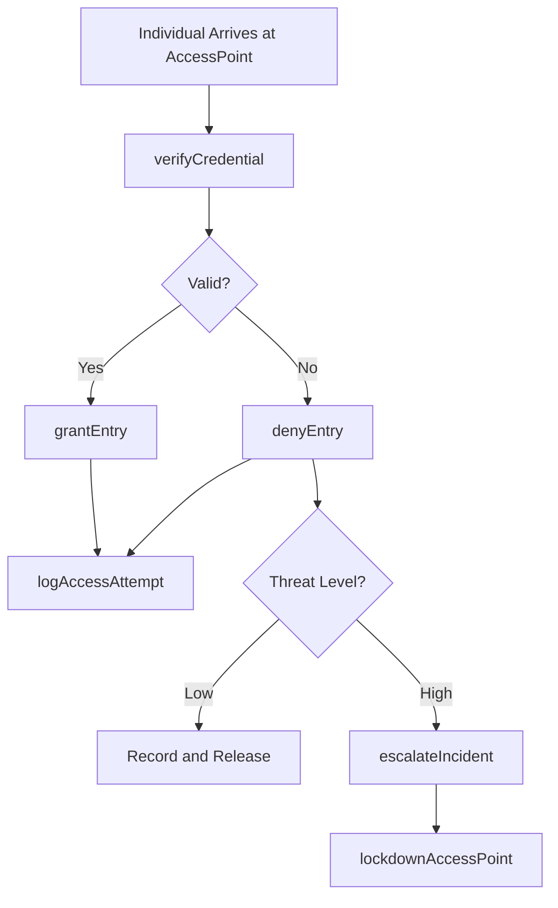
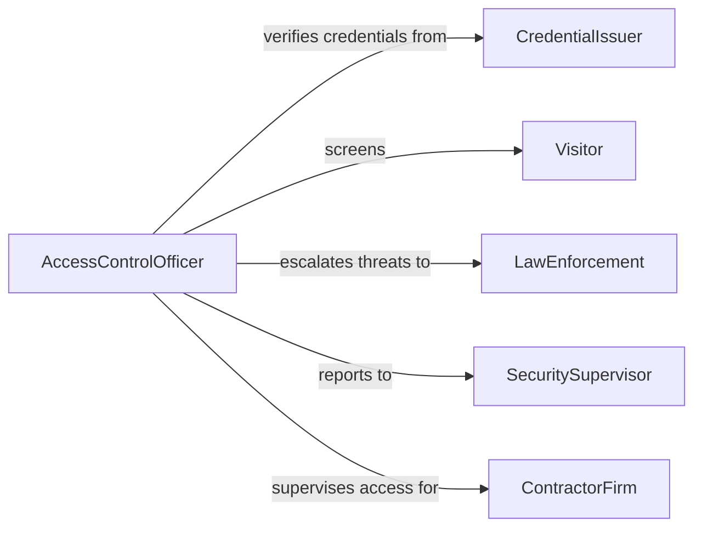

# Prevent Unauthorized Individuals Entering Restricted

> Business-as-Code definition for preventing unauthorized entry to restricted areas. Models the access screening, identity verification, and denial workflow used to protect secure zones.

## Overview

Preventing unauthorized individuals from entering restricted areas involves identity verification, credential checking, and physical denial of entry at controlled access points. This activity spans checkpoint staffing, screening technology operation, and incident escalation when unauthorized access is attempted.

## Actors

| Actor | Description |
|-------|-------------|
| Visitor | Individual seeking entry to a restricted area |
| CredentialIssuer | Authority that issues badges, passes, or clearances |
| LawEnforcement | External agency engaged for criminal trespass situations |
| RegulatoryBody | Government entity mandating access control standards |
| ContractorFirm | External company whose workers require supervised access |

## Roles

| Role | Description |
|------|-------------|
| AccessControlOfficer | Staffs entry points and verifies credentials |
| SecuritySupervisor | Oversees checkpoint operations and escalation procedures |
| BadgeAdministrator | Manages issuance and revocation of access credentials |
| SurveillanceOperator | Monitors camera feeds at restricted entry points |

## Entities

| Entity | Description |
|--------|-------------|
| AccessPoint | A controlled entry location such as a gate or door |
| Credential | Badge, pass, or clearance authorizing area access |
| AccessRequest | Formal request by an individual for area entry |
| DenialRecord | Log entry documenting a refused access attempt |
| RestrictedZone | Defined area requiring authorization to enter |
| IncidentReport | Documentation of an unauthorized access attempt |

## Actions

| Action | Description |
|--------|-------------|
| verifyCredential | Validate an individual's badge, pass, or clearance |
| denyEntry | Refuse access to an unauthorized individual |
| grantEntry | Allow a verified individual into the restricted area |
| escalateIncident | Notify supervisors or law enforcement of a breach attempt |
| logAccessAttempt | Record details of each entry attempt |
| revokeCredential | Invalidate a previously issued access credential |
| lockdownAccessPoint | Seal an entry point in response to a security threat |

## Events

| Event | Description |
|-------|-------------|
| credentialVerified | An individual's access credential has been validated |
| entryDenied | An unauthorized individual has been refused access |
| entryGranted | A verified individual has been admitted to the area |
| incidentEscalated | An unauthorized access attempt has been reported upward |
| accessAttemptLogged | An entry attempt has been recorded in the system |
| credentialRevoked | An access credential has been invalidated |
| accessPointLockedDown | An entry point has been sealed for security |

## Searches

| Search | Description |
|--------|-------------|
| findAccessAttempts | List entry attempts by person, access point, or date |
| getDenialRecords | Retrieve refused access events by reason or time period |
| getActiveCredentials | List valid credentials for a given restricted zone |
| findIncidents | Search unauthorized access incidents by severity or status |

## Workflow



## Actor Relationships



## Usage

### Calling Actions

```typescript
import { preventUnauthorizedIndividualsEnteringRestricted } from '@headlessly/prevent-unauthorized-individuals-entering-restricted'

const access = preventUnauthorizedIndividualsEnteringRestricted()

// Verify an individual's credential at an access point
const result = await access.verifyCredential({
  individualId: 'visitor-4821',
  credentialId: 'badge-00193',
  accessPointId: 'gate-north-1'
})

// Deny entry when credential is invalid
await access.denyEntry({
  individualId: 'visitor-4821',
  accessPointId: 'gate-north-1',
  reason: 'Expired badge - clearance lapsed 2026-01-15'
})

// Escalate a repeated unauthorized attempt
await access.escalateIncident({
  accessPointId: 'gate-north-1',
  individualId: 'visitor-4821',
  severity: 'high',
  description: 'Third denied attempt within 24 hours'
})
```

### Event-Driven Automation

```typescript
// Alert security supervisor on repeated denials
access.entryDenied(async ({ individualId, accessPointId }) => {
  const recent = await access.findAccessAttempts({
    individualId,
    status: 'denied',
    since: '24h'
  })
  if (recent.length >= 3) {
    await access.escalateIncident({
      accessPointId,
      individualId,
      severity: 'high',
      description: `${recent.length} denied attempts in 24 hours`
    })
  }
})

// Auto-lockdown on high-severity escalation
access.incidentEscalated(async ({ accessPointId, severity }) => {
  if (severity === 'critical') {
    await access.lockdownAccessPoint({ accessPointId })
  }
})
```
