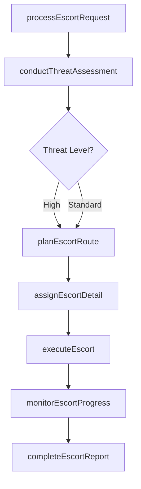
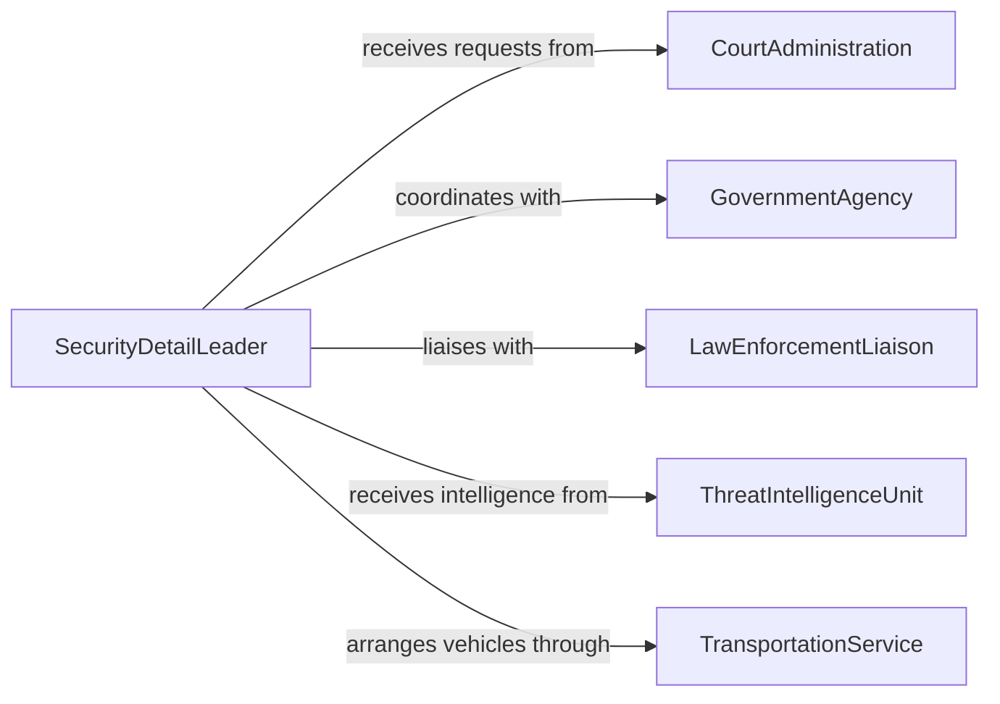

# Provide Security Escorts Officials Jury

> Business-as-Code definition for providing security escorts to officials, jury members, and other protected individuals. Models the planning, execution, and monitoring of protective escort operations.

## Overview

Providing security escorts for officials, jury members, and other individuals involves threat assessment, route planning, personnel deployment, and real-time protective accompaniment during transit and at designated locations. This definition exposes actions for escort request processing, route planning, and protective detail execution, along with events for tracking escort status and searches for assignment and incident records.

## Actors

| Actor | Description |
|-------|-------------|
| CourtAdministration | Requests escort services for judges, jury members, and court personnel |
| GovernmentAgency | Requests protection for officials attending public or sensitive events |
| LawEnforcementLiaison | Coordinates with local police for route clearance and backup support |
| ThreatIntelligenceUnit | Provides threat assessments and intelligence briefings for principals |
| TransportationService | Supplies vehicles and drivers for secure transport |

## Roles

| Role | Description |
|------|-------------|
| SecurityDetailLeader | Plans and leads the escort operation from start to finish |
| ProtectiveAgent | Provides close physical security to the principal during movement |
| AdvanceAgent | Surveys routes and locations in advance to identify risks |
| CommunicationsOperator | Maintains real-time communications between escort team and command |

## Entities

| Entity | Description |
|--------|-------------|
| EscortRequest | A formal request for security escort services for a principal |
| Principal | The individual receiving protective escort services |
| Routeplan | A documented travel path with waypoints, alternates, and timing |
| ThreatAssessment | An evaluation of risks to the principal based on intelligence |
| EscortAssignment | The allocation of personnel and resources to an escort operation |
| IncidentReport | Documentation of any security events occurring during an escort |

## Actions

| Action | Description |
|--------|-------------|
| processEscortRequest | Receive and evaluate a request for security escort services |
| conductThreatAssessment | Analyze potential threats to the principal and the planned route |
| planEscortRoute | Design primary and alternate routes with security checkpoints |
| assignEscortDetail | Allocate protective agents and resources to the escort operation |
| executeEscort | Provide protective accompaniment during the principal's movement |
| monitorEscortProgress | Track the escort in real time and respond to emerging threats |
| completeEscortReport | Document the escort operation outcome including any incidents |

## Events

| Event | Description |
|-------|-------------|
| escortRequestProcessed | A security escort request has been received and evaluated |
| threatAssessmentCompleted | Threat analysis for the principal and route has been finalized |
| escortRoutePlanned | Primary and alternate escort routes have been documented |
| escortDetailAssigned | Personnel and resources have been allocated to the operation |
| escortStarted | Protective escort operations have commenced |
| escortCompleted | The principal has been safely delivered to the destination |
| escortIncidentReported | A security event during the escort has been documented |

## Searches

| Search | Description |
|--------|-------------|
| findEscortRequests | List escort requests by status, principal, or date range |
| getAssignmentsByAgent | Retrieve escort assignments for a specific protective agent |
| getThreatAssessments | Query threat assessments by principal, location, or threat level |
| findIncidentReports | Locate incident reports filed during escort operations |

## Workflow



## Actor Relationships



## Usage

### Calling Actions

```typescript
import { provideSecurityEscortsOfficialsJury } from '@headlessly/provide-security-escorts-officials-jury'

const escorts = provideSecurityEscortsOfficialsJury()

// Process an escort request for a jury panel
const request = await escorts.processEscortRequest({
  principalType: 'jury-panel',
  principalCount: 12,
  origin: 'County Courthouse, Room 4B',
  destination: 'Sequestered Hotel',
  requestedDate: '2026-03-10',
  requestedBy: 'court-administration'
})

// Conduct threat assessment
const assessment = await escorts.conductThreatAssessment({
  requestId: request.id,
  threatLevel: 'elevated',
  knownThreats: ['media-exposure', 'case-related-intimidation']
})

// Plan the escort route
await escorts.planEscortRoute({
  requestId: request.id,
  primaryRoute: 'courthouse-to-hotel-route-A',
  alternateRoute: 'courthouse-to-hotel-route-B',
  checkpoints: ['parking-garage-exit', 'highway-on-ramp', 'hotel-entrance']
})
```

### Event-Driven Automation

```typescript
// Auto-assign detail when route is planned
escorts.escortRoutePlanned(async ({ requestId, threatLevel }) => {
  const teamSize = threatLevel === 'elevated' ? 4 : 2
  await escorts.assignEscortDetail({
    requestId,
    agentCount: teamSize,
    vehicleCount: Math.ceil(teamSize / 2)
  })
})

// Alert command on incident during escort
escorts.escortIncidentReported(async ({ requestId, incidentType, location }) => {
  await notify({
    to: 'security-command',
    message: `Incident during escort ${requestId}: ${incidentType} at ${location}. Immediate response required.`
  })
})
```
