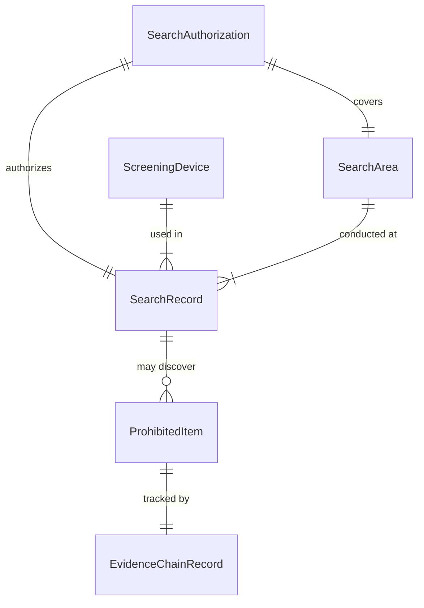
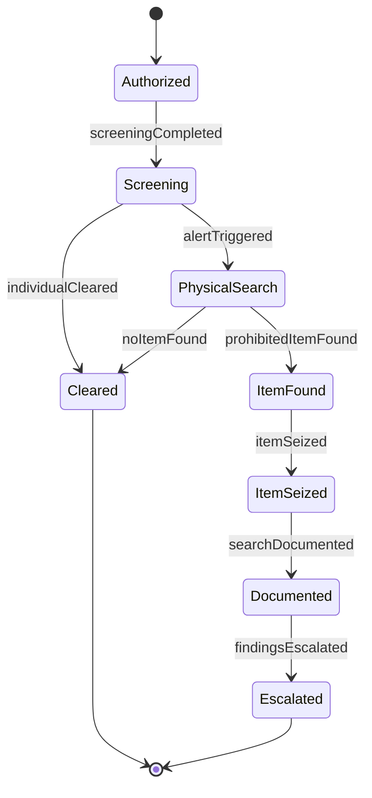
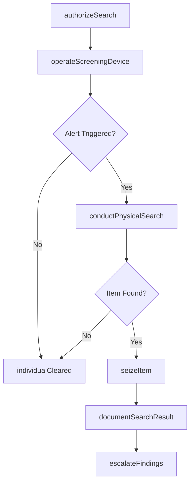
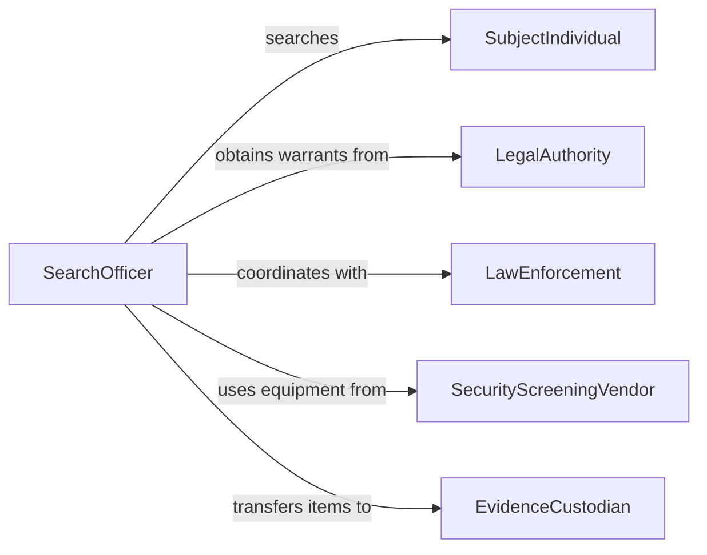

# Search Individuals Illegal Dangerous Items

> Business-as-Code definition for searching individuals for illegal or dangerous items. Models the screening authorization, physical and technological search execution, and contraband handling workflow.

## Overview

Searching individuals for illegal or dangerous items involves the authorized inspection of persons, their belongings, and vehicles to detect contraband, weapons, or prohibited materials. This activity covers search authorization, screening procedures using manual and technological methods, documentation of findings, and proper handling of seized items.

## Actors

| Actor | Description |
|-------|-------------|
| SubjectIndividual | Person being searched for prohibited items |
| LegalAuthority | Court or agency providing search warrants or authorization |
| LawEnforcement | Police agency coordinating or conducting searches |
| SecurityScreeningVendor | Provider of scanning equipment and screening technology |
| EvidenceCustodian | Facility or person responsible for storing seized items |

## Roles

| Role | Description |
|------|-------------|
| SearchOfficer | Conducts physical or technological searches of individuals |
| SupervisingOfficer | Authorizes and oversees search operations |
| ScreeningTechnician | Operates scanning and detection equipment |
| EvidenceHandler | Processes, logs, and secures items found during searches |

## Entities

| Entity | Description |
|--------|-------------|
| SearchAuthorization | Legal warrant or policy basis for conducting a search |
| SearchRecord | Documentation of a search event and its outcome |
| ProhibitedItem | Contraband, weapon, or dangerous material found |
| ScreeningDevice | Equipment used for detection such as metal detectors or X-ray scanners |
| EvidenceChainRecord | Log tracking custody of seized items |
| SearchArea | Designated location where searches are conducted |

## Actions

| Action | Description |
|--------|-------------|
| authorizeSearch | Obtain or verify legal basis for conducting a search |
| conductPhysicalSearch | Perform a manual pat-down or inspection of belongings |
| operateScreeningDevice | Use technology to scan an individual or their possessions |
| documentSearchResult | Record the outcome and details of a completed search |
| seizeItem | Confiscate and secure an illegal or dangerous item found |
| escalateFindings | Report significant discoveries to law enforcement or supervisors |
| releaseIndividual | Clear and release an individual after a completed search |

## Events

| Event | Description |
|-------|-------------|
| searchAuthorized | Legal authority for a search has been confirmed |
| physicalSearchConducted | A manual search of an individual has been completed |
| screeningCompleted | A technological scan has been finished |
| prohibitedItemFound | An illegal or dangerous item has been discovered |
| itemSeized | A prohibited item has been confiscated and secured |
| findingsEscalated | Search results have been reported to higher authorities |
| individualCleared | An individual has passed the search without findings |

## Searches

| Search | Description |
|--------|-------------|
| findSearchRecords | List search events by officer, subject, or date |
| getSeizedItems | Retrieve seized item records by type, case, or date |
| getScreeningStats | Aggregate screening metrics by location or time period |
| findPendingAuthorizations | List search authorizations awaiting approval |

## Entity Relationships



## State Diagram



## Workflow



## Actor Relationships



## Usage

### Calling Actions

```typescript
import { searchIndividualsIllegalDangerousItems } from '@headlessly/search-individuals-illegal-dangerous-items'

const screening = searchIndividualsIllegalDangerousItems()

// Authorize a search at a checkpoint
const auth = await screening.authorizeSearch({
  subjectId: 'individual-3847',
  basis: 'checkpoint-policy',
  location: 'terminal-b-security'
})

// Operate a screening device
const scanResult = await screening.operateScreeningDevice({
  authorizationId: auth.id,
  deviceId: 'xray-scanner-04',
  subjectId: 'individual-3847'
})

// Seize a prohibited item
await screening.seizeItem({
  searchRecordId: scanResult.searchRecordId,
  itemDescription: 'Concealed folding knife - 4 inch blade',
  category: 'weapon',
  location: 'carry-on-bag'
})
```

### Event-Driven Automation

```typescript
// Alert supervisor on prohibited item discovery
screening.prohibitedItemFound(async ({ searchRecordId, category, subjectId }) => {
  await notify({
    to: 'supervising-officer',
    message: `${category} found on subject ${subjectId} - search record ${searchRecordId}`
  })
})

// Log screening throughput metrics
screening.screeningCompleted(async ({ location, timestamp }) => {
  await metrics.increment('screening.completed', {
    tags: { location },
    timestamp
  })
})
```
