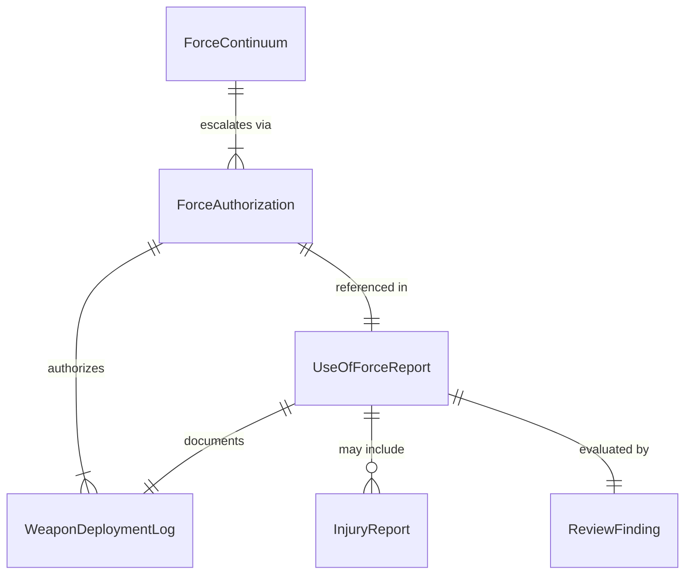
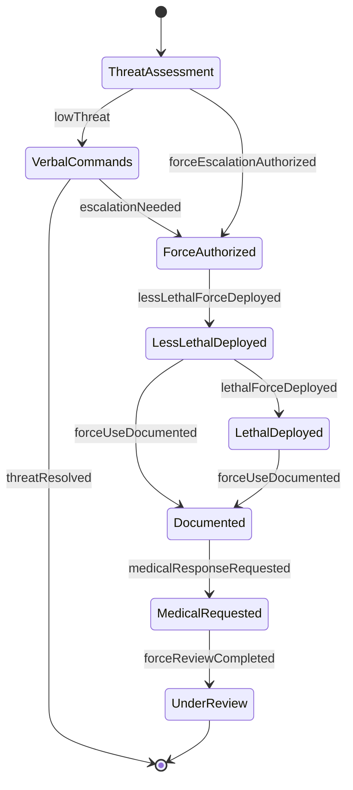
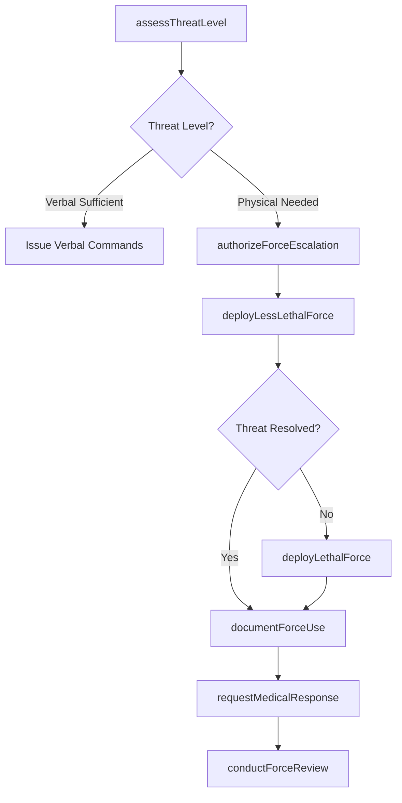
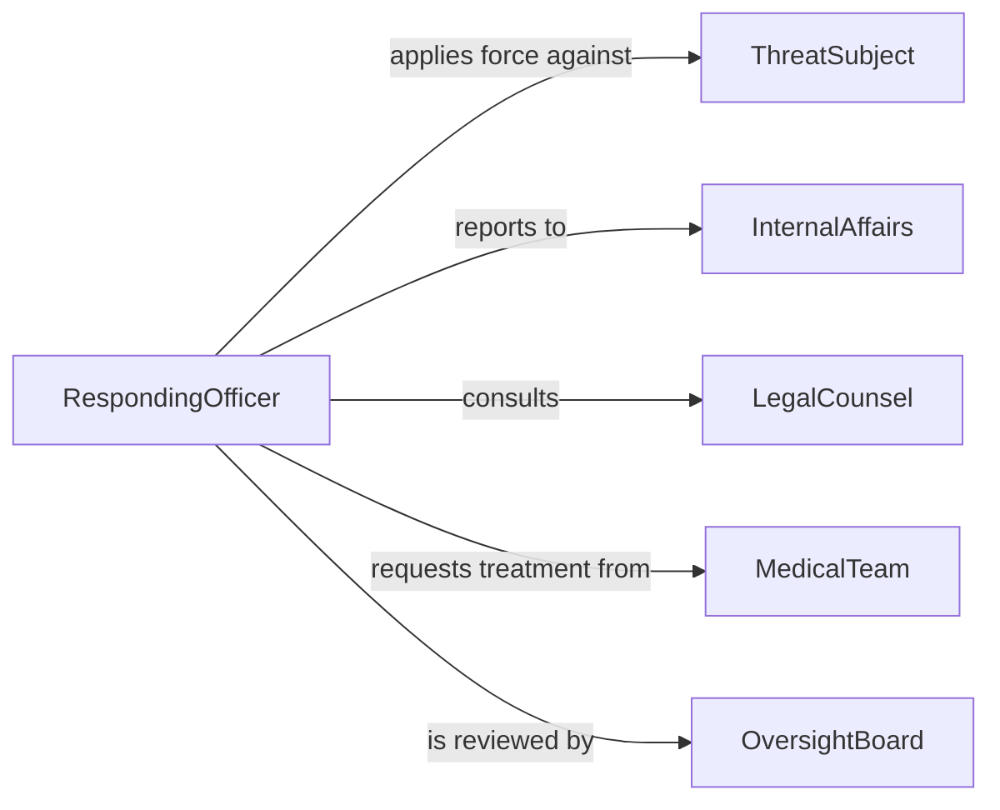

# Use Weapons Physical Force Maintain

> Business-as-Code definition for using weapons or physical force to maintain security. Models the use-of-force continuum, authorization, deployment, and post-incident review process.

## Overview

Using weapons or physical force to maintain security involves the controlled application of force when non-physical means are insufficient to resolve a threat. This activity covers the use-of-force continuum, authorization protocols, deployment of less-lethal and lethal force options, and mandatory post-incident documentation and review procedures.

## Actors

| Actor | Description |
|-------|-------------|
| ThreatSubject | Individual posing a security threat requiring force response |
| InternalAffairs | Review body investigating use-of-force incidents |
| LegalCounsel | Attorney advising on lawfulness of force application |
| MedicalTeam | Emergency medical personnel treating injuries from force use |
| OversightBoard | Civilian or regulatory body reviewing force policies |

## Roles

| Role | Description |
|------|-------------|
| RespondingOfficer | Applies force to neutralize a security threat |
| FieldCommander | Authorizes escalation on the use-of-force continuum |
| UseOfForceReviewer | Conducts post-incident evaluation of force application |
| WeaponsOfficer | Manages and deploys specialized weapons and equipment |
| TrainingInstructor | Certifies personnel on approved force techniques |

## Entities

| Entity | Description |
|--------|-------------|
| UseOfForceReport | Mandatory documentation of every force application |
| ForceContinuum | Defined escalation levels from verbal commands to lethal force |
| ForceAuthorization | Approval to escalate beyond a given force level |
| WeaponDeploymentLog | Record of weapon or equipment use during an incident |
| InjuryReport | Documentation of any injuries resulting from force use |
| ReviewFinding | Outcome of a post-incident use-of-force review |

## Actions

| Action | Description |
|--------|-------------|
| assessThreatLevel | Evaluate the severity and immediacy of a security threat |
| authorizeForceEscalation | Approve escalation to a higher level on the force continuum |
| deployLessLethalForce | Apply non-lethal measures such as restraints or deterrents |
| deployLethalForce | Apply lethal force when authorized as a last resort |
| documentForceUse | Complete mandatory reporting of all force applied |
| requestMedicalResponse | Summon medical assistance for injured parties |
| conductForceReview | Perform a post-incident evaluation of force application |

## Events

| Event | Description |
|-------|-------------|
| threatLevelAssessed | The severity of a security threat has been evaluated |
| forceEscalationAuthorized | Approval to escalate force has been granted |
| lessLethalForceDeployed | Non-lethal force measures have been applied |
| lethalForceDeployed | Lethal force has been applied as a last resort |
| forceUseDocumented | A use-of-force report has been completed |
| medicalResponseRequested | Emergency medical assistance has been summoned |
| forceReviewCompleted | A post-incident evaluation has been finalized |

## Searches

| Search | Description |
|--------|-------------|
| findForceReports | List use-of-force reports by officer, date, or incident |
| getWeaponDeployments | Retrieve weapon deployment logs by type or incident |
| getInjuryReports | Search injury records associated with force events |
| findReviewFindings | List post-incident review outcomes by status or finding |

## Entity Relationships



## State Diagram



## Workflow



## Actor Relationships



## Usage

### Calling Actions

```typescript
import { useWeaponsPhysicalForceMaintain } from '@headlessly/use-weapons-physical-force-maintain'

const forceOps = useWeaponsPhysicalForceMaintain()

// Assess a developing threat
const assessment = await forceOps.assessThreatLevel({
  incidentId: 'incident-20260205-009',
  subjectBehavior: 'armed-and-aggressive',
  immediacy: 'imminent',
  location: 'main-lobby'
})

// Authorize force escalation
await forceOps.authorizeForceEscalation({
  incidentId: 'incident-20260205-009',
  currentLevel: 'verbal-commands',
  authorizedLevel: 'less-lethal',
  authorizedBy: 'commander-davis'
})

// Document the force event
await forceOps.documentForceUse({
  incidentId: 'incident-20260205-009',
  officerId: 'officer-kim',
  forceType: 'less-lethal',
  method: 'conducted-energy-device',
  outcome: 'subject-subdued',
  injuries: 'none-observed'
})
```

### Event-Driven Automation

```typescript
// Trigger mandatory review after any force deployment
forceOps.lessLethalForceDeployed(async ({ incidentId, officerId }) => {
  await forceOps.conductForceReview({
    incidentId,
    officerId,
    reviewType: 'standard',
    assignedTo: 'internal-affairs'
  })
})

// Request medical response whenever force is deployed
forceOps.lethalForceDeployed(async ({ incidentId, location }) => {
  await forceOps.requestMedicalResponse({
    incidentId,
    location,
    priority: 'critical'
  })
  await forceOps.conductForceReview({
    incidentId,
    reviewType: 'critical-incident',
    assignedTo: 'oversight-board'
  })
})
```
