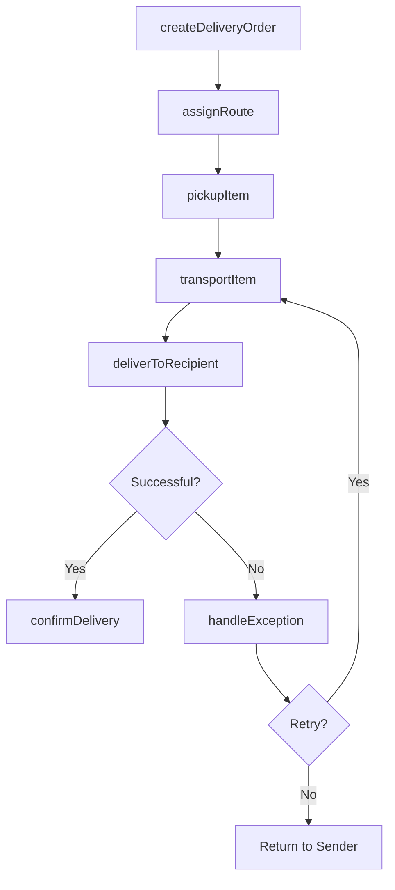
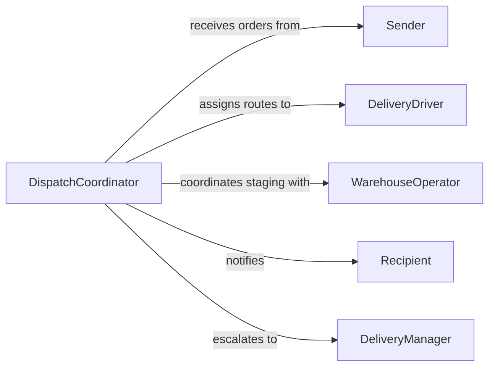

# Deliver Items

> Business-as-Code definition for delivering items. Models the end-to-end process of picking, transporting, and handing off packages, materials, documents, and supplies to their intended recipients across courier, logistics, and internal distribution operations.

## Overview

Delivering items involves picking up goods from a source location, transporting them via appropriate means, and completing handoff to the designated recipient with confirmation of receipt. This activity spans courier services, internal mail rooms, warehouse distribution, last-mile package delivery, and supply chain fulfillment. The definition covers route planning, proof of delivery, exception handling for failed deliveries, and real-time tracking for transparency and accountability.

## Actors

| Actor | Description |
|-------|-------------|
| Sender | The individual or organization dispatching the item for delivery |
| Recipient | The intended receiver of the delivered item |
| ShippingCarrier | A third-party logistics provider handling long-haul transport |
| WarehouseOperator | Picks and stages items for outbound delivery |
| Customer | Places orders that generate delivery requirements |

## Roles

| Role | Description |
|------|-------------|
| DeliveryDriver | Transports items from the distribution point to the recipient |
| DispatchCoordinator | Assigns delivery routes and manages driver schedules |
| MailRoomClerk | Sorts and distributes internal mail and packages within a facility |
| DeliveryManager | Oversees delivery operations, monitors performance, and resolves exceptions |

## Entities

| Entity | Description |
|--------|-------------|
| DeliveryOrder | A request to transport an item from origin to destination |
| Package | The physical item or parcel being delivered |
| Route | The planned path from pickup to delivery with waypoints |
| ProofOfDelivery | Confirmation that the item was received, such as a signature or photo |
| DeliveryException | A record of a failed or incomplete delivery attempt |
| TrackingEvent | A timestamped status update showing the item's progress |

## Actions

| Action | Description |
|--------|-------------|
| createDeliveryOrder | Initiate a new delivery request with origin, destination, and item details |
| assignRoute | Plan and assign an optimized delivery route to a driver |
| pickupItem | Collect the package from the sender or warehouse |
| transportItem | Move the item along the assigned route to the destination |
| deliverToRecipient | Hand off the item and capture proof of delivery |
| handleException | Process failed delivery attempts with reason codes and next steps |
| confirmDelivery | Finalize the delivery record with recipient acknowledgment |

## Events

| Event | Description |
|-------|-------------|
| orderCreated | A new delivery order has been submitted |
| routeAssigned | A delivery route has been planned and assigned to a driver |
| itemPickedUp | The package has been collected from the origin |
| itemInTransit | The item is currently being transported to the destination |
| itemDelivered | The item has been successfully handed to the recipient |
| deliveryFailed | A delivery attempt was unsuccessful |
| deliveryConfirmed | The recipient has acknowledged receipt of the item |

## Searches

| Search | Description |
|--------|-------------|
| findDeliveryOrders | List delivery orders by status, date, sender, or recipient |
| trackItem | Retrieve real-time tracking events for a specific package |
| getExceptions | Access failed delivery records requiring resolution |
| getRouteStatus | Check the progress of active delivery routes |

## Workflow



## Actor Relationships



## Usage

### Calling Actions

```typescript
import { deliverItems } from '@headlessly/deliver-items'

const delivery = deliverItems()

// Create a delivery order for office supplies
const order = await delivery.createDeliveryOrder({
  sender: { name: 'Central Warehouse', address: '500 Distribution Way' },
  recipient: { name: 'Branch Office North', address: '120 Commerce Dr, Suite 300' },
  items: [
    { description: 'Printer paper - 10 reams', weight: 22, sku: 'SUP-PP-010' },
    { description: 'Toner cartridges - 4 pack', weight: 3, sku: 'SUP-TC-004' }
  ],
  priority: 'standard',
  requestedDelivery: '2026-02-06T14:00:00'
})

// Assign route and pick up
await delivery.assignRoute({
  orderId: order.id,
  driverId: 'DRV-042',
  route: ['warehouse-dock-3', 'branch-office-north'],
  estimatedDuration: 45
})

await delivery.pickupItem({
  orderId: order.id,
  location: 'warehouse-dock-3',
  pickupTime: new Date()
})

// Deliver and confirm
await delivery.deliverToRecipient({
  orderId: order.id,
  recipient: 'J. Martinez',
  proofOfDelivery: { type: 'signature', data: 'base64-signature-data' }
})
```

### Event-Driven Automation

```typescript
// Notify recipient when item is in transit
delivery.itemInTransit(async ({ orderId, recipientId, eta }) => {
  await notify({
    to: recipientId,
    message: `Your delivery ${orderId} is on the way. Estimated arrival: ${eta}`
  })
})

// Auto-reschedule failed deliveries
delivery.deliveryFailed(async ({ orderId, reason, attemptCount }) => {
  if (attemptCount < 3) {
    await delivery.assignRoute({
      orderId,
      reschedule: true,
      nextAttempt: getNextBusinessDay()
    })
  } else {
    await delivery.handleException({
      orderId,
      action: 'return-to-sender',
      reason
    })
  }
})
```
