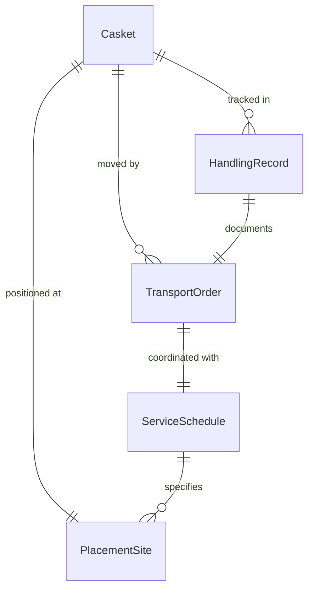
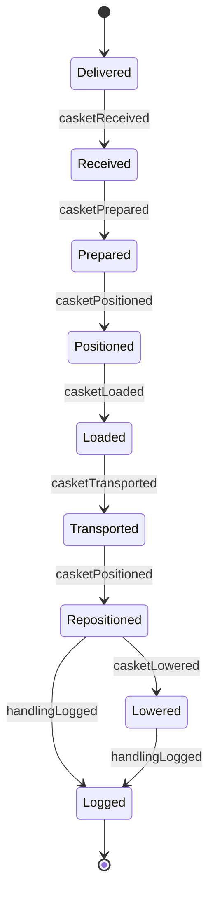
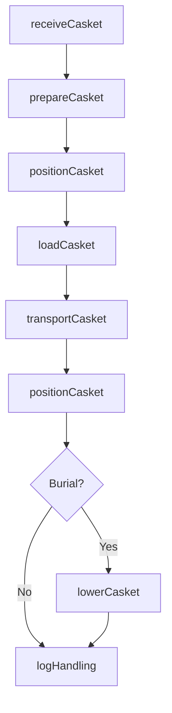
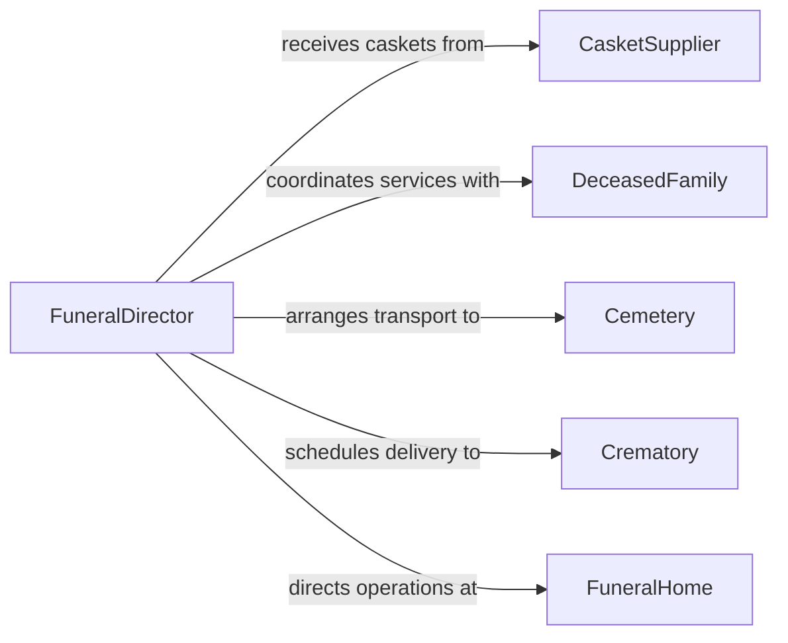

# Handle Caskets

> Business-as-Code definition for casket handling operations. Models the safe transport, positioning, and placement of caskets during funeral service preparation and interment ceremonies.

## Overview

Casket handling encompasses the careful lifting, transporting, and positioning of caskets during viewings, funeral services, and burial or cremation processes. This activity requires coordinated teamwork, adherence to safety protocols, and respectful treatment of the deceased throughout all stages of movement. The definition captures actions from initial casket receipt through final placement at the gravesite or crematory.

## Actors

| Actor | Description |
|-------|-------------|
| FuneralHome | Facility where caskets are received, stored, and prepared for services |
| CasketSupplier | Manufacturer or distributor providing caskets and related hardware |
| Cemetery | Burial grounds where caskets are transported for interment |
| Crematory | Facility receiving caskets for cremation services |
| DeceasedFamily | Family members coordinating casket selection and service logistics |

## Roles

| Role | Description |
|------|-------------|
| FuneralDirector | Oversees all casket handling operations and service coordination |
| Pallbearer | Carries and transports the casket during services and interment |
| EmbalmerTechnician | Prepares the deceased and places remains into the casket |
| TransportDriver | Operates vehicles used to move caskets between locations |

## Entities

| Entity | Description |
|--------|-------------|
| Casket | The container holding the deceased for services and burial |
| TransportOrder | A directive specifying casket pickup, route, and delivery details |
| ServiceSchedule | Timetable of events requiring casket movement and positioning |
| HandlingRecord | Documentation of each casket movement including personnel involved |
| PlacementSite | The specific location where a casket is positioned for service or interment |

## Actions

| Action | Description |
|--------|-------------|
| receiveCasket | Accept delivery of a casket at the funeral home or service location |
| prepareCasket | Ready the casket for viewing by placing remains and arranging interior |
| transportCasket | Move the casket between locations using appropriate vehicles |
| positionCasket | Place the casket at the designated location for a service or ceremony |
| lowerCasket | Descend the casket into the gravesite using lowering equipment |
| loadCasket | Place the casket onto a hearse or transport vehicle |
| logHandling | Record casket movement details for chain-of-custody documentation |

## Events

| Event | Description |
|-------|-------------|
| casketReceived | A casket has been delivered and accepted at the facility |
| casketPrepared | The casket has been readied with remains for viewing or service |
| casketTransported | The casket has been moved to the next designated location |
| casketPositioned | The casket has been placed at the service or ceremony site |
| casketLowered | The casket has been interred at the gravesite |
| casketLoaded | The casket has been secured onto a transport vehicle |
| handlingLogged | A handling event has been documented in the chain-of-custody record |

## Searches

| Search | Description |
|--------|-------------|
| findTransportOrders | List casket transport orders by date, location, or status |
| getHandlingRecords | Retrieve handling history for a specific casket or service |
| getServiceSchedules | Look up upcoming services requiring casket movement |

## Entity Relationships



## State Diagram



## Workflow



## Actor Relationships



## Usage

### Calling Actions

```typescript
import { handleCaskets } from '@headlessly/handle-caskets'

const caskets = handleCaskets()

// Receive a casket delivery
const receipt = await caskets.receiveCasket({
  casketId: 'CSK-2026-0412',
  supplier: 'Heritage Casket Co.',
  model: 'Mahogany Executive',
  receivedAt: '2026-02-05T09:00:00Z'
})

// Transport casket to cemetery
await caskets.transportCasket({
  casketId: receipt.casketId,
  origin: 'Grace Funeral Home',
  destination: 'Oakwood Memorial Cemetery',
  vehicleId: 'HEARSE-03',
  scheduledTime: '2026-02-06T14:00:00Z'
})

// Lower casket at gravesite
await caskets.lowerCasket({
  casketId: receipt.casketId,
  gravesiteId: 'SEC-B-ROW-12-PLOT-4',
  pallbearers: ['J. Smith', 'R. Davis', 'M. Thompson', 'A. Wilson', 'T. Brown', 'K. Lee']
})
```

### Event-Driven Automation

```typescript
// Notify cemetery staff when casket is en route
caskets.casketLoaded(async ({ casketId, destination, estimatedArrival }) => {
  await notify({
    to: 'cemetery-operations',
    message: `Casket ${casketId} departing for ${destination}, ETA ${estimatedArrival}`
  })
})

// Generate chain-of-custody report after interment
caskets.casketLowered(async ({ casketId, gravesiteId }) => {
  await caskets.logHandling({
    casketId,
    event: 'interment-complete',
    location: gravesiteId,
    timestamp: new Date().toISOString()
  })
})
```
