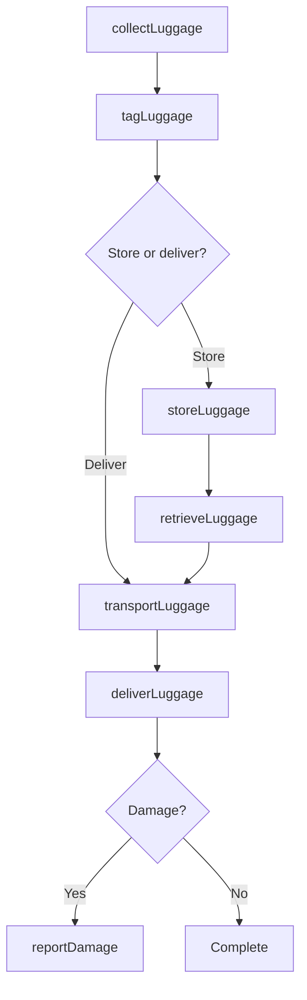
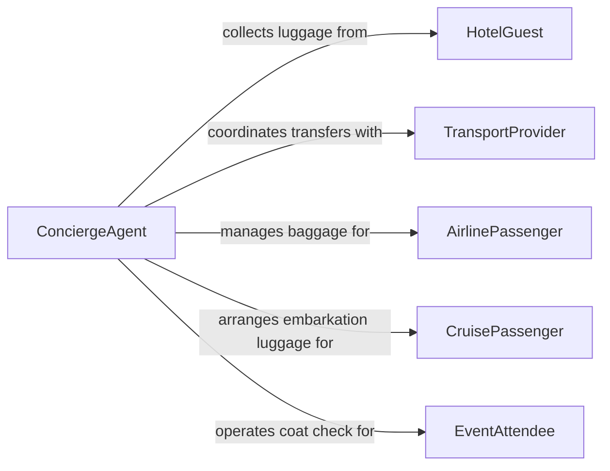

# Handle Luggage Possessions Patrons

> Business-as-Code definition for patron luggage and possessions handling. Models the receiving, transporting, storing, and returning of guest luggage and personal belongings in hospitality, travel, and event settings.

## Overview

Handling luggage and possessions for patrons encompasses the collection, transport, secure storage, and return of personal items in hotels, airports, cruise ships, event venues, and other hospitality environments. This activity requires careful tracking to prevent loss or damage, timely delivery to meet guest expectations, and secure handling of valuables. Service quality in luggage handling directly impacts guest satisfaction scores and repeat patronage.

## Actors

| Actor | Description |
|-------|-------------|
| HotelGuest | Patron checking in or out whose luggage requires handling |
| AirlinePassenger | Traveler whose bags are checked, transferred, or retrieved |
| CruisePassenger | Guest embarking or disembarking with luggage requiring transport |
| EventAttendee | Patron at a venue using coat check or bag storage services |
| TransportProvider | Taxi, shuttle, or limousine service involved in luggage transfers |

## Roles

| Role | Description |
|------|-------------|
| Bellhop | Carries and delivers luggage between guest vehicles, lobby, and rooms |
| BaggageHandler | Loads, unloads, and routes luggage at airports or transit terminals |
| ConciergeAgent | Coordinates luggage services and manages special handling requests |
| StorageAttendant | Manages secure luggage storage areas and coat check operations |

## Entities

| Entity | Description |
|--------|-------------|
| LuggageItem | A specific bag, suitcase, or personal belonging being handled |
| ClaimTicket | A numbered tag linking a patron to their stored or checked items |
| StorageArea | Secure room, closet, or rack designated for holding patron belongings |
| HandlingRequest | A service request specifying pickup, delivery, or storage of luggage |
| DamageReport | Documentation of any loss or damage incurred during handling |

## Actions

| Action | Description |
|--------|-------------|
| collectLuggage | Pick up luggage from a patron at the arrival point or room |
| tagLuggage | Attach identification tags and claim tickets to each item |
| transportLuggage | Move luggage to the designated destination such as a room or storage area |
| storeLuggage | Place luggage in a secure storage area for temporary holding |
| retrieveLuggage | Locate and pull luggage from storage when the patron requests it |
| deliverLuggage | Return luggage to the patron at the specified location |
| reportDamage | Document and file a claim for any lost or damaged items |

## Events

| Event | Description |
|-------|-------------|
| luggageCollected | Luggage has been picked up from the patron |
| luggageTagged | Identification tags and claim tickets have been attached |
| luggageTransported | Luggage has been moved to its designated location |
| luggageStored | Luggage has been placed in secure storage |
| luggageRetrieved | Luggage has been pulled from storage for return to the patron |
| luggageDelivered | Luggage has been returned to the patron |
| damageReported | A loss or damage claim has been documented |

## Searches

| Search | Description |
|--------|-------------|
| findLuggageByPatron | Locate all luggage items associated with a specific guest or passenger |
| getStorageInventory | List all items currently held in a storage area |
| getPendingDeliveries | Find luggage items awaiting delivery to patrons |
| getDamageReports | Retrieve filed damage or loss claims by date or patron |

## Workflow



## Actor Relationships



## Usage

### Calling Actions

```typescript
import { handleLuggagePossessionsPatrons } from '@headlessly/handle-luggage-possessions-patrons'

const luggage = handleLuggagePossessionsPatrons()

// Collect luggage at hotel check-in
const items = await luggage.collectLuggage({
  patronId: 'guest-2026-5581',
  items: [
    { type: 'suitcase', size: 'large', color: 'black' },
    { type: 'garment-bag', size: 'standard', color: 'navy' }
  ],
  collectedAt: 'Main Lobby - Valet Stand',
  collectedBy: 'bellhop-jmorales'
})

// Tag and transport to room
await luggage.tagLuggage({
  items: items.map(i => i.id),
  claimTicket: 'CLM-5581-A'
})

await luggage.transportLuggage({
  items: items.map(i => i.id),
  destination: 'Room 1214',
  transportedBy: 'bellhop-jmorales'
})

// Deliver luggage to guest room
await luggage.deliverLuggage({
  items: items.map(i => i.id),
  location: 'Room 1214',
  confirmedBy: 'guest-2026-5581'
})
```

### Event-Driven Automation

```typescript
// Notify guest when luggage arrives at room
luggage.luggageDelivered(async ({ patronId, location, items }) => {
  await notify({
    to: patronId,
    channel: 'sms',
    message: `Your ${items.length} item(s) have been delivered to ${location}`
  })
})

// Auto-escalate damage reports to management
luggage.damageReported(async ({ patronId, itemDescription, claimTicket }) => {
  await notify({
    to: 'front-desk-manager',
    message: `Damage claim filed by ${patronId}: ${itemDescription} (Claim: ${claimTicket})`
  })
})
```
