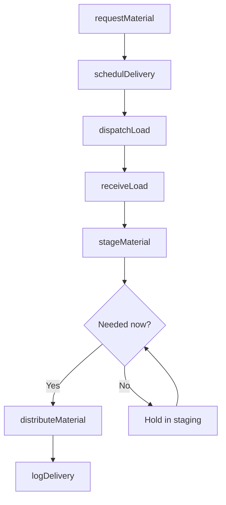
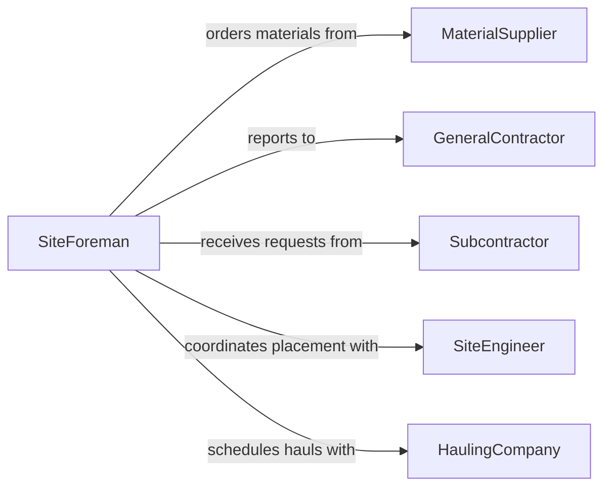

# Move Construction Extraction Materials Locations

> Business-as-Code definition for construction and extraction material logistics. Models the delivery, staging, and distribution of building materials, aggregate, and extracted resources to active job sites.

## Overview

Moving construction and extraction materials to needed locations involves the transport of lumber, concrete, steel, gravel, soil, ore, and other bulk materials from supply yards, quarries, and staging areas to active construction or extraction sites. This activity requires coordination with project schedules, equipment availability, and site access constraints. Timely material delivery prevents costly crew idle time, while proper staging ensures materials are positioned safely and accessibly for the trades that need them.

## Actors

| Actor | Description |
|-------|-------------|
| MaterialSupplier | Quarry, lumber yard, or concrete plant providing raw materials |
| GeneralContractor | Primary contractor managing the construction or extraction project |
| Subcontractor | Specialty trade requiring specific materials at the job site |
| SiteEngineer | Technical professional specifying material placement locations |
| HaulingCompany | Trucking firm transporting bulk materials to the site |

## Roles

| Role | Description |
|------|-------------|
| SiteForeman | Directs material placement and coordinates deliveries on the job site |
| MaterialDriver | Operates trucks and haul vehicles delivering materials to the site |
| StagingCoordinator | Manages laydown yards and staging areas for incoming materials |
| ProjectScheduler | Aligns material deliveries with the construction schedule |

## Entities

| Entity | Description |
|--------|-------------|
| MaterialLoad | A specific quantity of construction or extraction material being moved |
| DeliveryTicket | Documentation accompanying a material shipment with quantity and origin |
| StagingArea | Designated laydown zone on site where materials are temporarily stored |
| JobSite | The active construction or extraction location requiring materials |
| HaulRoute | The planned path from the material source to the job site |
| MaterialRequest | A formal request from a trade or foreman for specific materials |

## Actions

| Action | Description |
|--------|-------------|
| requestMaterial | Submit a material need specifying type, quantity, and delivery location |
| schedulDelivery | Coordinate delivery timing with the supplier and project schedule |
| dispatchLoad | Send a loaded vehicle from the source to the job site |
| receiveLoad | Accept the material delivery at the job site and verify quantities |
| stageMaterial | Position materials in the designated laydown or staging area |
| distributeMaterial | Move staged materials to the specific work zone where they are needed |
| logDelivery | Record delivery details including quantities, timestamps, and condition |

## Events

| Event | Description |
|-------|-------------|
| materialRequested | A new material request has been submitted by a trade or foreman |
| deliveryScheduled | A material delivery has been confirmed on the project schedule |
| loadDispatched | A loaded vehicle has departed the source for the job site |
| loadReceived | Materials have been accepted and verified at the job site |
| materialStaged | Materials have been positioned in the staging area |
| materialDistributed | Materials have been moved to the specific work zone |
| deliveryLogged | Delivery details have been recorded in the project system |

## Searches

| Search | Description |
|--------|-------------|
| findMaterialRequests | List outstanding material requests by trade, type, or priority |
| getDeliverySchedule | Retrieve upcoming deliveries for a specific job site or date range |
| getStagingInventory | Check what materials are currently available in the staging area |
| getDeliveryHistory | Look up past deliveries by supplier, material type, or date |

## Workflow



## Actor Relationships



## Usage

### Calling Actions

```typescript
import { moveConstructionExtractionMaterialsLocations } from '@headlessly/move-construction-extraction-materials-locations'

const siteMaterials = moveConstructionExtractionMaterialsLocations()

// Request concrete for foundation pour
const request = await siteMaterials.requestMaterial({
  jobSiteId: 'PROJ-2026-HARBOR-TOWER',
  materialType: 'ready-mix-concrete',
  quantity: 40,
  unit: 'cubic-yards',
  deliveryZone: 'Foundation Grid A1-A4',
  requiredBy: '2026-02-06T07:00:00Z',
  requestedBy: 'foreman-rgarcia'
})

// Schedule and dispatch
await siteMaterials.schedulDelivery({
  requestId: request.id,
  supplierId: 'Pacific-Ready-Mix',
  scheduledTime: '2026-02-06T06:30:00Z',
  vehicleCount: 5
})

// Receive and stage at job site
await siteMaterials.receiveLoad({
  requestId: request.id,
  deliveryTicket: 'DT-PMX-88421',
  quantityReceived: 40,
  unit: 'cubic-yards',
  receivedBy: 'foreman-rgarcia'
})

// Distribute to pour location
await siteMaterials.distributeMaterial({
  requestId: request.id,
  workZone: 'Foundation Grid A1-A4',
  method: 'pump-truck'
})
```

### Event-Driven Automation

```typescript
// Alert foreman when load is dispatched
siteMaterials.loadDispatched(async ({ requestId, materialType, estimatedArrival }) => {
  await notify({
    to: 'site-foreman',
    message: `${materialType} load dispatched, ETA ${estimatedArrival}`
  })
})

// Auto-update project schedule when materials arrive
siteMaterials.loadReceived(async ({ requestId, jobSiteId, materialType, quantity }) => {
  await updateProjectSchedule({
    jobSiteId,
    event: 'material-received',
    materialType,
    quantity,
    receivedAt: new Date().toISOString()
  })
})
```
