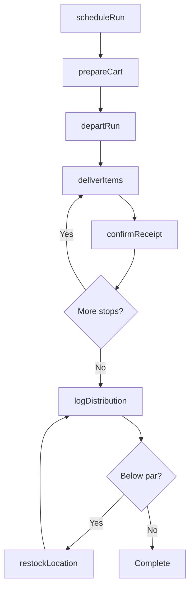
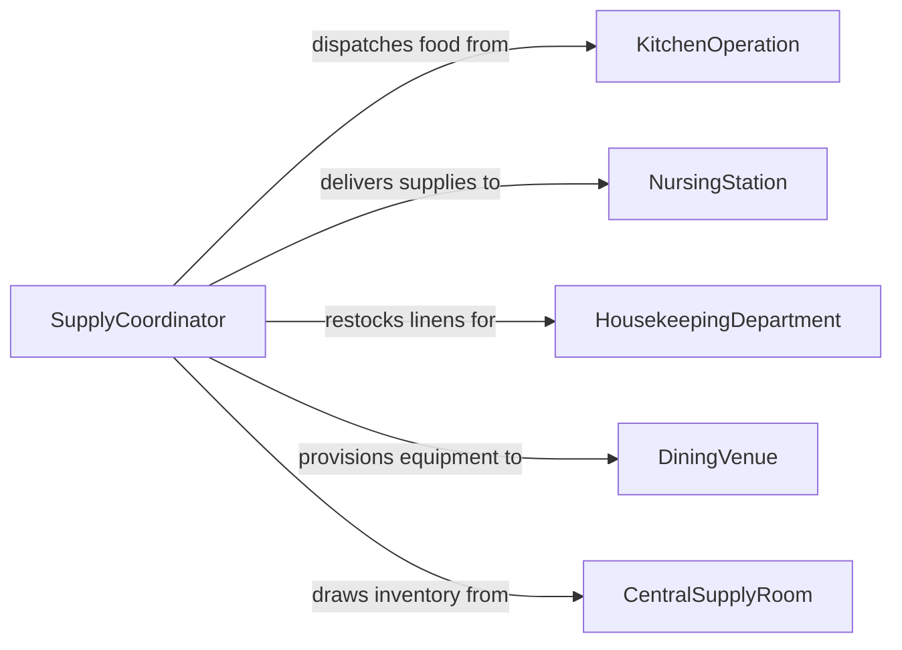

# Move Equipment Supplies Food Required

> Business-as-Code definition for equipment, supply, and food distribution operations. Models the internal movement of provisions, service equipment, and food items to designated locations in hospitality, healthcare, and institutional settings.

## Overview

Moving equipment, supplies, and food to required locations encompasses the transport of kitchen provisions, medical supplies, cleaning equipment, linens, and prepared food items to their points of use within hotels, hospitals, schools, and other institutional facilities. This activity supports daily operations by ensuring that each department, floor, patient room, or dining area receives the correct items on schedule. Maintaining food safety temperatures, preventing cross-contamination, and tracking equipment distribution are essential to operational compliance.

## Actors

| Actor | Description |
|-------|-------------|
| KitchenOperation | Central kitchen or food preparation area producing meals and provisions |
| NursingStation | Hospital floor or wing requiring medical supplies and meal trays |
| HousekeepingDepartment | Facility division needing cleaning supplies and linens |
| DiningVenue | Restaurant, cafeteria, or banquet hall receiving food and service equipment |
| CentralSupplyRoom | Storage area from which supplies and equipment are distributed |

## Roles

| Role | Description |
|------|-------------|
| DistributionAttendant | Delivers equipment, supplies, and food along designated routes |
| DietaryAide | Prepares and delivers meal trays to patients or dining areas |
| SupplyCoordinator | Manages par levels and schedules restocking runs for all departments |
| FloorSupervisor | Receives deliveries and confirms correct quantities at the destination |

## Entities

| Entity | Description |
|--------|-------------|
| DeliveryRun | A scheduled route delivering items to multiple locations in sequence |
| SupplyCart | A wheeled cart loaded with items for distribution |
| MealTray | An individual food service tray prepared for a patient or guest |
| ParLevel | The target minimum quantity of an item that should be maintained at a location |
| DeliveryManifest | A checklist of items, quantities, and destinations for a distribution run |

## Actions

| Action | Description |
|--------|-------------|
| prepareCart | Load a supply cart with the items specified on the delivery manifest |
| scheduleRun | Plan a delivery route with stops, timing, and assigned personnel |
| departRun | Begin the distribution route from the central supply or kitchen area |
| deliverItems | Drop off items at each designated location along the route |
| confirmReceipt | Obtain acknowledgment that delivered items were received in correct quantity |
| restockLocation | Replenish items at a location to meet par level requirements |
| logDistribution | Record delivery details including quantities, times, and temperature readings |

## Events

| Event | Description |
|-------|-------------|
| cartPrepared | A supply cart has been loaded and is ready for distribution |
| runScheduled | A delivery run has been planned and assigned to an attendant |
| runDeparted | The distribution attendant has left the staging area |
| itemsDelivered | Items have been dropped off at a designated location |
| receiptConfirmed | The receiving party has acknowledged the delivery |
| locationRestocked | A location has been replenished to its par level |
| distributionLogged | All delivery details have been recorded in the system |

## Searches

| Search | Description |
|--------|-------------|
| findDeliveryRuns | List delivery runs by date, route, or assigned attendant |
| getParLevels | Retrieve current inventory versus par levels for each location |
| getPendingDeliveries | Find items that are scheduled but not yet delivered |
| getDistributionHistory | Look up past deliveries for a specific location or item type |

## Workflow



## Actor Relationships



## Usage

### Calling Actions

```typescript
import { moveEquipmentSuppliesFoodRequired } from '@headlessly/move-equipment-supplies-food-required'

const distribution = moveEquipmentSuppliesFoodRequired()

// Schedule a morning meal tray delivery run
const run = await distribution.scheduleRun({
  route: 'Floor-3-East-Wing',
  stops: ['Room-301', 'Room-302', 'Room-305', 'Room-308', 'Room-312'],
  runType: 'meal-delivery',
  scheduledTime: '2026-02-05T07:30:00Z',
  assignedTo: 'aide-mwilson'
})

// Prepare the distribution cart
await distribution.prepareCart({
  runId: run.id,
  items: [
    { type: 'meal-tray', patient: 'Room-301', dietaryCode: 'cardiac-low-sodium' },
    { type: 'meal-tray', patient: 'Room-302', dietaryCode: 'diabetic' },
    { type: 'meal-tray', patient: 'Room-305', dietaryCode: 'regular' },
    { type: 'meal-tray', patient: 'Room-308', dietaryCode: 'pureed' },
    { type: 'meal-tray', patient: 'Room-312', dietaryCode: 'regular' }
  ],
  temperatureCheck: { hot: 63, cold: 5, unit: 'C' }
})

// Deliver and confirm at each stop
await distribution.deliverItems({
  runId: run.id,
  stop: 'Room-301',
  deliveredBy: 'aide-mwilson',
  confirmedBy: 'nurse-lpatel'
})
```

### Event-Driven Automation

```typescript
// Alert kitchen when par levels drop below threshold
distribution.locationRestocked(async ({ location, item, currentLevel, parLevel }) => {
  if (currentLevel < parLevel * 0.3) {
    await notify({
      to: 'kitchen-manager',
      message: `Low stock alert: ${item} at ${location} is at ${currentLevel}/${parLevel}`
    })
  }
})

// Track meal tray delivery compliance
distribution.receiptConfirmed(async ({ runId, stop, deliveredAt, scheduledTime }) => {
  const delayMinutes = (new Date(deliveredAt).getTime() - new Date(scheduledTime).getTime()) / 60000
  if (delayMinutes > 15) {
    await logComplianceIssue({
      runId,
      location: stop,
      issue: `Meal delivery ${Math.round(delayMinutes)} minutes late`
    })
  }
})
```
