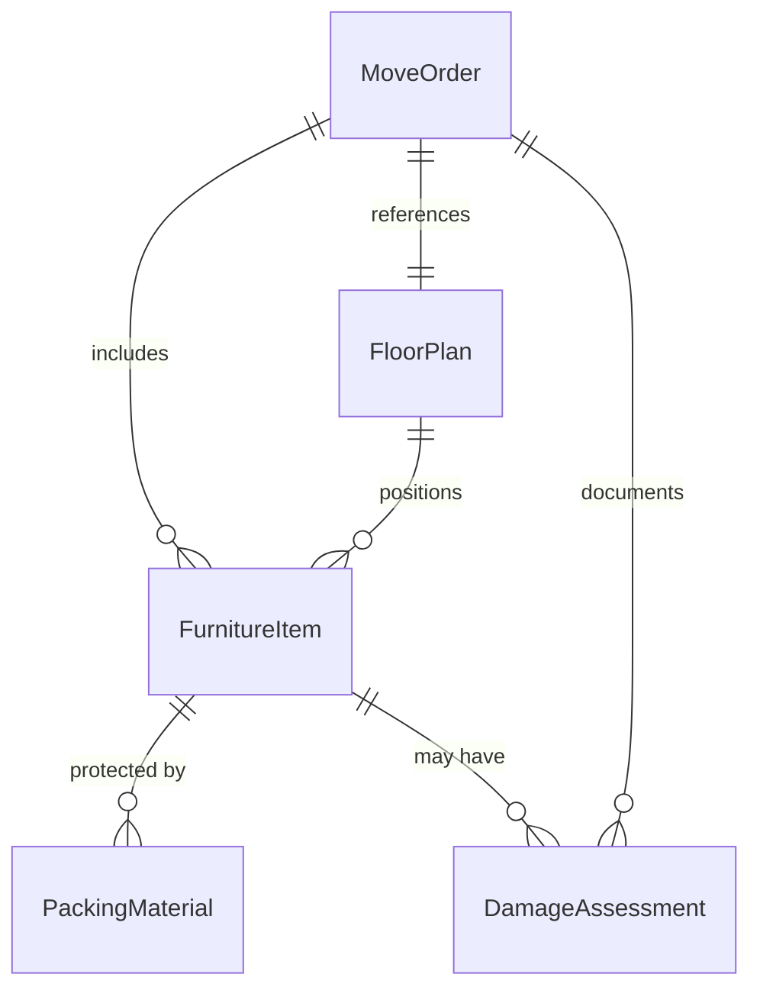
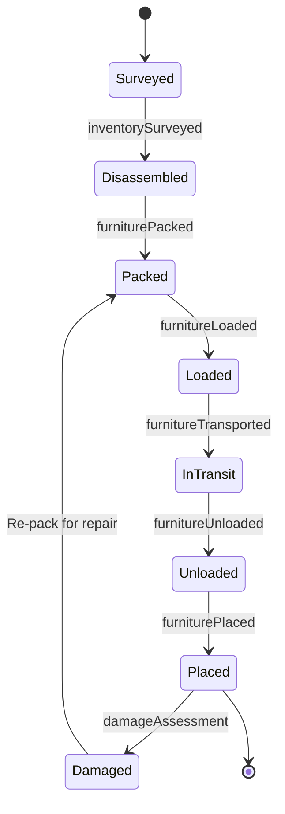
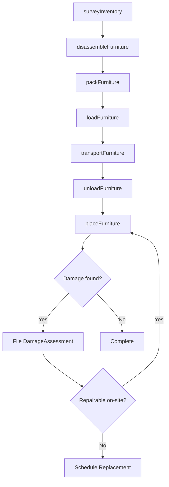
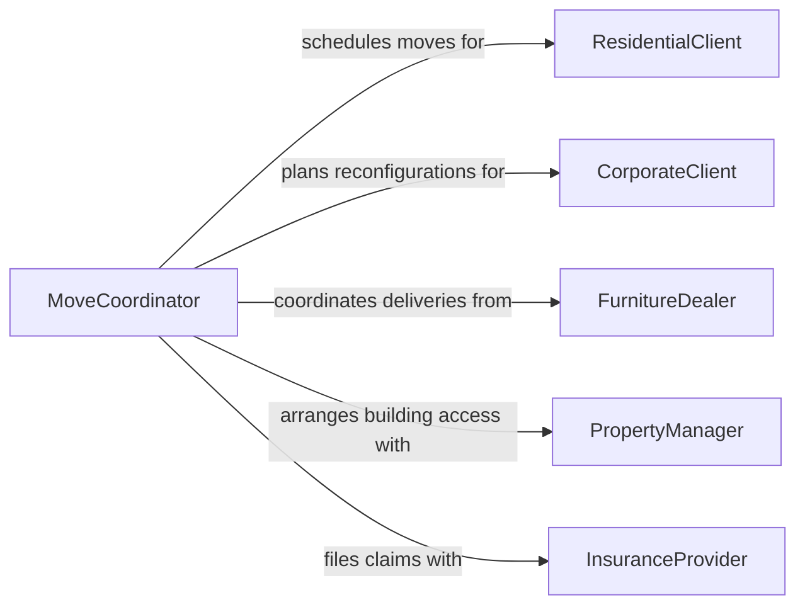

# Move Furniture

> Business-as-Code definition for furniture moving operations. Models the planning, packing, transporting, and placing of furniture for residential relocations, office reconfigurations, and commercial installations.

## Overview

Furniture moving involves the disassembly, wrapping, loading, transporting, unloading, and reassembly of desks, chairs, tables, cabinets, and other furnishings. This activity serves residential moves, corporate office reconfigurations, hospitality room turnovers, and commercial fitout projects. Protecting items from damage, navigating tight spaces, and coordinating placement according to floor plans are central concerns that determine service quality and customer satisfaction.

## Actors

| Actor | Description |
|-------|-------------|
| ResidentialClient | Homeowner or renter relocating household furniture |
| CorporateClient | Business requesting office furniture reconfiguration or relocation |
| FurnitureDealer | Retailer or manufacturer delivering new furniture to a site |
| PropertyManager | Building manager coordinating elevator access and loading dock schedules |
| InsuranceProvider | Company covering furniture against damage or loss during moves |

## Roles

| Role | Description |
|------|-------------|
| MovingCrewLead | Supervises the moving team and coordinates logistics on site |
| Mover | Physically lifts, carries, and positions furniture items |
| PackingSpecialist | Wraps, pads, and secures furniture for safe transport |
| MoveCoordinator | Plans the move schedule, assigns crews, and manages client communication |

## Entities

| Entity | Description |
|--------|-------------|
| FurnitureItem | A specific piece of furniture being moved, with dimensions and weight |
| MoveOrder | A job record specifying origin, destination, inventory, and schedule |
| FloorPlan | Layout diagram showing where furniture should be placed at the destination |
| PackingMaterial | Blankets, wrap, tape, and padding used to protect furniture |
| DamageAssessment | Report documenting any scratches, dents, or breakage during the move |

## Actions

| Action | Description |
|--------|-------------|
| surveyInventory | Catalog all furniture items to be moved with dimensions and condition notes |
| disassembleFurniture | Break down large pieces into components for safe transport |
| packFurniture | Wrap and pad furniture items to prevent damage during transit |
| loadFurniture | Place packed furniture onto the moving vehicle in optimal order |
| transportFurniture | Drive furniture from the origin to the destination location |
| unloadFurniture | Remove furniture from the vehicle at the destination |
| placeFurniture | Position and reassemble furniture according to the floor plan |

## Events

| Event | Description |
|-------|-------------|
| inventorySurveyed | All furniture items have been cataloged and documented |
| furnitureDisassembled | Large pieces have been broken down into transportable components |
| furniturePacked | Items have been wrapped and secured for safe transit |
| furnitureLoaded | All items have been placed on the transport vehicle |
| furnitureTransported | The vehicle has arrived at the destination with all items |
| furnitureUnloaded | Items have been removed from the vehicle at the destination |
| furniturePlaced | All items have been positioned and reassembled per the floor plan |

## Searches

| Search | Description |
|--------|-------------|
| findMoveOrders | List move orders by client, date, status, or location |
| getItemInventory | Retrieve the furniture inventory for a specific move order |
| getDamageAssessments | Look up damage reports for a move or specific item |
| getCrewSchedule | View crew assignments and availability by date |

## Entity Relationships



## State Diagram



## Workflow



## Actor Relationships



## Usage

### Calling Actions

```typescript
import { moveFurniture } from '@headlessly/move-furniture'

const furniture = moveFurniture()

// Survey inventory for an office move
const inventory = await furniture.surveyInventory({
  moveOrderId: 'MO-2026-0331',
  location: '400 Market St, Suite 800',
  items: [
    { name: 'Executive Desk', dimensions: '72x36x30in', weight: 95, condition: 'good' },
    { name: 'Conference Table', dimensions: '120x48x30in', weight: 220, condition: 'good' },
    { name: 'Filing Cabinet 4-Drawer', dimensions: '15x25x52in', weight: 65, condition: 'fair' }
  ]
})

// Pack and load
await furniture.packFurniture({
  moveOrderId: 'MO-2026-0331',
  items: inventory.items.map(i => i.id),
  materials: ['moving-blankets', 'shrink-wrap', 'corner-protectors']
})

await furniture.loadFurniture({
  moveOrderId: 'MO-2026-0331',
  vehicleId: 'TRUCK-26FT-04',
  loadedBy: 'crew-alpha'
})

// Place furniture at new office
await furniture.placeFurniture({
  moveOrderId: 'MO-2026-0331',
  floorPlanId: 'FP-SUITE-1200',
  placedBy: 'crew-alpha'
})
```

### Event-Driven Automation

```typescript
// Notify client when furniture arrives at destination
furniture.furnitureTransported(async ({ moveOrderId, destination }) => {
  await notify({
    to: 'client',
    message: `Your furniture has arrived at ${destination}. Unloading will begin shortly.`
  })
})

// Auto-generate damage report if issues found during placement
furniture.furniturePlaced(async ({ moveOrderId, items }) => {
  const damaged = items.filter(i => i.conditionChange)
  if (damaged.length > 0) {
    await notify({
      to: 'move-coordinator',
      message: `${damaged.length} item(s) with condition changes on move ${moveOrderId}`
    })
  }
})
```
