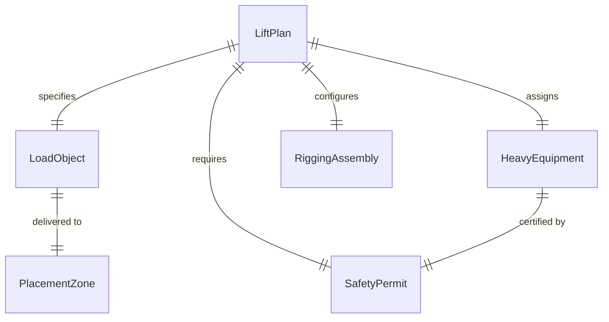
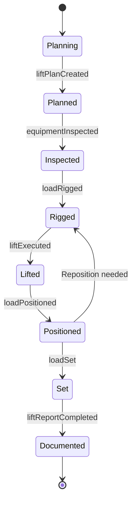
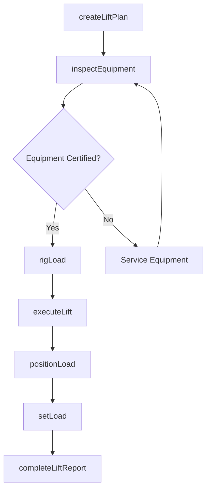
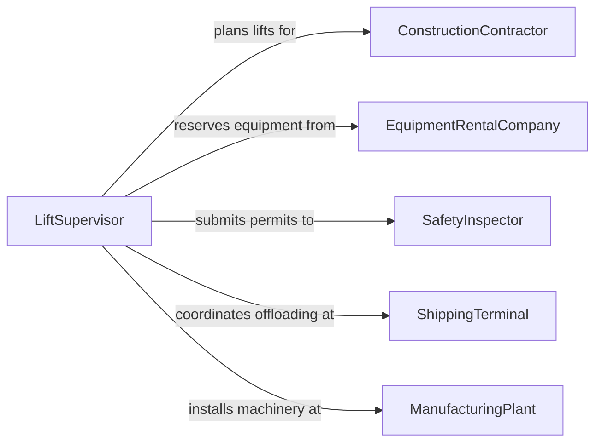

# Move Large Objects Using Heavy

> Business-as-Code definition for heavy equipment lifting and moving operations. Models the planning, rigging, lifting, and placement of oversized objects using cranes, forklifts, and specialized heavy machinery.

## Overview

Moving large objects with heavy equipment involves coordinating crane lifts, forklift operations, and rigging assemblies to relocate oversized or heavy items that cannot be moved manually. This activity spans industrial manufacturing, construction, shipping, and infrastructure projects where structural steel, precast concrete, heavy machinery, and other large loads must be precisely positioned. Safety planning, load calculations, and equipment certification are critical to every operation.

## Actors

| Actor | Description |
|-------|-------------|
| ConstructionContractor | General contractor requesting heavy lifts on job sites |
| EquipmentRentalCompany | Provider of cranes, forklifts, and rigging hardware |
| SafetyInspector | Third-party or internal inspector verifying lift safety compliance |
| ShippingTerminal | Port or freight yard where heavy objects are loaded or offloaded |
| ManufacturingPlant | Facility producing or receiving large machinery and components |

## Roles

| Role | Description |
|------|-------------|
| CraneOperator | Operates cranes and hoisting equipment to lift and position loads |
| Rigger | Attaches slings, chains, and rigging hardware to secure loads for lifting |
| LiftSupervisor | Plans lift operations, calculates load charts, and directs crew |
| Spotter | Guides equipment operators with visual signals during lifts and placements |

## Entities

| Entity | Description |
|--------|-------------|
| LiftPlan | Detailed plan specifying load weight, rigging configuration, and crane placement |
| LoadObject | The large item being moved, including weight and dimensional specifications |
| HeavyEquipment | Crane, forklift, or other machinery used to perform the lift |
| RiggingAssembly | Collection of slings, shackles, and spreader bars used to secure the load |
| PlacementZone | The target area where the object will be set down after lifting |
| SafetyPermit | Authorization document confirming the lift meets regulatory standards |

## Actions

| Action | Description |
|--------|-------------|
| createLiftPlan | Develop a detailed plan including load calculations and equipment selection |
| inspectEquipment | Verify cranes, rigging, and support equipment are certified and functional |
| rigLoad | Attach slings, chains, and hardware to the object for safe lifting |
| executeLift | Operate heavy equipment to raise the object from its current position |
| positionLoad | Guide the suspended load to the designated placement zone |
| setLoad | Lower and release the object at the target location |
| completeLiftReport | Document the lift including personnel, equipment used, and any incidents |

## Events

| Event | Description |
|-------|-------------|
| liftPlanCreated | A new lift plan has been developed and approved |
| equipmentInspected | All lifting equipment has passed pre-operation inspection |
| loadRigged | The object has been secured with rigging and is ready for lifting |
| liftExecuted | The object has been raised from its original position |
| loadPositioned | The suspended load has been guided to the placement zone |
| loadSet | The object has been lowered and released at the target location |
| liftReportCompleted | Post-lift documentation has been filed |

## Searches

| Search | Description |
|--------|-------------|
| findLiftPlans | List lift plans by site, date, or equipment type |
| getEquipmentCertifications | Retrieve certification and inspection records for heavy equipment |
| getLoadHistory | Look up past lift operations for a specific object or site |

## Entity Relationships



## State Diagram



## Workflow



## Actor Relationships



## Usage

### Calling Actions

```typescript
import { moveLargeObjectsUsingHeavy } from '@headlessly/move-large-objects-using-heavy'

const heavyLift = moveLargeObjectsUsingHeavy()

// Create a lift plan for a steel beam installation
const plan = await heavyLift.createLiftPlan({
  loadDescription: 'W36x194 Steel Beam - 60ft',
  weightKg: 17400,
  dimensions: { lengthM: 18.3, widthM: 0.37, heightM: 0.93 },
  equipment: 'Liebherr LTM 1300-6.2',
  rigging: 'four-point spreader bar',
  site: 'Downtown Tower - Level 14'
})

// Execute the lift
await heavyLift.rigLoad({
  planId: plan.id,
  rigger: 'crew-delta',
  riggingType: 'spreader-bar-4pt',
  inspectedAt: '2026-02-05T07:30:00Z'
})

await heavyLift.executeLift({
  planId: plan.id,
  operator: 'op-kwalters',
  liftHeight: 52.0,
  windSpeed: 12
})

// Set the load at final position
await heavyLift.setLoad({
  planId: plan.id,
  placementZone: 'Grid-C4-Level14',
  alignmentVerified: true
})
```

### Event-Driven Automation

```typescript
// Halt operations if wind exceeds safe threshold
heavyLift.liftExecuted(async ({ planId, windSpeed }) => {
  if (windSpeed > 30) {
    await notify({
      to: 'site-safety',
      message: `Wind speed ${windSpeed} km/h during lift ${planId} - review suspension criteria`
    })
  }
})

// Auto-generate compliance report after lift completion
heavyLift.liftReportCompleted(async ({ planId, site, personnel }) => {
  await generateComplianceReport({
    liftPlanId: planId,
    site,
    crewMembers: personnel,
    filedAt: new Date().toISOString()
  })
})
```
