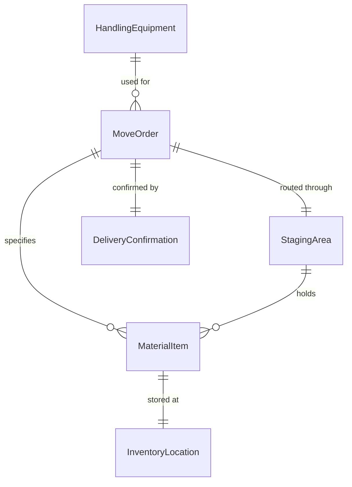
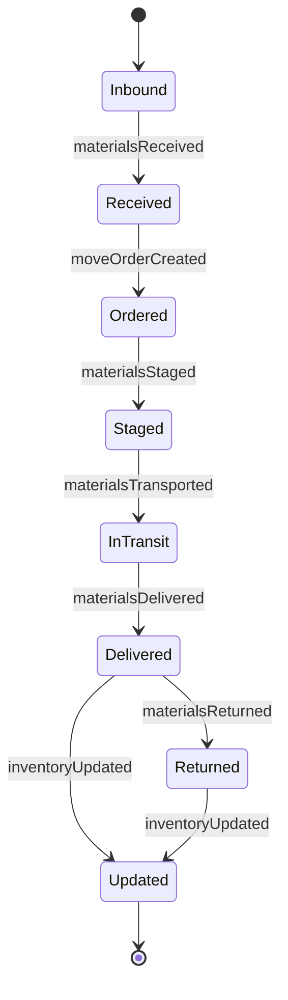
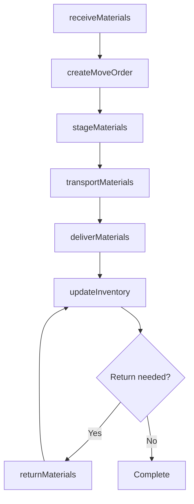
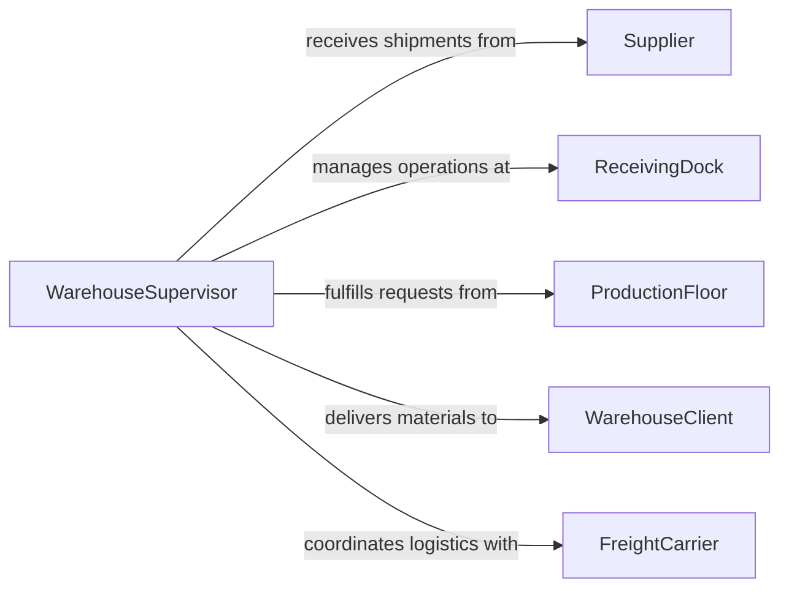

# Move Materials Equipment Supplies

> Business-as-Code definition for general material handling operations. Models the receiving, staging, transporting, and delivering of materials, equipment, and supplies across warehouse, manufacturing, and facility environments.

## Overview

Moving materials, equipment, and supplies encompasses the physical handling tasks required to receive incoming goods, stage them for use, transport them within or between facilities, and deliver them to the point of need. This is a foundational logistics activity spanning warehousing, manufacturing floors, retail stockrooms, and office operations. Effective material movement depends on proper inventory tracking, safe handling procedures, and coordinated scheduling to minimize downtime and prevent damage or loss.

## Actors

| Actor | Description |
|-------|-------------|
| Supplier | External vendor delivering raw materials, parts, or finished goods |
| ReceivingDock | Facility area where inbound shipments are accepted and inspected |
| ProductionFloor | Manufacturing area consuming materials and supplies |
| WarehouseClient | Internal department or external customer requesting material delivery |
| FreightCarrier | Transportation company moving goods between locations |

## Roles

| Role | Description |
|------|-------------|
| MaterialHandler | Physically moves, loads, and unloads materials using manual or powered equipment |
| WarehouseSupervisor | Coordinates material flow, assigns tasks, and monitors handling operations |
| InventoryClerk | Tracks quantities, locations, and movement of materials through the facility |
| ShippingReceivingCoordinator | Manages inbound and outbound dock operations and carrier scheduling |

## Entities

| Entity | Description |
|--------|-------------|
| MaterialItem | A specific material, part, or supply being moved |
| MoveOrder | A request specifying what to move, from where, and to where |
| StagingArea | Temporary holding zone where items are grouped before transport |
| HandlingEquipment | Pallet jacks, dollies, carts, and other tools used to move items |
| DeliveryConfirmation | Record verifying that materials arrived at the correct destination |
| InventoryLocation | A named storage bin, shelf, or zone within a facility |

## Actions

| Action | Description |
|--------|-------------|
| receiveMaterials | Accept and inspect inbound deliveries at the receiving dock |
| createMoveOrder | Generate a directive to relocate specific items between locations |
| stageMaterials | Group and position items in a staging area for upcoming transport |
| transportMaterials | Move items from one location to another within or between facilities |
| deliverMaterials | Place items at their designated destination and obtain confirmation |
| updateInventory | Record the new location and status of moved items in the inventory system |
| returnMaterials | Move unused or rejected items back to storage or the supplier |

## Events

| Event | Description |
|-------|-------------|
| materialsReceived | Inbound materials have been accepted at the receiving dock |
| moveOrderCreated | A new move order has been generated and assigned |
| materialsStaged | Items have been grouped in the staging area and are ready for transport |
| materialsTransported | Items have been moved from origin to destination |
| materialsDelivered | Items have arrived at the final destination and delivery is confirmed |
| inventoryUpdated | Inventory records reflect the new item locations |
| materialsReturned | Unused or rejected items have been sent back to storage or supplier |

## Searches

| Search | Description |
|--------|-------------|
| findMoveOrders | List move orders by status, date, origin, or destination |
| getMaterialLocations | Retrieve current storage locations for specific materials |
| getPendingDeliveries | Look up deliveries awaiting completion or confirmation |
| getHandlingMetrics | Retrieve throughput, cycle time, and error rates for material handling |

## Entity Relationships



## State Diagram



## Workflow



## Actor Relationships



## Usage

### Calling Actions

```typescript
import { moveMaterialsEquipmentSupplies } from '@headlessly/move-materials-equipment-supplies'

const materials = moveMaterialsEquipmentSupplies()

// Receive an inbound shipment
const receipt = await materials.receiveMaterials({
  supplierId: 'SUP-4821',
  items: [
    { sku: 'BRG-2205', description: 'Ball Bearing Assembly', quantity: 500 },
    { sku: 'SFT-1102', description: 'Drive Shaft 12mm', quantity: 200 }
  ],
  dock: 'Receiving Bay 3',
  receivedAt: '2026-02-05T08:15:00Z'
})

// Create a move order to production
const moveOrder = await materials.createMoveOrder({
  items: [{ sku: 'BRG-2205', quantity: 100 }],
  origin: 'Warehouse-A, Rack-14',
  destination: 'Production Line 2, Station 5',
  priority: 'standard'
})

// Deliver and update inventory
await materials.deliverMaterials({
  moveOrderId: moveOrder.id,
  deliveredBy: 'handler-tgarcia',
  confirmedBy: 'line-lead-bchen'
})
```

### Event-Driven Automation

```typescript
// Auto-replenish production line when materials are delivered
materials.materialsDelivered(async ({ moveOrderId, destination, items }) => {
  if (destination.startsWith('Production Line')) {
    await materials.updateInventory({
      moveOrderId,
      items,
      location: destination,
      timestamp: new Date().toISOString()
    })
  }
})

// Alert supervisor when move orders pile up
materials.moveOrderCreated(async ({ priority }) => {
  const pending = await materials.findMoveOrders({ status: 'pending' })
  if (pending.length > 20) {
    await notify({
      to: 'warehouse-supervisor',
      message: `${pending.length} pending move orders - consider additional staffing`
    })
  }
})
```
