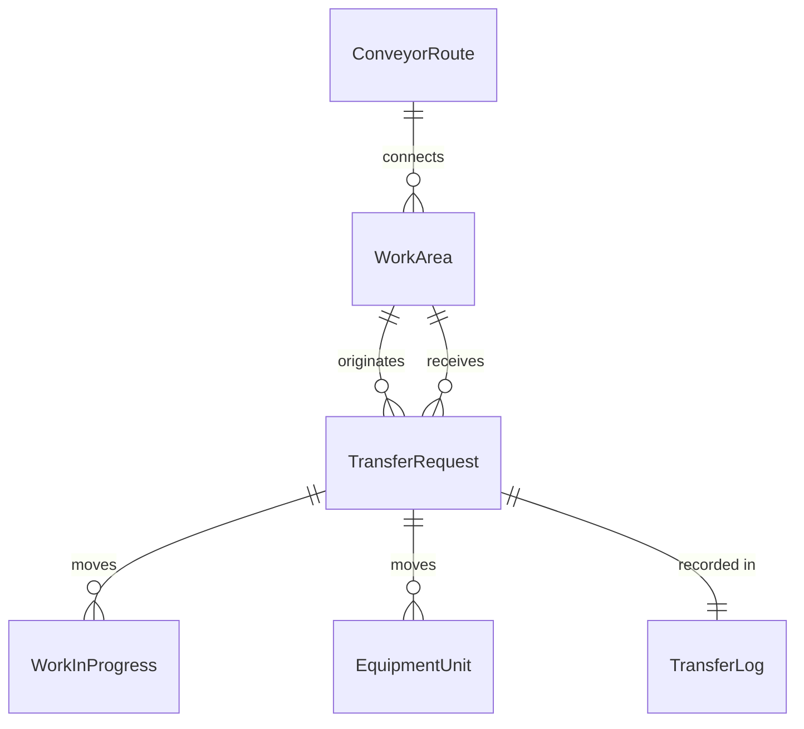
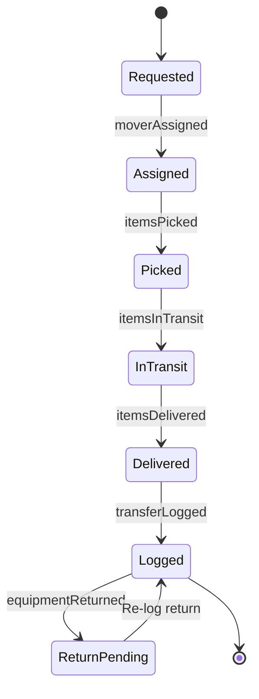
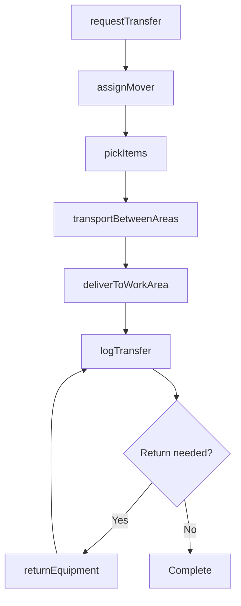
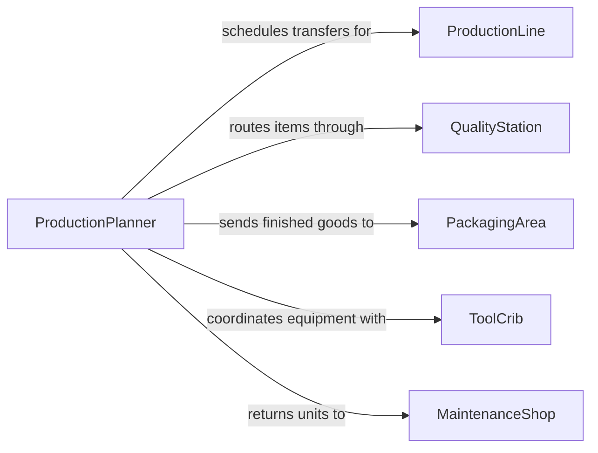

# Move Products Materials Equipment Between

> Business-as-Code definition for inter-area material transfer operations. Models the movement of products, materials, and equipment between distinct work areas within manufacturing, assembly, and processing facilities.

## Overview

Moving products, materials, and equipment between work areas is the internal logistics activity that keeps production lines, assembly stations, and processing zones supplied and operational. This involves transferring work-in-progress items from one production stage to the next, relocating tools and equipment to where they are needed, and routing finished goods to packaging or shipping areas. Timely inter-area movement directly impacts production throughput, equipment utilization, and on-time delivery performance.

## Actors

| Actor | Description |
|-------|-------------|
| ProductionLine | Assembly or manufacturing line consuming materials and producing goods |
| QualityStation | Inspection area where products are checked between process stages |
| PackagingArea | Zone where finished goods are prepared for shipment |
| ToolCrib | Central storage area issuing and receiving shared tools and equipment |
| MaintenanceShop | Facility area where equipment is serviced before redeployment |

## Roles

| Role | Description |
|------|-------------|
| MaterialMover | Physically transfers items between work areas using carts, forklifts, or conveyors |
| ProductionPlanner | Schedules inter-area transfers to align with production sequences |
| FloorSupervisor | Oversees work area operations and approves transfer requests |
| ToolCoordinator | Manages equipment checkout and return between the tool crib and work areas |

## Entities

| Entity | Description |
|--------|-------------|
| TransferRequest | A directive to move specific items from one work area to another |
| WorkInProgress | Partially completed products moving between production stages |
| EquipmentUnit | A tool, fixture, or machine being relocated between work areas |
| WorkArea | A defined zone within a facility where specific tasks are performed |
| TransferLog | Record of completed inter-area movements with timestamps and handlers |
| ConveyorRoute | An automated path connecting work areas for continuous material flow |

## Actions

| Action | Description |
|--------|-------------|
| requestTransfer | Submit a request to move items from one work area to another |
| assignMover | Designate personnel or automated systems to fulfill the transfer request |
| pickItems | Collect the specified items from the origin work area |
| transportBetweenAreas | Move items along the designated route to the destination work area |
| deliverToWorkArea | Place items at the receiving work area and confirm handoff |
| logTransfer | Record the completed transfer with quantities, timestamps, and handler details |
| returnEquipment | Move tools or equipment back to the tool crib or maintenance shop |

## Events

| Event | Description |
|-------|-------------|
| transferRequested | A new inter-area transfer request has been submitted |
| moverAssigned | Personnel or equipment have been assigned to the transfer |
| itemsPicked | Items have been collected from the origin work area |
| itemsInTransit | Items are being moved between work areas |
| itemsDelivered | Items have arrived at the destination work area |
| transferLogged | The completed transfer has been recorded in the system |
| equipmentReturned | Tools or equipment have been returned to their home location |

## Searches

| Search | Description |
|--------|-------------|
| findTransferRequests | List transfer requests by work area, status, or priority |
| getWorkAreaInventory | Retrieve current item counts and equipment present in a work area |
| getTransferHistory | Look up past transfers between specific work areas |
| getPendingTransfers | Find transfers that are requested but not yet completed |

## Entity Relationships



## State Diagram



## Workflow



## Actor Relationships



## Usage

### Calling Actions

```typescript
import { moveProductsMaterialsEquipmentBetween } from '@headlessly/move-products-materials-equipment-between'

const interArea = moveProductsMaterialsEquipmentBetween()

// Request transfer of work-in-progress to next production stage
const transfer = await interArea.requestTransfer({
  items: [
    { partNumber: 'ASM-4200', description: 'Partially assembled motor housing', quantity: 24 }
  ],
  originArea: 'Assembly Station 3',
  destinationArea: 'Quality Inspection Bay 1',
  priority: 'high',
  requiredBy: '2026-02-05T10:00:00Z'
})

// Assign a material mover
await interArea.assignMover({
  transferId: transfer.id,
  moverId: 'mover-dlopez',
  equipment: 'electric-pallet-jack-07'
})

// Complete delivery and log
await interArea.deliverToWorkArea({
  transferId: transfer.id,
  receivedBy: 'qi-lead-snguyen',
  itemCount: 24,
  conditionNotes: 'All units intact'
})
```

### Event-Driven Automation

```typescript
// Trigger next production stage when materials arrive
interArea.itemsDelivered(async ({ transferId, destinationArea, items }) => {
  if (destinationArea.includes('Assembly')) {
    await startProductionBatch({
      workArea: destinationArea,
      parts: items,
      triggeredBy: transferId
    })
  }
})

// Alert floor supervisor when transfers are delayed
interArea.transferRequested(async ({ transferId, requiredBy }) => {
  setTimeout(async () => {
    const status = await interArea.findTransferRequests({ id: transferId })
    if (status[0]?.status === 'pending') {
      await notify({
        to: 'floor-supervisor',
        message: `Transfer ${transferId} overdue - was due by ${requiredBy}`
      })
    }
  }, new Date(requiredBy).getTime() - Date.now())
})
```
