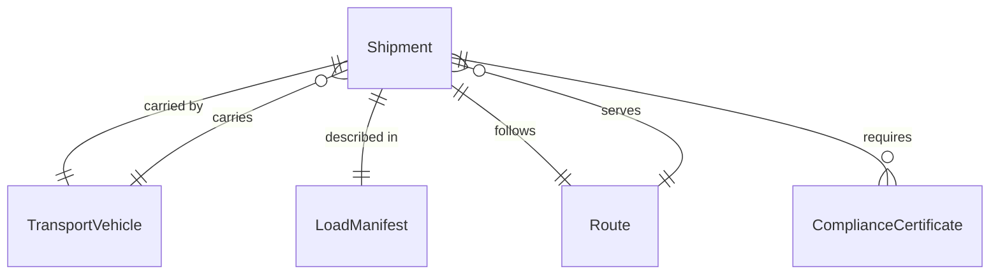
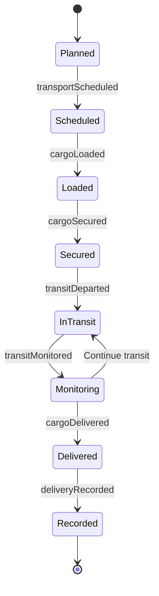
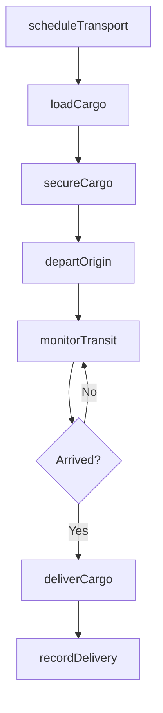
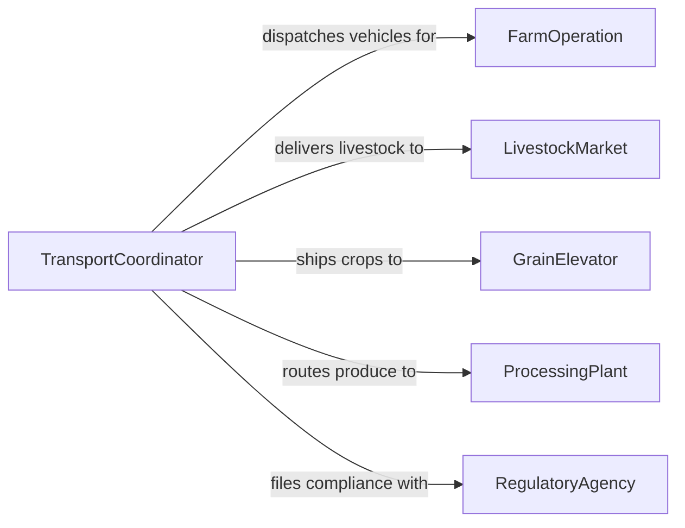

# Transport Animals Crops Equipment

> Business-as-Code definition for agricultural transport operations. Models the movement of livestock, harvested crops, and farm equipment between fields, storage facilities, markets, and processing sites.

## Overview

Transporting animals, crops, and agricultural equipment involves loading, securing, and moving goods across farm operations and distribution networks. This activity covers livestock hauling to markets or veterinary facilities, crop transport from fields to storage or processing plants, and equipment relocation between work sites. Compliance with animal welfare regulations, perishable goods handling, and oversize load requirements are integral to every transport operation.

## Actors

| Actor | Description |
|-------|-------------|
| FarmOperation | Agricultural business originating transport of animals, crops, or equipment |
| LivestockMarket | Auction house or sale yard receiving transported animals |
| GrainElevator | Storage facility accepting harvested crop deliveries |
| ProcessingPlant | Facility where crops or livestock are processed after transport |
| RegulatoryAgency | Government body enforcing animal welfare and transport safety rules |

## Roles

| Role | Description |
|------|-------------|
| TransportCoordinator | Plans routes, schedules, and vehicle assignments for all agricultural transport |
| LivestockHandler | Loads, secures, and monitors animals during transit |
| EquipmentOperator | Drives and manages heavy farm equipment during relocation |
| HarvestDriver | Operates grain carts, trucks, or trailers moving crops from field to storage |

## Entities

| Entity | Description |
|--------|-------------|
| Shipment | A record of goods being transported including type, quantity, and destination |
| TransportVehicle | Truck, trailer, or livestock carrier used for agricultural hauling |
| LoadManifest | Detailed listing of items, animals, or equipment aboard a vehicle |
| Route | Planned path from origin to destination including waypoints and rest stops |
| ComplianceCertificate | Documentation proving adherence to animal welfare or transport regulations |

## Actions

| Action | Description |
|--------|-------------|
| scheduleTransport | Plan a transport run with vehicle assignment and route selection |
| loadCargo | Place animals, crops, or equipment onto the transport vehicle |
| secureCargo | Fasten and stabilize cargo to prevent shifting or injury during transit |
| departOrigin | Begin the transport journey from the originating location |
| monitorTransit | Track vehicle location, cargo condition, and environmental factors en route |
| deliverCargo | Unload animals, crops, or equipment at the destination facility |
| recordDelivery | Document delivery completion including condition assessments |

## Events

| Event | Description |
|-------|-------------|
| transportScheduled | A new transport run has been planned and assigned |
| cargoLoaded | Animals, crops, or equipment have been placed on the vehicle |
| cargoSecured | All cargo has been fastened and verified for safe transit |
| transitDeparted | The transport vehicle has left the origin location |
| transitMonitored | An in-transit status update has been recorded |
| cargoDelivered | Cargo has been unloaded at the destination |
| deliveryRecorded | Delivery details and condition report have been filed |

## Searches

| Search | Description |
|--------|-------------|
| findShipments | List shipments by cargo type, date range, or destination |
| getVehicleStatus | Retrieve current location and load status of transport vehicles |
| getComplianceRecords | Look up regulatory certificates for a specific transport or vehicle |
| getRouteHistory | Retrieve past routes and delivery performance metrics |

## Entity Relationships



## State Diagram



## Workflow



## Actor Relationships



## Usage

### Calling Actions

```typescript
import { transportAnimalsCropsEquipment } from '@headlessly/transport-animals-crops-equipment'

const transport = transportAnimalsCropsEquipment()

// Schedule a livestock transport
const shipment = await transport.scheduleTransport({
  cargoType: 'livestock',
  description: '45 head of cattle',
  origin: 'Bar-K Ranch, Field Station 3',
  destination: 'Midwest Livestock Auction',
  vehicleId: 'TRAILER-LV-08',
  scheduledDate: '2026-02-10T06:00:00Z'
})

// Load and secure the cargo
await transport.loadCargo({
  shipmentId: shipment.id,
  itemCount: 45,
  loadedBy: 'handler-jmartinez'
})

await transport.secureCargo({
  shipmentId: shipment.id,
  method: 'livestock-partition',
  verifiedBy: 'handler-jmartinez'
})

// Record delivery at destination
await transport.deliverCargo({
  shipmentId: shipment.id,
  receivedBy: 'Midwest Livestock Auction - Dock B',
  conditionNotes: 'All animals in good health, no injuries observed'
})
```

### Event-Driven Automation

```typescript
// Alert destination when transport departs
transport.transitDeparted(async ({ shipmentId, destination, estimatedArrival }) => {
  await notify({
    to: destination,
    message: `Shipment ${shipmentId} en route, ETA ${estimatedArrival}`
  })
})

// Flag compliance issues during transit monitoring
transport.transitMonitored(async ({ shipmentId, temperature, humidity }) => {
  if (temperature > 35) {
    await notify({
      to: 'transport-dispatch',
      message: `High temperature alert for shipment ${shipmentId}: ${temperature}C`
    })
  }
})
```
